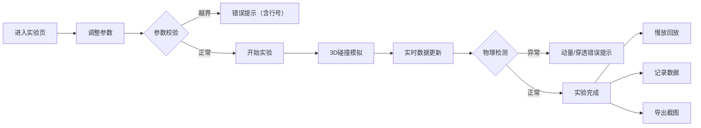

## 1. 产品概述
3D弹性碰撞台球实验交互可视化平台，为物理课堂提供沉浸式教学工具。学生可调整球体质量、初速度、碰撞角、摩擦系数等参数，实时观察动量守恒现象。系统支持错误检测、慢放回放、数据记录和截图导出。

- **核心价值**：将抽象物理概念转化为直观3D交互体验，提升教学效果
- **目标用户**：中学/大学物理教师、学生、物理教研人员
- **解决问题**：传统实验器材限制多、数据采集困难、错误情况无法直观展示

## 2. 核心功能

### 2.1 用户角色
| 角色 | 注册方式 | 核心权限 |
|------|----------|----------|
| 教师/学生 | 无需注册 | 全部实验功能、参数调整、数据导出 |

### 2.2 功能模块
1. **3D实验场景**：台球桌、球体、碰撞向量箭头、轨迹追踪
2. **参数控制面板**：质量、初速度、碰撞角、摩擦系数调整
3. **数据监控面板**：实时动量、动能、速度数据展示
4. **错误检测系统**：动量异常、穿透检测、参数越界提示
5. **回放控制**：播放/暂停、慢放、进度条控制
6. **实验记录**：历史数据表格、来源追踪、修正痕迹保留
7. **截图导出**：一键保存实验画面

### 2.3 页面详情
| 页面名称 | 模块名称 | 功能描述 |
|-----------|-------------|---------------------|
| 主实验页 | 3D视窗 | 可旋转/缩放的3D台球碰撞场景，显示速度向量、轨迹 |
| 主实验页 | 参数控制区 | 滑动条/输入框调整球体参数，实时同步3D视图 |
| 主实验页 | 数据面板 | 实时显示动量、动能、碰撞前后对比数据 |
| 主实验页 | 错误提示区 | 高亮显示动量异常、穿透、参数越界等错误，含原始行号 |
| 主实验页 | 回放控制 | 播放/暂停、0.25x-4x倍速、进度拖拽 |
| 主实验页 | 实验记录 | 可筛选的历史实验数据表，保留修改痕迹 |
| 主实验页 | 导出按钮 | 截图保存、数据导出功能 |

## 3. 核心流程
用户进入实验页 → 调整球体参数（系统实时校验参数范围）→ 点击开始实验 → 3D场景模拟碰撞（同步更新数据面板）→ 系统检测动量异常/穿透等错误并提示 → 用户可暂停/慢放观察细节 → 记录实验数据或导出截图

## 4. 界面设计

### 4.1 设计风格
- **主色调**：深空蓝 (#0A1628) 背景，科技青 (#00D4FF) 强调色
- **辅助色**：警示橙 (#FF6B35) 用于错误提示，成功绿 (#00FF88) 用于正常状态
- **字体**：Space Grotesk 标题 + JetBrains Mono 数据字体
- **按钮风格**：圆角矩形，发光悬停效果，3D按压反馈
- **布局**：左侧3D视窗（70%）+ 右侧控制面板（30%），卡片式设计
- **图标风格**：线条型 lucide 图标，科技感十足

### 4.2 页面设计概览
| 页面名称 | 模块名称 | UI元素 |
|-----------|-------------|-------------|
| 主实验页 | 3D视窗 | 深色背景、发光台球桌、动态向量箭头、轨迹线 |
| 主实验页 | 参数面板 | 滑动条带数值显示、参数卡片、错误高亮边框 |
| 主实验页 | 数据面板 |  monospace字体数据表格、实时变化动画、颜色编码状态 |
| 主实验页 | 错误提示 | 橙色警示卡片、错误代码、来源行号、修复建议 |
| 主实验页 | 回放控制 | 播放控制条、倍速选择按钮、时间码显示 |

### 4.3 响应式
- 桌面端：左右分栏布局（7:3）
- 平板端：上下布局，3D视窗在上
- 移动端：精简参数面板，支持横向滚动
- 触摸优化：增大滑动条和按钮触控区域

### 4.4 3D场景设计
- **环境**：深色科技感实验室，轻微光晕效果，无HDRI保持性能
- **光照**：三光源系统，主光+补光+轮廓光，突出球体质感
- **相机**：默认俯视45度角，支持轨道控制、缩放、平移
- **动画**：碰撞瞬间闪光效果、向量箭头呼吸动画、轨迹渐隐
- **后处理**：轻微泛光、抗锯齿，避免过度效果影响性能
