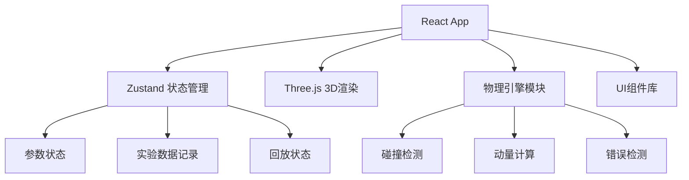

## 1. 架构设计


## 2. 技术选型
- **前端框架**：React 18 + TypeScript
- **构建工具**：Vite 5
- **样式方案**：Tailwind CSS 3
- **3D引擎**：Three.js + @react-three/fiber + @react-three/drei
- **状态管理**：Zustand
- **图标库**：lucide-react
- **物理计算**：自定义弹性碰撞物理引擎
- **导出功能**：html2canvas（截图）

## 3. 目录结构
```
src/
├── components/
│   ├── Scene3D/          # 3D场景组件
│   │   ├── Table.tsx     # 台球桌
│   │   ├── Ball.tsx      # 球体
│   │   ├── VectorArrow.tsx # 向量箭头
│   │   └── index.tsx     # 场景主组件
│   ├── ControlPanel/     # 参数控制面板
│   │   ├── BallParams.tsx # 球体参数
│   │   ├── Playback.tsx  # 回放控制
│   │   └── index.tsx
│   ├── DataPanel/        # 数据面板
│   │   ├── MomentumTable.tsx
│   │   ├── ErrorList.tsx
│   │   └── index.tsx
│   └── ExperimentLog/    # 实验记录
│       └── index.tsx
├── hooks/
│   ├── usePhysics.ts     # 物理计算hook
│   ├── usePlayback.ts    # 回放控制hook
│   └── useErrorDetection.ts # 错误检测hook
├── store/
│   └── useExperimentStore.ts # Zustand状态
├── utils/
│   ├── physics.ts        # 物理公式
│   ├── collision.ts      # 碰撞检测
│   └── export.ts         # 导出工具
├── types/
│   └── index.ts          # 类型定义
└── App.tsx
```

## 4. 核心数据模型
```typescript
interface Ball {
  id: string;
  mass: number;      // kg
  radius: number;    // m
  position: Vector3;
  velocity: Vector3; // m/s
  color: string;
  source?: string;   // 数据来源
}

interface ExperimentState {
  balls: Ball[];
  friction: number;  // 0-1
  collisionAngle: number; // 度
  isPlaying: boolean;
  playbackSpeed: number;
  currentTime: number;
}

interface MomentumData {
  timestamp: number;
  ballId: string;
  momentum: Vector3;
  kineticEnergy: number;
  sourceLine?: number; // 原始数据行号
}

interface PhysicsError {
  id: string;
  type: 'momentum_gain' | 'penetration' | 'param_out_of_bounds';
  message: string;
  timestamp: number;
  sourceLocation: string; // 原始位置/行号
  ballIds: string[];
  severity: 'warning' | 'error';
}

interface ExperimentRecord {
  id: string;
  timestamp: Date;
  initialBalls: Ball[];
  finalBalls: Ball[];
  momentumBefore: Vector3;
  momentumAfter: Vector3;
  errors: PhysicsError[];
  screenshot?: string;
  modificationTrace: {
    field: string;
    oldValue: any;
    newValue: any;
    timestamp: Date;
  }[];
}
```

## 5. 物理引擎设计
### 5.1 弹性碰撞公式
```
m₁v₁ + m₂v₂ = m₁v₁' + m₂v₂'  (动量守恒)
v₁' = ((m₁-m₂)v₁ + 2m₂v₂) / (m₁+m₂)
v₂' = ((m₂-m₁)v₂ + 2m₁v₁) / (m₁+m₂)
```

### 5.2 碰撞检测
- 连续碰撞检测(CCD)防止穿透
- 球体间距离检测：|p₁ - p₂| ≤ r₁ + r₂
- 边界碰撞检测

### 5.3 错误检测规则
1. **动量增加检测**：总动量变化 > 1% 触发警告
2. **穿透检测**：球体嵌入深度 > 0.1r 触发错误
3. **参数越界**：质量(0.1-10kg)、速度(0-10m/s)、摩擦(0-1)
4. 所有错误保留原始数据来源和行号
