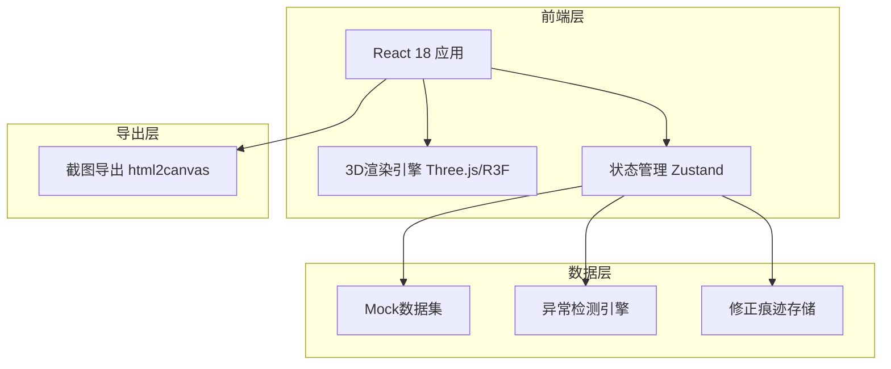
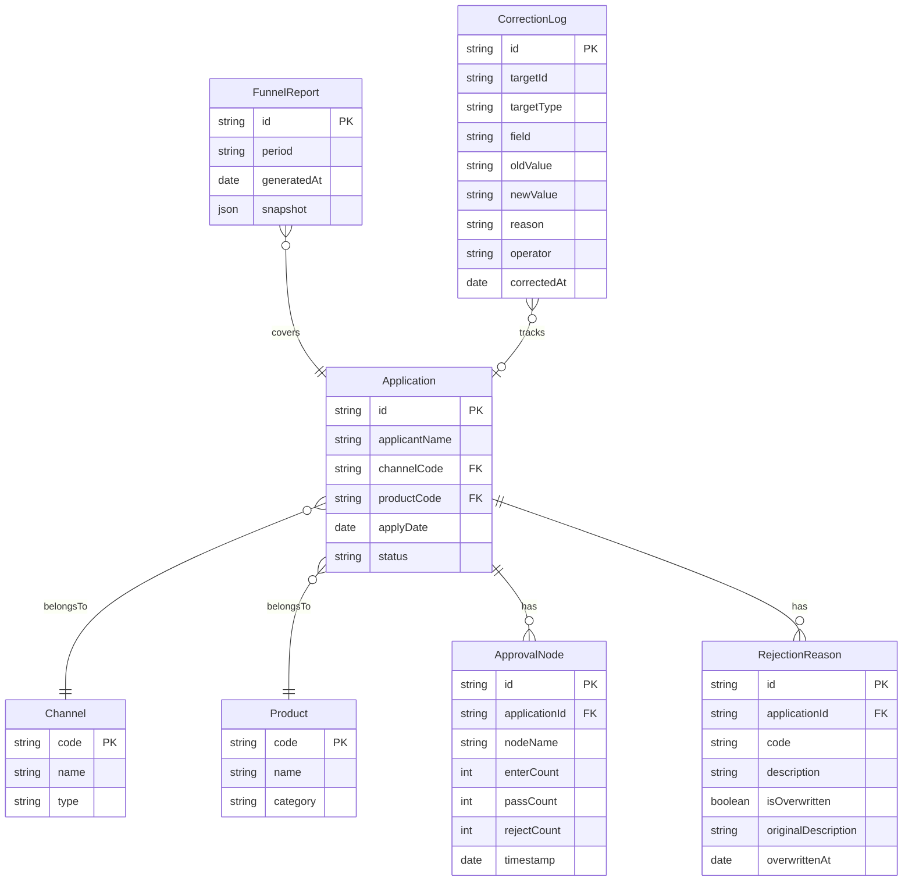

## 1. 架构设计



## 2. 技术说明

- 前端：React@18 + TypeScript + Tailwind CSS@3 + Vite
- 3D渲染：three + @react-three/fiber + @react-three/drei + @react-three/postprocessing
- 状态管理：Zustand
- 截图导出：html2canvas
- 初始化工具：vite-init
- 后端：无（纯前端，Mock数据）
- 数据库：无（内存数据集）

## 3. 路由定义

| 路由 | 用途 |
|------|------|
| / | 漏斗主页面，包含3D漏斗、筛选面板、节点明细、历史对比、导出截图 |

## 4. 数据模型

### 4.1 数据模型定义



### 4.2 异常检测规则

| 异常类型 | 检测逻辑 | 提示级别 |
|----------|----------|----------|
| 节点重复 | 同一申请在同一审批节点出现>=2条记录 | 错误（红色） |
| 渠道错归 | 申请渠道编码与渠道名称映射不匹配 | 警告（橙色） |
| 拒绝原因覆盖 | RejectionReason.isOverwritten=true | 错误（红色） |

## 5. 组件架构

```mermaid
graph TD
    "App" --> "FunnelPage"
    "FunnelPage" --> "FilterPanel"
    "FunnelPage" --> "FunnelScene3D"
    "FunnelPage" --> "NodeDetailPanel"
    "FunnelPage" --> "HistoryPanel"
    "FunnelPage" --> "AnomalyAlert"
    "FunnelPage" --> "ExportButton"
    "FunnelScene3D" --> "FunnelMesh"
    "FunnelScene3D" --> "FunnelLayer"
    "FunnelScene3D" --> "ParticleEffect"
    "FunnelScene3D" --> "SceneLighting"
    "FunnelScene3D" --> "PostProcessing"
    "NodeDetailPanel" --> "MetricCard"
    "NodeDetailPanel" --> "RejectionChart"
    "NodeDetailPanel" --> "SourceTimeline"
    "NodeDetailPanel" --> "CorrectionLogList"
    "HistoryPanel" --> "PeriodSelector"
    "HistoryPanel" --> "DiffHighlight"
```

## 6. 状态管理设计

使用Zustand管理以下状态切片：

- `funnelStore`：漏斗数据、筛选条件、选中节点、异常列表
- `historyStore`：历史报告列表、对比期次、差异结果
- `correctionStore`：修正日志、修正操作
