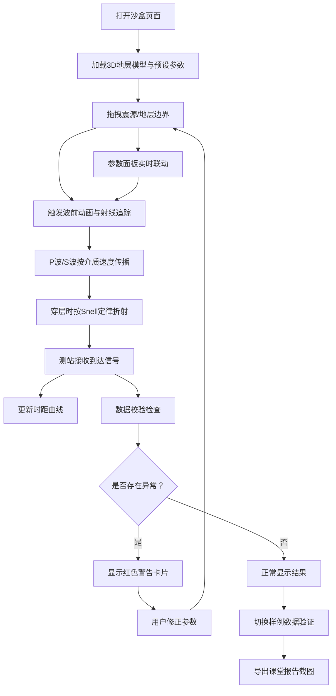

## 1. 产品概述

地震波传播沙盒（Seismic Wave Propagation Sandbox）是一款面向高中地理课堂的 Web3D 交互式教学工具。学生可通过拖拽震源和介质层，直观观察 P 波与 S 波在不同地层中的传播路径、到达时间差及波前扩散动画，从而理解地震波传播规律。

- 目标用户：高中地理教师与学生
- 核心价值：将抽象的地震波传播知识可视化、可交互化，支持课堂演示与自主探究

## 2. 核心功能

### 2.1 用户角色

| 角色 | 使用方式 | 核心权限 |
|------|----------|----------|
| 教师 | 直接访问 | 调整参数预设、导出课堂报告、管理样例数据 |
| 学生 | 直接访问 | 拖拽震源/介质层、观察波形、查看到时曲线 |

### 2.2 功能模块

1. **沙盒主页面**：3D 地层模型、震源拖拽、波前动画、测站标记、射线追踪、到时曲线面板、参数控制面板、数据校验提示、样例数据切换、报告导出

### 2.3 页面详情

| 页面名称 | 模块名称 | 功能描述 |
|----------|----------|----------|
| 沙盒主页面 | 3D 地层场景 | 可拖拽旋转缩放的3D分层地质模型，震源点可拖拽，地层边界可上下拖拽调整厚度 |
| 沙盒主页面 | 波前动画 | P波/S波从震源扩散的球面波前动画，速度随介质层变化，穿层时按Snell定律折射 |
| 沙盒主页面 | 测站系统 | 地表可添加测站标记，显示P波/S波到达时间差，悬浮显示详细信息 |
| 沙盒主页面 | 到时曲线面板 | 右侧面板展示走时-距离曲线（时距图），P波与S波分色显示 |
| 沙盒主页面 | 参数预设面板 | 左侧面板：震源深度、各层P波/S波速度、测站位置、地层边界深度等参数调节 |
| 沙盒主页面 | 数据校验 | 实时检测零速度、穿层错误、到时排序异常，以红色警告卡片形式提示 |
| 沙盒主页面 | 数据来源追溯 | 每条数据记录来源（震源位置/介质速度/测站/波形/地层边界/课堂报告），修正时保留历史痕迹 |
| 沙盒主页面 | 样例数据 | 预置3条样例：1条正常记录、1条边界记录（如零速度边界）、1条明显坏数据 |
| 沙盒主页面 | 报告导出 | 一键截图当前3D场景+参数面板+到时曲线，生成课堂报告图片 |

## 3. 核心流程

用户打开页面 → 查看默认3D地层模型与预设参数 → 拖拽震源位置调整震源深度 → 拖拽地层边界调整介质层厚度 → 观察P波/S波波前动画与射线传播路径 → 添加/移动测站 → 查看时距曲线 → 切换样例数据观察校验效果 → 调整参数观察变化 → 导出课堂报告截图

## 4. 用户界面设计

### 4.1 设计风格

- **主色调**：深蓝黑底色（#0a0e1a），搭配地球科学暖橙色（#ff6b35）作为强调色，P波用青色（#00e5ff），S波用品红色（#ff4081）
- **按钮风格**：圆角微3D按钮，带微妙内阴影
- **字体**：显示字体使用 Orbitron（科技感），正文使用 Noto Sans SC（中文友好）
- **布局风格**：中央3D画布为主，左侧参数面板，右侧时距曲线面板，底部校验提示条
- **图标**：使用 Lucide 图标库，地震/波形相关使用自定义SVG

### 4.2 页面设计概览

| 页面名称 | 模块名称 | UI元素 |
|----------|----------|--------|
| 沙盒主页面 | 3D地层场景 | 全屏Three.js画布，半透明渐变地层，可拖拽震源标记（脉冲动画），射线线条，波前球面 |
| 沙盒主页面 | 参数预设面板 | 左侧280px抽屉，深色半透明背景，滑块+输入框，折叠分组（震源/介质/测站） |
| 沙盒主页面 | 到时曲线面板 | 右侧280px抽屉，Canvas2D绘制走时-距离曲线，P波青色/S波品红色，悬浮十字线 |
| 沙盒主页面 | 校验提示 | 底部浮层，红色/黄色/绿色状态条，可展开查看详情 |
| 沙盒主页面 | 样例切换 | 顶部工具栏，三个标签按钮切换正常/边界/坏数据 |
| 沙盒主页面 | 报告导出 | 顶部工具栏相机图标按钮，点击截图并下载PNG |

### 4.3 响应式

- 桌面端优先（1920×1080），3D画布自适应窗口
- 面板可折叠收起，移动端堆叠为上下布局

### 4.4 3D场景指引

- **环境**：深色空间背景，微弱星空粒子，营造地球深部氛围
- **灯光**：顶部平行光模拟地表阳光，震源点自发光（橙色脉冲）
- **相机**：透视相机，默认45°俯角，OrbitControls自由旋转，可锁定为剖面视图
- **构图**：地层剖面为主视觉，震源位于中心偏下，测站分布在顶部地表
- **交互**：震源拖拽（TransformControls）、地层边界拖拽、测站拖拽、射线悬浮高亮
- **动画**：波前球面扩散动画（透明度渐变），射线流动粒子，测站到达脉冲
- **后处理**：Bloom发光效果（震源/波前），边缘线描（地层边界）
- **性能预算**：保持60fps，波前球面使用InstancedMesh优化
