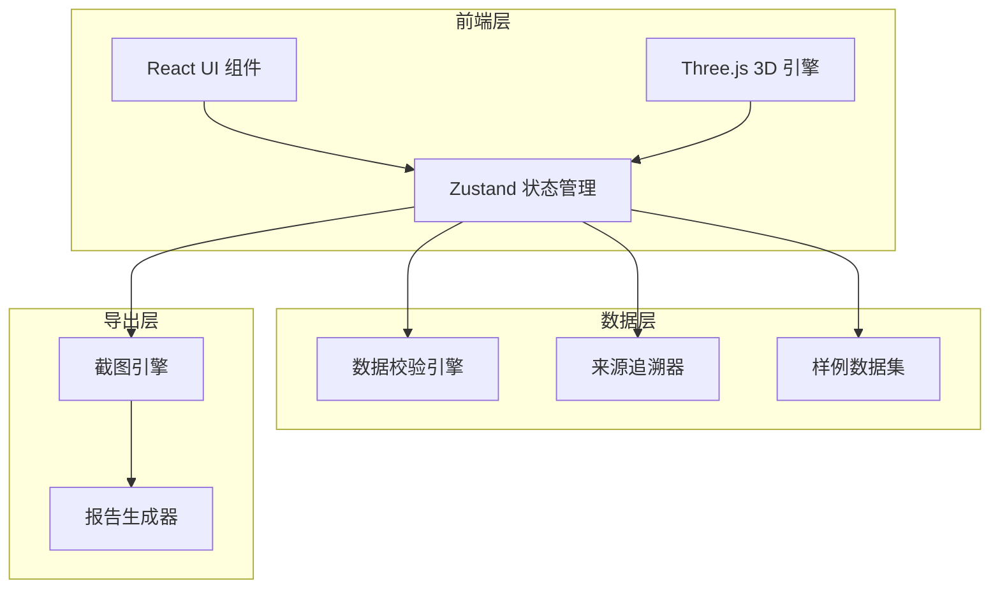
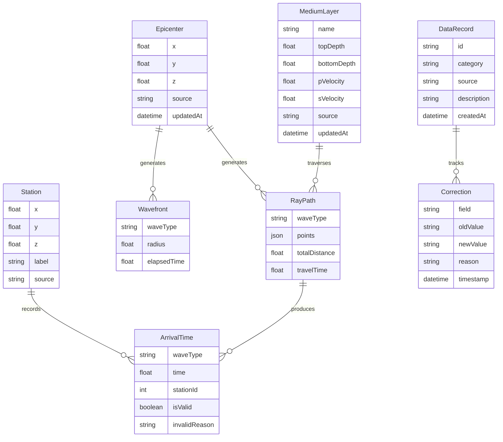

## 1. 架构设计



## 2. 技术说明

- 前端：React@18 + TypeScript + Tailwind CSS@3 + Vite
- 3D引擎：Three.js + @react-three/fiber + @react-three/drei + @react-three/postprocessing
- 状态管理：Zustand
- 初始化工具：vite-init (react-ts 模板)
- 后端：无（纯前端，数据本地管理）
- 数据库：无（使用内存状态 + LocalStorage持久化）

## 3. 路由定义

| 路由 | 用途 |
|------|------|
| / | 沙盒主页面，包含所有交互功能 |

## 4. 数据模型

### 4.1 核心数据模型定义



### 4.2 数据定义

```typescript
interface Epicenter {
  id: string;
  position: [number, number, number];
  source: string;
  updatedAt: string;
  corrections: Correction[];
}

interface MediumLayer {
  id: string;
  name: string;
  topDepth: number;
  bottomDepth: number;
  pVelocity: number;
  sVelocity: number;
  color: string;
  source: string;
  updatedAt: string;
  corrections: Correction[];
}

interface Station {
  id: string;
  position: [number, number, number];
  label: string;
  source: string;
}

interface ArrivalTime {
  stationId: string;
  waveType: 'P' | 'S';
  time: number;
  isValid: boolean;
  invalidReason?: string;
}

interface RaySegment {
  start: [number, number, number];
  end: [number, number, number];
  layerId: string;
  waveType: 'P' | 'S';
  velocity: number;
  distance: number;
  travelTime: number;
}

interface RayPath {
  waveType: 'P' | 'S';
  segments: RaySegment[];
  totalDistance: number;
  travelTime: number;
  isValid: boolean;
  validationErrors: string[];
}

interface Correction {
  id: string;
  field: string;
  oldValue: string;
  newValue: string;
  reason: string;
  timestamp: string;
  source: string;
}

interface ValidationResult {
  level: 'error' | 'warning' | 'info';
  code: string;
  message: string;
  affectedIds: string[];
}

interface SampleData {
  id: string;
  category: 'normal' | 'boundary' | 'bad';
  label: string;
  description: string;
  epicenter: Epicenter;
  layers: MediumLayer[];
  stations: Station[];
  expectedValidationResults: ValidationResult[];
}

interface SandboxState {
  epicenter: Epicenter;
  layers: MediumLayer[];
  stations: Station[];
  rayPaths: RayPath[];
  wavefronts: WavefrontState[];
  validationResults: ValidationResult[];
  activeSample: string | null;
  isAnimating: boolean;
  animationTime: number;
}
```

## 5. 物理计算说明

### 5.1 波速与走时

- P波走时：T_p = Σ(d_i / V_pi)，其中 d_i 为射线在第 i 层的路径长度，V_pi 为P波在该层的速度
- S波走时：T_s = Σ(d_i / V_si)
- 到达时间差：ΔT = T_s - T_p

### 5.2 Snell定律折射

- 入射角与折射角关系：sin(θ₁)/V₁ = sin(θ₂)/V₂
- 当 sin(θ₂) > 1 时发生全反射

### 5.3 校验规则

| 规则代码 | 触发条件 | 级别 | 提示信息 |
|----------|----------|------|----------|
| ZERO_VELOCITY | 任意层 Vp 或 Vs = 0 | error | "第{i}层{type}波速度为零，无法计算走时" |
| CROSS_LAYER_ERROR | 射线路径穿过不连续层边界未折射 | error | "射线路径在层{i}/{j}边界未按Snell定律折射" |
| ARRIVAL_SORT_ERROR | 同一测站S波到达时间早于P波 | error | "测站{s}的S波到达时间早于P波，物理不可能" |
| VELOCITY_INVERSION | 上层速度 > 下层速度（可能但需注意） | warning | "层{i}速度大于层{j}，可能产生速度反转" |
| MISSING_LAYER | 层间存在间隙 | warning | "层{i}底部与层{i+1}顶部之间存在间隙" |

## 6. 样例数据定义

### 样例1：正常记录

- 震源深度：15km
- 三层模型：表层(0-5km, Vp=5.8, Vs=3.4)、中层(5-15km, Vp=6.5, Vs=3.7)、下层(15-35km, Vp=7.0, Vs=4.0)
- 3个测站：距震中50km、100km、200km
- 预期：正常P/S波到时差，无校验错误

### 样例2：边界记录

- 震源深度：5km（恰好位于层边界）
- 同三层模型但中层Vs设为极低值(0.1 km/s)
- 预期：触发 VELOCITY_INVERSION 警告，接近零速度但不触发 ZERO_VELOCITY

### 样例3：明显坏数据

- 震源深度：15km
- 中层 Vp=0，Vs=-2（负速度）
- 测站时间排序错误
- 预期：触发 ZERO_VELOCITY、ARRIVAL_SORT_ERROR 错误
