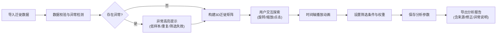

## 1. 产品概述

信用风险迁徙矩阵3D可视化系统是为风控团队打造的交互式分析工具，将客户信用评级的动态迁徙过程以三维矩阵形式直观呈现，帮助风控人员快速识别风险等级变化趋势、定位异常数据、导出可追溯的分析报告。

- 解决核心问题：传统二维迁徙表无法直观展示多维度（评级×时间×行业）的风险演变规律，异常数据容易被掩盖
- 目标用户：风控分析师、信用风险管理团队、信贷审批人员
- 产品价值：将抽象的信用迁徙数据转化为可交互的3D场景，提升风险识别效率和决策准确性

---

## 2. 核心功能

### 2.1 用户角色

| 角色 | 注册方式 | 核心权限 |
|------|----------|----------|
| 风控分析师 | 系统内置（本地工具） | 完整的数据导入、3D交互、参数配置、报告导出权限 |

### 2.2 功能模块

1. **3D迁徙矩阵主场景**：三维立方体矩阵展示评级迁徙状态，支持旋转、缩放、点击交互
2. **时间轴播放控制**：按月度播放迁徙动画，支持暂停、快进、定位到特定月份
3. **数据筛选面板**：按行业标签、余额区间、迁徙次数进行多维度筛选
4. **异常检测系统**：自动识别低样本等级、余额重复、筛选失效等异常并高亮提示
5. **参数配置与保存**：保存视图角度、筛选条件、权重设置等分析参数
6. **分析报告导出**：生成包含数据来源、修正痕迹、异常说明的完整分析报告

### 2.3 页面详情

| 页面名称 | 模块名称 | 功能描述 |
|----------|----------|----------|
| 主分析页面 | 3D矩阵视图 | 三维立方体矩阵，X轴=期初评级，Y轴=期末评级，Z轴=时间/月份，立方体大小=迁徙次数，颜色=余额权重 |
| 主分析页面 | 顶部工具栏 | 数据导入、参数保存/加载、报告导出、视图重置 |
| 主分析页面 | 左侧控制面板 | 时间轴播放控制、播放速度调节、时间点定位 |
| 主分析页面 | 右侧筛选面板 | 行业标签多选、余额区间滑块、迁徙次数范围设置、余额权重开关 |
| 主分析页面 | 底部信息栏 | 数据来源追溯、修正痕迹记录、异常提示汇总 |
| 主分析页面 | 浮动详情面板 | 点击立方体后显示该迁徙路径的详细统计信息 |

---

## 3. 核心流程

**用户主流程描述**：
1. 风控分析师导入包含客户评级、月份、迁徙次数、余额、行业标签、风险报告的原始数据
2. 系统自动进行数据校验，标记低样本等级、余额重复、行业筛选失效等异常情况
3. 三维矩阵渲染完成后，分析师可通过鼠标拖拽旋转、滚轮缩放查看整体迁徙格局
4. 使用时间轴播放功能，按月度观察评级迁徙的动态演变，识别哪个等级"掉得最快"
5. 通过右侧面板设置行业筛选、余额权重、迁徙次数阈值等参数
6. 发现异常立方体（红色高亮）时点击查看详情，确认风险点
7. 保存当前分析参数（视图角度、筛选条件、权重设置）便于后续回溯
8. 导出完整分析报告，包含数据来源、修正痕迹、异常说明、关键发现

---

## 4. 用户界面设计

### 4.1 设计风格

**整体风格**：专业金融风控风格，深色主题，强调数据可信度和专业感

- **主色调**：深空蓝 `#0a1628`（背景）、科技蓝 `#1e40af`（主交互）
- **辅助色**：
  - 风险梯度：绿色 `#10b981`（低风险）→ 黄色 `#f59e0b`（中风险）→ 橙色 `#f97316`（较高风险）→ 红色 `#ef4444`（高风险）
  - 异常提示：亮红 `#dc2626`（闪烁边框）
  - 余额权重：紫色 `#7c3aed` 渐变
- **按钮样式**：扁平微立体，2px圆角，hover时有轻微上浮动画
- **字体**：
  - 标题：`JetBrains Mono` 等宽字体，体现专业严谨
  - 正文：`Inter` 字体，保证清晰度和可读性
  - 数据数字：`Roboto Mono` 等宽字体，便于数值对比
- **布局风格**：三栏式布局，主3D场景居中，左右控制面板采用半透明毛玻璃效果
- **图标风格**：线性简约图标，使用Font Awesome图标库，统一2px线宽

### 4.2 页面设计概述

| 页面名称 | 模块名称 | UI元素 |
|----------|----------|--------|
| 主分析页面 | 3D矩阵视图 | 三维立方体网格（X:期初评级 Y:期末评级 Z:时间）、立方体大小映射迁徙次数、颜色映射余额/风险等级、发光边框标记异常、坐标轴标签、3D坐标轴辅助、雾化背景增强纵深感 |
| 主分析页面 | 顶部工具栏 | Logo、导入数据按钮、保存参数按钮、加载参数按钮、导出报告按钮、视图重置按钮、帮助按钮 |
| 主分析页面 | 左侧控制面板 | 时间轴刻度条、播放/暂停按钮、快进/快退按钮、播放速度滑块（0.5x~2x）、当前月份显示、时间点下拉选择 |
| 主分析页面 | 右侧筛选面板 | 行业标签多选组（带全选/反选）、余额区间双滑块、迁徙次数范围输入、余额权重开关按钮、异常显示开关、图例说明 |
| 主分析页面 | 底部信息栏 | 数据来源标签（可点击展开详情）、修正历史记录（时间戳+操作人+变更内容）、异常提示徽章（点击展开异常列表）、数据统计摘要（样本量/迁徙总数/异常数） |
| 主分析页面 | 浮动详情面板 | 迁徙路径标题（AAA→AA）、迁徙次数统计、平均余额、占比饼图、行业分布柱状图、风险报告摘要、数据来源追溯链接 |

### 4.3 响应式设计

- **设计原则**：桌面端优先，兼顾大屏展示（风控中心大屏）
- **断点设置**：
  - 大屏（>1920px）：左右面板加宽，3D场景保持最大可视区域
  - 标准桌面（1280px~1920px）：标准三栏布局
  - 小屏（<1280px）：左右面板可折叠收起，采用抽屉式交互
- **触摸优化**：支持移动端手势旋转、双指缩放，但核心交互仍以鼠标键盘为主

### 4.4 3D场景设计指导

**环境与氛围**：
- 背景：深空蓝渐变背景，轻微噪点纹理模拟星空
- 雾化效果：线性雾化，远处立方体渐隐入背景，增强空间纵深感
- 光晕效果：异常立方体周围添加红色辉光，营造警示氛围

**光照设置**：
- 主光源：白色平行光，从左前上方45°照射，强度1.2
- 环境光：淡蓝色环境光，强度0.4，保证暗部可见
- 点光源：2个辅助点光源（蓝色+紫色），分别放置在场景对角，增强立方体金属质感
- 立方体自发光：根据风险等级设置不同的自发光强度，高风险红色立方体自发光强度0.3

**相机设置与运动**：
- 初始相机：PerspectiveCamera，fov=60，位置(15, 12, 20)，看向场景中心
- 相机控制：OrbitControls，启用阻尼效果，旋转惯性0.05
- 自动旋转：可开关，开启后相机围绕场景缓慢旋转（速度0.25rpm）
- 自适应：窗口大小变化时自动调整相机宽高比和渲染尺寸

**场景组成与焦点元素**：
- 核心：三维立方体矩阵（最大10×10×24，即10个评级等级×10个期末等级×24个月）
- 辅助元素：
  - X/Y/Z坐标轴标签（评级等级：AAA, AA, A, BBB, BB, B, CCC, CC, C, D）
  - 底部网格地面，半透明显示
  - 迁徙流向线：选中时显示从期初到期末的流动曲线
- 焦点引导：首次加载时相机从远处缓慢推进到观察位置，营造进入感

**交互与动画**：
- 悬停效果：鼠标悬停在立方体上时，立方体轻微放大（scale 1.1）并显示白色边框
- 点击效果：选中的立方体持续高亮（黄色边框+放大1.15倍），弹出详情面板
- 时间播放动画：立方体按时间顺序逐个"点亮"，新出现的立方体有缩放出现动画（0→1）
- 异常闪烁：异常立方体每2秒红色边框闪烁一次，持续0.3秒
- 筛选动画：筛选条件变化时，不满足条件的立方体有透明度渐隐动画（opacity 1→0.1）

**后处理效果**：
- Bloom泛光效果：使发光的异常立方体产生光晕，强度0.6
- FXAA抗锯齿：保证边缘平滑
- 轻微色调映射：ACES电影级色调映射，提升画面质感
- 对比度/饱和度：微调提升视觉冲击力

**性能预算**：
- 立方体数量：最多1000个（10×10×10），使用InstancedMesh优化渲染
- 帧率目标：稳定60fps，最低不低于30fps
- 资源来源：纯代码生成几何体，无外部3D模型资源
- 纹理：程序化生成渐变纹理，不加载外部图片资源

---

## 5. 数据异常处理规则

### 5.1 低样本等级检测
- 触发条件：某评级等级的样本量 < 5笔
- 处理方式：
  - 该等级对应的所有立方体添加黄色虚线边框
  - 底部信息栏显示提示："⚠️ 评级XX样本量不足，统计结果可能存在偏差"
  - 导出报告中单独标注"低样本等级说明"章节

### 5.2 余额重复检测
- 触发条件：同一客户ID在同一月份出现多条记录且余额完全相同
- 处理方式：
  - 相关数据标记为"余额重复"，立方体添加紫色斜纹图案
  - 系统自动去重，但保留重复记录的完整痕迹
  - 提示用户："检测到XX笔余额重复记录，已自动去重，详情见修正痕迹"

### 5.3 行业筛选失效检测
- 触发条件：用户选择的行业标签组合后，有效样本量 = 0
- 处理方式：
  - 筛选面板显示红色警告："当前筛选条件下无有效数据，请调整行业选择"
  - 3D场景显示灰色占位立方体，提示"无数据"
  - 提供"重置筛选"快捷按钮

### 5.4 样例数据说明
系统内置3条典型样例记录，便于直接观察完整处理链：
1. **正常记录**：客户A，2024-01，AA→A，迁徙次数1，余额500万，行业"制造业"，无异常
2. **边界记录**：客户B，2024-06，CCC→CC，迁徙次数1，余额50万，行业"其他"，样本量不足（触发低样本告警）
3. **明显坏数据**：客户C，2024-03，AAA→D，迁徙次数999，余额-100万，行业""，同时触发"异常迁徙次数""余额为负""行业标签缺失"三个异常
