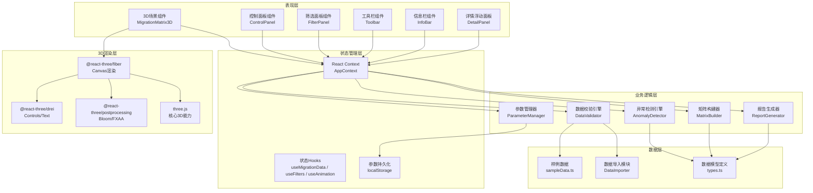
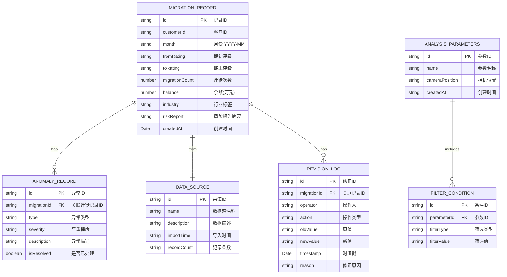

## 1. 架构设计



---

## 2. 技术描述

### 2.1 核心技术栈
- **前端框架**：React@18.2.0 + TypeScript@5.3.0
- **构建工具**：Vite@5.0.0
- **样式方案**：TailwindCSS@3.4.0
- **3D渲染**：
  - three@0.160.0（核心WebGL渲染引擎）
  - @react-three/fiber@8.15.0（React声明式Three.js封装）
  - @react-three/drei@9.92.0（常用3D组件库）
  - @react-three/postprocessing@2.15.0（后处理效果）
- **数据可视化**：recharts@2.10.0（详情面板图表）
- **图标库**：@fortawesome/fontawesome-svg-core@6.5.0 + @fortawesome/free-solid-svg-icons@6.5.0

### 2.2 技术选型理由
- **React + TypeScript**：保证组件化开发质量，类型安全降低维护成本
- **TailwindCSS**：快速构建专业UI，支持深色主题定制
- **@react-three/fiber**：声明式3D开发，与React生态无缝集成，便于状态管理
- **@react-three/drei**：提供开箱即用的OrbitControls、Text等组件，避免重复造轮子
- **后处理效果**：Bloom泛光增强异常高亮视觉效果，FXAA保证画面平滑

### 2.3 初始化方式
使用 `npm create vite@latest` 初始化React+TypeScript项目，手动安装上述依赖。

### 2.4 数据持久化
- **参数保存**：使用 localStorage 存储用户配置（视图角度、筛选条件、权重设置）
- **数据导入**：支持本地CSV/JSON文件导入，纯前端处理，不依赖后端
- **报告导出**：前端生成HTML/PDF格式报告，支持下载保存

---

## 3. 目录结构与路由定义

### 3.1 目录结构
```
src/
├── components/
│   ├── ThreeD/
│   │   ├── MigrationMatrix3D.tsx    # 3D矩阵主组件
│   │   ├── CubeInstance.tsx         # 立方体实例组件
│   │   ├── AxisLabels.tsx           # 坐标轴标签
│   │   └── FlowLines.tsx            # 迁徙流向线
│   ├── ControlPanel/
│   │   ├── TimelinePlayer.tsx       # 时间轴播放器
│   │   └── PlaybackControls.tsx     # 播放控制按钮
│   ├── FilterPanel/
│   │   ├── IndustryFilter.tsx       # 行业筛选
│   │   ├── BalanceSlider.tsx        # 余额区间滑块
│   │   └── MigrationRange.tsx       # 迁徙次数范围
│   ├── Toolbar/
│   │   ├── TopToolbar.tsx           # 顶部工具栏
│   │   └── ActionButtons.tsx        # 操作按钮组
│   ├── InfoBar/
│   │   ├── BottomInfoBar.tsx        # 底部信息栏
│   │   ├── DataSourceBadge.tsx      # 数据来源标签
│   │   ├── RevisionTrail.tsx        # 修正痕迹
│   │   └── AnomalyBadge.tsx         # 异常提示徽章
│   └── DetailPanel/
│       ├── FloatingDetail.tsx       # 浮动详情面板
│       ├── MigrationStats.tsx       # 迁徙统计
│       ├── IndustryChart.tsx        # 行业分布图
│       └── RiskReport.tsx           # 风险报告摘要
├── hooks/
│   ├── useMigrationData.ts          # 迁徙数据管理Hook
│   ├── useFilters.ts                # 筛选条件Hook
│   ├── useAnimation.ts              # 动画控制Hook
│   └── useAnomalyDetection.ts       # 异常检测Hook
├── services/
│   ├── DataValidator.ts             # 数据校验引擎
│   ├── AnomalyDetector.ts           # 异常检测引擎
│   ├── MatrixBuilder.ts             # 矩阵构建器
│   ├── ReportGenerator.ts           # 报告生成器
│   ├── ParameterManager.ts          # 参数管理器
│   └── DataImporter.ts              # 数据导入模块
├── store/
│   └── AppContext.tsx               # 全局状态Context
├── types/
│   └── index.ts                     # TypeScript类型定义
├── data/
│   └── sampleData.ts                # 内置样例数据
├── utils/
│   ├── colorMapping.ts              # 颜色映射工具
│   ├── ratingUtils.ts               # 评级计算工具
│   └── exportUtils.ts               # 导出工具函数
├── App.tsx
├── main.tsx
└── index.css
```

### 3.2 路由定义

| 路由 | 页面/组件 | 用途 |
|------|-----------|------|
| `/` | `App.tsx` | 主分析页面，包含所有功能模块 |

> 本项目为单页应用(SPA)，所有功能集成在主页面中，通过组件化组织而非多页面路由。

---

## 4. 核心数据模型

### 4.1 数据模型ER图



### 4.2 核心TypeScript类型定义

```typescript
// 评级等级枚举
export type RatingLevel = 'AAA' | 'AA' | 'A' | 'BBB' | 'BB' | 'B' | 'CCC' | 'CC' | 'C' | 'D';

// 行业类型
export type IndustryType = 
  | '制造业' 
  | '金融业' 
  | '房地产业' 
  | '批发零售业' 
  | '交通运输业' 
  | '信息技术业' 
  | '其他';

// 异常类型
export type AnomalyType = 
  | 'LOW_SAMPLE' 
  | 'DUPLICATE_BALANCE' 
  | 'INVALID_FILTER' 
  | 'NEGATIVE_BALANCE'
  | 'INVALID_MIGRATION_COUNT'
  | 'MISSING_INDUSTRY';

// 迁徙记录
export interface MigrationRecord {
  id: string;
  customerId: string;
  month: string;
  fromRating: RatingLevel;
  toRating: RatingLevel;
  migrationCount: number;
  balance: number;
  industry: IndustryType | '';
  riskReport: string;
  createdAt: string;
  dataSourceId: string;
  anomalies: AnomalyRecord[];
  revisions: RevisionLog[];
}

// 异常记录
export interface AnomalyRecord {
  id: string;
  migrationId: string;
  type: AnomalyType;
  severity: 'warning' | 'error';
  description: string;
  isResolved: boolean;
}

// 修正日志
export interface RevisionLog {
  id: string;
  migrationId: string;
  operator: string;
  action: 'create' | 'update' | 'delete' | 'deduplicate';
  field: string;
  oldValue: string;
  newValue: string;
  timestamp: string;
  reason: string;
}

// 数据源
export interface DataSource {
  id: string;
  name: string;
  description: string;
  importTime: string;
  recordCount: number;
}

// 分析参数
export interface AnalysisParameters {
  id: string;
  name: string;
  createdAt: string;
  cameraPosition: { x: number; y: number; z: number };
  cameraTarget: { x: number; y: number; z: number };
  filters: FilterConditions;
  balanceWeightEnabled: boolean;
  showAnomalies: boolean;
  playbackSpeed: number;
  currentMonth: string;
}

// 筛选条件
export interface FilterConditions {
  industries: IndustryType[];
  balanceMin: number;
  balanceMax: number;
  migrationCountMin: number;
  migrationCountMax: number;
  ratings: RatingLevel[];
}

// 矩阵立方体数据
export interface MatrixCubeData {
  x: number; // 期初评级索引
  y: number; // 期末评级索引
  z: number; // 时间索引
  fromRating: RatingLevel;
  toRating: RatingLevel;
  month: string;
  count: number;
  totalBalance: number;
  avgBalance: number;
  records: MigrationRecord[];
  anomalies: AnomalyRecord[];
  isFiltered: boolean;
}
```

---

## 5. 关键算法与逻辑

### 5.1 评级等级映射
```typescript
// 评级顺序（风险从低到高）
export const RATING_ORDER: RatingLevel[] = ['AAA', 'AA', 'A', 'BBB', 'BB', 'B', 'CCC', 'CC', 'C', 'D'];

// 获取评级索引（0-9）
export const getRatingIndex = (rating: RatingLevel): number => RATING_ORDER.indexOf(rating);

// 计算迁徙方向：正数=向下迁徙（风险升高），负数=向上迁徙（风险降低）
export const getMigrationDirection = (from: RatingLevel, to: RatingLevel): number => {
  return getRatingIndex(to) - getRatingIndex(from);
};
```

### 5.2 异常检测算法
```typescript
// 低样本检测
export const detectLowSample = (records: MigrationRecord[], threshold = 5): AnomalyRecord[] => {
  const ratingCounts = records.reduce((acc, r) => {
    acc[r.fromRating] = (acc[r.fromRating] || 0) + 1;
    acc[r.toRating] = (acc[r.toRating] || 0) + 1;
    return acc;
  }, {} as Record<RatingLevel, number>);
  
  return Object.entries(ratingCounts)
    .filter(([_, count]) => count < threshold)
    .map(([rating]) => ({
      id: `low-sample-${rating}`,
      migrationId: '',
      type: 'LOW_SAMPLE',
      severity: 'warning',
      description: `评级${rating}样本量不足${threshold}，统计结果可能存在偏差`,
      isResolved: false,
    }));
};

// 余额重复检测
export const detectDuplicateBalance = (records: MigrationRecord[]): AnomalyRecord[] => {
  const duplicates = records.filter((record, index) => 
    records.some((other, otherIndex) => 
      index !== otherIndex &&
      other.customerId === record.customerId &&
      other.month === record.month &&
      other.balance === record.balance
    )
  );
  
  return duplicates.map(record => ({
    id: `dup-${record.id}`,
    migrationId: record.id,
    type: 'DUPLICATE_BALANCE',
    severity: 'warning',
    description: `同一客户同一月份存在余额重复记录`,
    isResolved: false,
  }));
};
```

### 5.3 风险颜色映射算法
```typescript
export const getMigrationColor = (fromRating: RatingLevel, toRating: RatingLevel): string => {
  const direction = getMigrationDirection(fromRating, toRating);
  const colors: Record<number, string> = {
    [-3]: '#10b981', // 大幅向上迁徙 - 亮绿
    [-2]: '#34d399', // 向上迁徙 - 绿
    [-1]: '#6ee7b7', // 轻微向上 - 浅绿
    [0]: '#60a5fa',  // 维持不变 - 蓝
    [1]: '#fbbf24',  // 轻微向下 - 浅黄
    [2]: '#f97316',  // 向下迁徙 - 橙
    [3]: '#ef4444',  // 大幅向下迁徙 - 红
  };
  
  // 超过3级的极端迁徙
  if (direction <= -4) return '#059669';
  if (direction >= 4) return '#dc2626';
  
  return colors[direction] || '#6b7280';
};
```

### 5.4 余额权重算法
```typescript
// 计算立方体大小（考虑余额权重）
export const calculateCubeScale = (
  count: number,
  totalBalance: number,
  balanceWeightEnabled: boolean,
  maxCount: number,
  maxBalance: number
): number => {
  const countFactor = count / maxCount;
  
  if (!balanceWeightEnabled) {
    return 0.3 + countFactor * 0.7; // 0.3 ~ 1.0
  }
  
  const balanceFactor = totalBalance / maxBalance;
  const weightedFactor = countFactor * 0.6 + balanceFactor * 0.4;
  return 0.3 + weightedFactor * 0.7;
};
```

---

## 6. 性能优化策略

### 6.1 3D渲染优化
- **InstancedMesh**：使用实例化网格渲染大量立方体，减少Draw Call
- **视锥体剔除**：Three.js内置，只渲染相机可见范围内的对象
- **LOD（细节层次）**：远处立方体降低几何体精度
- **按需渲染**：仅在相机移动、动画播放时触发重渲染

### 6.2 数据处理优化
- **Web Worker**：数据校验和异常检测在Web Worker中进行，避免阻塞UI
- **数据缓存**：计算结果缓存，筛选条件变化时增量更新
- **虚拟列表**：详情面板中的记录列表使用虚拟滚动

### 6.3 状态管理优化
- **状态分片**：按功能模块拆分Context，避免不必要的重渲染
- **useMemo/useCallback**：合理使用缓存计算结果和回调函数
- **选择器模式**：使用useSelector精确订阅需要的状态

---

## 7. 安全与数据隐私

### 7.1 数据安全
- **纯前端处理**：所有数据导入、分析、导出均在浏览器本地完成，不上传服务器
- **数据清理**：提供数据清除功能，一键清除本地存储的所有数据
- **敏感信息脱敏**：导出报告时可选择对客户ID等敏感信息进行脱敏处理

### 7.2 参数安全
- **参数校验**：加载保存的参数时进行完整性校验，防止恶意篡改
- **版本控制**：参数格式包含版本号，便于后续升级兼容
