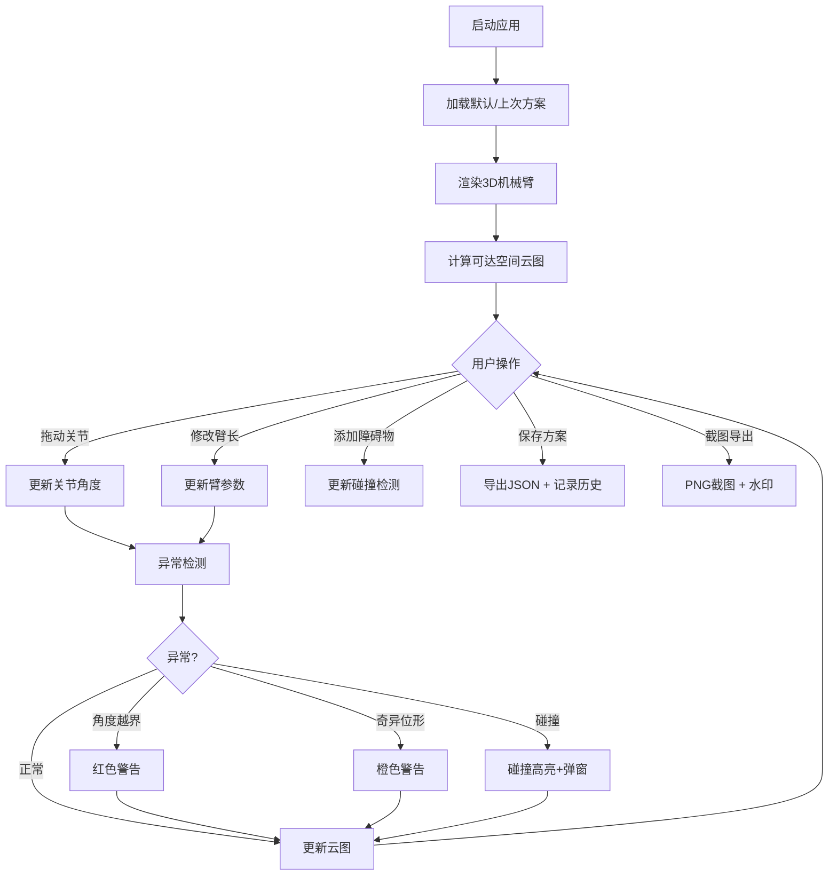

## 1. 产品概述

机械臂工作空间交互式可视化教学工具，面向机器人课程师生。通过3D交互场景，让学生直观理解机械臂可达空间、关节限制、奇异位形和碰撞检测等核心概念，彻底告别表格与截图拼接的低效方式。

- 解决传统教学中"靠表格和截图拼凑"机械臂可达空间的问题，提供实时交互式3D可视化
- 目标用户：机器人课程教师（演示）与学生（实验），价值在于让抽象的运动学概念可见、可操作、可验证

## 2. 核心功能

### 2.1 用户角色

| 角色 | 使用方式 | 核心权限 |
|------|----------|----------|
| 教师 | 打开即用 | 配置参数、演示、导出实验截图、保存/加载方案 |
| 学生 | 打开即用 | 拖动关节、观察可达空间、碰撞检测、截图导出 |

### 2.2 功能模块

1. **工作台页面**：3D机械臂场景、关节参数面板、可达云图、碰撞/安全区、异常提示、参数保存/加载、截图导出、历史记录

### 2.3 页面详情

| 页面名称 | 模块名称 | 功能描述 |
|----------|----------|----------|
| 工作台 | 3D机械臂场景 | 多关节机械臂3D模型，支持拖动关节滑块实时改变角度，关节角度限位可视化 |
| 工作台 | 可达空间云图 | 蒙特卡洛采样生成可达空间点云，参数变化时实时重新计算，点云颜色按距离/可达性渐变 |
| 工作台 | 碰撞检测与安全区 | 支持添加障碍物（球体/立方体），安全区边界可视化，碰撞时高亮+弹窗提示 |
| 工作台 | 异常提示系统 | 角度越界（红色警告+限位标记）、奇异位形（橙色警告+Jacobian行列式≈0标识）、碰撞未提示绝不允许 |
| 工作台 | 参数面板 | 各关节角度滑块、臂长输入、关节限位设置，参数变更来源标注（手动/自动/修正） |
| 工作台 | 参数保存/加载 | 方案保存为JSON文件，加载时校验数据一致性，历史修正痕迹保留 |
| 工作台 | 历史记录面板 | 每次参数修改记录时间戳+来源+变更内容，支持回退到任意历史状态 |
| 工作台 | 截图导出 | 场景截图（PNG），含时间戳+当前参数水印，导出文件名含实验信息 |

## 3. 核心流程

1. 用户打开工具 → 看到默认3关节机械臂 + 默认可达云图
2. 拖动关节角度滑块 / 修改臂长 → 机械臂实时变形 → 可达云图实时更新 → 异常自动检测提示
3. 添加障碍物/安全区 → 碰撞检测生效 → 碰撞时末端/臂段高亮 + 弹窗警告
4. 调整参数满意后 → 保存方案（JSON）→ 记录历史修正
5. 导出截图 → PNG含水印参数信息

## 4. 用户界面设计

### 4.1 设计风格

- **主色调**：深色科技风 — 深蓝灰底色 (#0a0f1e)，青色强调 (#00e5ff)，橙色警告 (#ff9100)，红色危险 (#ff1744)
- **按钮风格**：圆角胶囊按钮，微光晕效果，hover时发光加强
- **字体**：JetBrains Mono（数据/参数）+ Source Han Sans（中文UI）
- **布局**：左侧3D场景占主体（~70%），右侧参数/历史面板（~30%），底部状态栏
- **图标风格**：线性图标（lucide-react），科技感

### 4.2 页面设计概览

| 页面名称 | 模块名称 | UI元素 |
|----------|----------|--------|
| 工作台 | 3D场景区 | 深色背景，网格地面，机械臂金属质感渲染，关节处发光圆环标识，可达云图半透明点云 |
| 工作台 | 参数面板 | 暗色卡片，关节角度滑块（带限位色条），臂长输入框，参数来源标签 |
| 工作台 | 异常提示栏 | 顶部浮层，红/橙/黄分级警告条，含图标+文字+关闭按钮 |
| 工作台 | 历史记录 | 时间线列表，每条含时间戳+变更摘要+来源标签，点击可回退 |
| 工作台 | 工具栏 | 保存/加载/截图/重置按钮，胶囊形，图标+文字 |

### 4.3 响应式设计

- 桌面优先设计，最小支持1280px宽度
- 3D场景区域自适应缩放
- 参数面板可折叠/展开

### 4.4 3D场景指导

- **环境**：深色空间感背景，微弱网格地面，环境光+方向光
- **光照**：主方向光（偏暖白），环境光（冷蓝调），关节处点光源（青色）
- **相机**：透视相机，默认45度俯视角，OrbitControls支持旋转/缩放/平移
- **机械臂材质**：金属质感（MeshStandardMaterial, metalness:0.8, roughness:0.3）
- **可达云图**：半透明点云，颜色按到基座距离从青→蓝渐变
- **障碍物**：半透明红色/橙色几何体
- **安全区**：半透明绿色球体/圆柱
- **交互**：关节处高亮环标识可拖动，hover时关节环变亮变大
