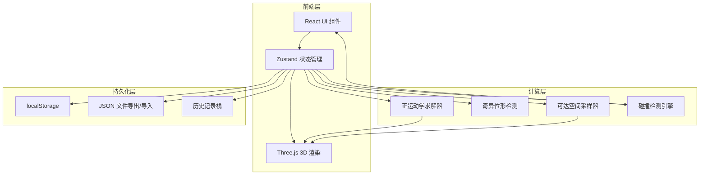

## 1. 架构设计



## 2. 技术说明

- **前端框架**：React 18 + TypeScript + Vite
- **3D渲染**：Three.js + @react-three/fiber + @react-three/drei
- **状态管理**：Zustand（含persist中间件自动持久化到localStorage）
- **UI样式**：Tailwind CSS 3
- **图标**：lucide-react
- **后端**：无（纯前端，数据持久化通过localStorage + JSON文件导入导出）
- **数据库**：无（使用localStorage + 文件系统）

## 3. 路由定义

| 路由 | 用途 |
|------|------|
| / | 工作台主页面（3D场景+参数面板+历史记录） |

## 4. 核心模块设计

### 4.1 正运动学求解器（FK Solver）

- 输入：各关节角度 θ₁...θₙ、各臂长 L₁...Lₙ
- 输出：各关节位置坐标、末端执行器位置
- 算法：DH参数法，逐关节累积变换矩阵
- 支持2-6自由度机械臂

### 4.2 奇异位形检测（Singularity Detector）

- 计算Jacobian矩阵
- 检测行列式绝对值 < 阈值（默认0.01）
- 阈值可配置
- 检测到奇异位形时：返回警告信息+当前Jacobian行列式值

### 4.3 可达空间采样器（Workspace Sampler）

- 蒙特卡洛采样：在各关节角度范围内随机采样N个配置（默认10000点）
- 对每个配置计算末端位置
- 支持增量采样（参数变化时不全部重新计算，而是标记脏后延迟重算）
- 点云颜色按到基座距离渐变

### 4.4 碰撞检测引擎（Collision Detector）

- 支持障碍物类型：球体、立方体
- 支持安全区类型：球体、圆柱体
- 检测方法：机械臂各段（圆柱近似）与障碍物几何体相交测试
- 碰撞结果：返回碰撞的臂段索引+碰撞类型（障碍物/安全区越界）

### 4.5 异常提示系统

| 异常类型 | 检测条件 | 提示级别 | 视觉反馈 |
|----------|----------|----------|----------|
| 角度越界 | θ < θmin 或 θ > θmax | 🔴 危险 | 关节环变红，滑块限位区变红，弹窗 |
| 奇异位形 | |det(J)| < ε | 🟠 警告 | 末端环变橙，状态栏警告 |
| 碰撞 | 臂段与障碍物相交 | 🔴 危险 | 碰撞臂段高亮红色，弹窗 |
| 安全区越界 | 末端超出安全区 | 🟡 提醒 | 安全区边界闪烁 |

## 5. 数据模型

### 5.1 核心数据结构

```typescript
interface JointConfig {
  id: number
  angle: number
  minAngle: number
  maxAngle: number
  length: number
}

interface RobotArm {
  joints: JointConfig[]
  basePosition: [number, number, number]
}

interface Obstacle {
  id: string
  type: "sphere" | "box"
  position: [number, number, number]
  size: number | [number, number, number]
  color: string
}

interface SafetyZone {
  id: string
  type: "sphere" | "cylinder"
  position: [number, number, number]
  size: number | [number, number, number]
}

interface Warning {
  type: "angle_limit" | "singularity" | "collision" | "safety_zone"
  severity: "danger" | "warning" | "info"
  message: string
  sourceJoint?: number
  jacobianDet?: number
  timestamp: number
}

interface HistoryEntry {
  id: string
  timestamp: number
  source: "manual" | "load" | "correction" | "reset"
  description: string
  snapshot: RobotArm
  warnings: Warning[]
}

interface ProjectState {
  arm: RobotArm
  obstacles: Obstacle[]
  safetyZones: SafetyZone[]
  warnings: Warning[]
  history: HistoryEntry[]
  workspacePoints: [number, number, number][]
}
```

### 5.2 持久化策略

- Zustand persist中间件自动将完整ProjectState存入localStorage
- 每次参数变更自动保存，含时间戳和来源标注
- JSON导出格式与localStorage格式一致，加载时校验字段完整性
- 历史记录栈上限100条，超出时FIFO淘汰

## 6. 项目目录结构

```
src/
├── components/
│   ├── scene/          # 3D场景相关组件
│   │   ├── ArmModel.tsx        # 机械臂3D模型
│   │   ├── WorkspaceCloud.tsx  # 可达空间点云
│   │   ├── ObstacleMesh.tsx    # 障碍物3D渲染
│   │   ├── SafetyZoneMesh.tsx  # 安全区3D渲染
│   │   └── SceneCanvas.tsx     # Three.js画布容器
│   ├── panel/          # 右侧面板组件
│   │   ├── JointControl.tsx    # 关节参数控制
│   │   ├── ObstaclePanel.tsx   # 障碍物管理
│   │   ├── HistoryPanel.tsx    # 历史记录面板
│   │   └── Toolbar.tsx         # 工具栏
│   └── ui/             # 通用UI组件
│       ├── WarningBar.tsx      # 异常提示条
│       └── Slider.tsx         # 自定义滑块
├── hooks/
│   ├── useForwardKinematics.ts # 正运动学hook
│   ├── useSingularity.ts      # 奇异位形检测hook
│   ├── useCollisionDetection.ts # 碰撞检测hook
│   └── useWorkspaceSampler.ts  # 可达空间采样hook
├── store/
│   └── useRobotStore.ts       # Zustand全局状态
├── utils/
│   ├── kinematics.ts          # 运动学计算
│   ├── collision.ts           # 碰撞检测算法
│   ├── screenshot.ts          # 截图导出
│   └── exportImport.ts        # JSON导入导出
├── pages/
│   └── Workbench.tsx          # 工作台主页面
├── App.tsx
└── main.tsx
```
