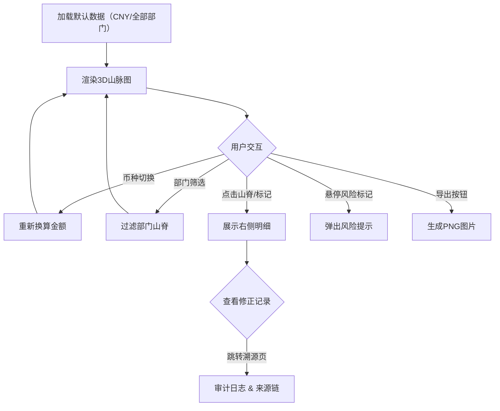

## 1. 产品概述
"现金流期限山脉"是一款面向CFO的交互式3D可视化工具，将未来收付款期限按部门和币种呈现为3D山脉图，帮助决策者直观识别资金压力区域与风险点，解决日期错位、币种未换算、低置信度数据混入等反复出错的问题。

## 2. 核心功能

### 2.1 用户角色
| 角色 | 注册方式 | 核心权限 |
|------|----------|----------|
| CFO / 财务主管 | 系统内分配 | 全部视图、筛选、导出、修正审核 |
| 财务分析师 | 系统内分配 | 查看、筛选、导出、提交修正建议 |

### 2.2 功能模块
1. **主视图页**：3D山脉图、部门/币种筛选面板、风险标记叠加、右侧明细面板
2. **数据溯源页**：审计日志、修正痕迹时间线、来源追溯

### 2.3 页面详情
| 页面名称 | 模块名称 | 功能描述 |
|----------|----------|----------|
| 主视图页 | 3D山脉画布 | Three.js渲染的3D山脉图，X轴=时间期限，Z轴=部门，Y轴=资金金额；支持旋转、缩放、拖拽；悬停显示数据点信息 |
| 主视图页 | 币种切换栏 | 顶部币种选择器，切换后3D视图与明细面板同步换算到目标币种；未换算数据标红警告 |
| 主视图页 | 部门筛选面板 | 左侧部门多选列表，勾选后3D山脉仅显示对应部门山脊，明细同步过滤 |
| 主视图页 | 风险标记层 | 山脉上叠加日期错位（红色闪烁）、低置信度（黄色半透明）、币种未换算（橙色边框）标记 |
| 主视图页 | 右侧明细面板 | 展示选中区域/数据点的收付款计划、来源、置信度、修正历史；与3D视图双向联动 |
| 主视图页 | 图片导出按钮 | 将当前3D视图（含标记）导出为PNG |
| 数据溯源页 | 审计日志表 | 按时间倒序展示所有数据修正记录，含修正人、修正字段、原始值、新值、修正原因 |
| 数据溯源页 | 来源追溯链 | 每条数据展示来源（收款计划/付款计划/资金报告）、置信度、是否经币种换算、关联修正 |
| 数据溯源页 | 一致性校验 | 自动检测数字/状态前后不一致，高亮冲突行 |

## 3. 核心流程

用户打开系统后，3D山脉图加载默认币种（CNY）和全部部门的收付款期限数据。用户可通过币种切换、部门筛选交互调整视图，山脉形态实时更新。点击山脊区域或风险标记，右侧明细面板展示对应数据详情与修正记录。发现异常时，系统自动检测并标出日期错位、币种未换算、低置信度数据。用户可进入数据溯源页查看完整审计链，也可导出当前视图为图片。

## 4. 用户界面设计

### 4.1 设计风格
- 主色调：深蓝灰（#1a1f36）背景 + 冰蓝（#4fc3f7）山脉高光 + 琥珀橙（#ff9800）风险强调
- 辅助色：翡翠绿（#4caf50）正常状态、警示红（#ef5350）日期错位、柠檬黄（#fdd835）低置信度
- 按钮风格：圆角8px，悬停渐变，3D山脉主题微光泽
- 字体：DM Sans（UI）+ JetBrains Mono（数字）
- 布局：左侧窄筛选面板 + 中央大3D画布 + 右侧可折叠明细面板
- 图标：lucide-react 图标库

### 4.2 页面设计概览
| 页面名称 | 模块名称 | UI元素 |
|----------|----------|--------|
| 主视图页 | 3D山脉画布 | 深色背景、冰蓝渐变山脉、红色/黄色/橙色风险标记叠层、悬停tooltip |
| 主视图页 | 币种切换栏 | 顶部pill按钮组，选中态冰蓝填充，未换算币种橙色边框 |
| 主视图页 | 部门筛选面板 | 左侧垂直列表，复选框+部门名+色条，可搜索 |
| 主视图页 | 右侧明细面板 | 卡片式布局，数据来源标签、置信度进度条、修正记录时间线、联动高亮 |
| 主视图页 | 图片导出按钮 | 右上角相机图标按钮，点击后toast提示"已导出" |
| 数据溯源页 | 审计日志表 | 斑马纹表格，红点标记冲突行，展开行显示修正详情 |
| 数据溯源页 | 来源追溯链 | 纵向时间线，节点标注来源系统与置信度，连线标注换算状态 |

### 4.3 响应式
- 桌面优先设计，3D画布最小宽度800px
- 平板：筛选面板折叠为底部抽屉，明细面板全屏覆盖
- 不支持手机端3D交互

### 4.4 3D场景指引
- 环境：深空夜景HDRI，微弱星空粒子
- 灯光：方向光（冰蓝冷光）+ 环境光（暗蓝），山脊顶部高光
- 相机：透视相机，默认45度俯角，OrbitControls旋转/缩放
- 构图：山脉居中，X轴时间刻度标注于地面，Z轴部门标签浮动
- 交互：OrbitControls拖拽旋转、滚轮缩放、raycaster点击选中
- 后处理：泛光（Bloom）效果增强山脉高光，低置信度区域半透明抖动
