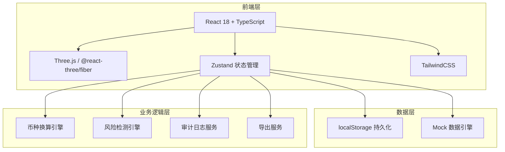
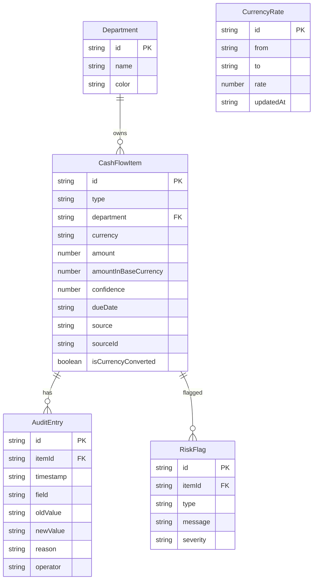

## 1. 架构设计



## 2. 技术说明
- 前端：React@18 + TypeScript + TailwindCSS@3 + Vite
- 初始化工具：vite-init（react-ts 模板）
- 3D渲染：three + @react-three/fiber + @react-three/drei + @react-three/postprocessing
- 状态管理：Zustand（含 persist 中间件实现 localStorage 持久化）
- 后端：无（纯前端，数据通过 mock 引擎生成，审计日志持久化到 localStorage）
- 数据库：无（localStorage 代替）

## 3. 路由定义
| 路由 | 用途 |
|------|------|
| / | 主视图页：3D山脉图、筛选、明细、风险标记 |
| /audit | 数据溯源页：审计日志、来源追溯、一致性校验 |

## 4. API定义
无后端API。所有数据通过前端 mock 引擎生成，状态通过 Zustand store 管理。

### 4.1 核心 TypeScript 类型

```typescript
interface CashFlowItem {
  id: string
  type: "receipt" | "payment"
  department: string
  currency: string
  amount: number
  amountInBaseCurrency: number | null
  confidence: number
  dueDate: string
  source: "collection_plan" | "payment_plan" | "fund_report"
  sourceId: string
  isCurrencyConverted: boolean
  auditTrail: AuditEntry[]
}

interface AuditEntry {
  id: string
  timestamp: string
  field: string
  oldValue: string | number | null
  newValue: string | number | null
  reason: string
  operator: string
}

interface RiskFlag {
  type: "date_misalignment" | "currency_unconverted" | "low_confidence"
  itemId: string
  message: string
  severity: "critical" | "warning" | "info"
}

interface Department {
  id: string
  name: string
  color: string
}

interface CurrencyRate {
  from: string
  to: string
  rate: number
  updatedAt: string
}
```

## 5. 数据模型

### 5.1 数据模型定义



### 5.2 Mock 数据结构
- 5个部门：销售部、采购部、研发部、市场部、运营部
- 4种币种：CNY、USD、EUR、JPY
- 60条收付款计划（跨越未来12个月）
- 部分数据刻意设置日期错位、币种未换算、低置信度（<0.6）以触发风险标记
