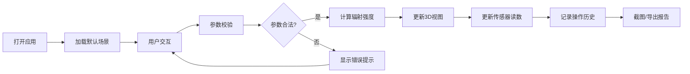

## 1. 产品概述

热辐射视角演示是一款面向物理科普教育的交互式3D可视化工具，通过直观的拖拽操作和实时数据反馈，帮助用户理解距离、辐射面积和热源温度对热辐射强度的影响规律。

- 核心价值：将抽象的热辐射物理公式转化为可交互的3D可视化场景，降低科普讲解门槛
- 目标用户：科普讲解员、物理教师、学生及对物理现象感兴趣的公众
- 解决痛点：传统静态图片/公式难以直观展示多参数联动效应，缺乏实时反馈和错误警示

## 2. 核心功能

### 2.1 用户角色

| 角色 | 注册方式 | 核心权限 |
|------|----------|----------|
| 科普讲解员 | 无需注册 | 完整操作权限、参数调整、截图导出、生成演示报告 |
| 学习者 | 无需注册 | 场景浏览、参数交互、查看传感器读数 |

### 2.2 功能模块

1. **主交互页面**：3D场景视图、参数控制面板、传感器读数面板
2. **演示报告模块**：历史操作记录、修正痕迹、数据来源标注
3. **导出模块**：场景截图、参数快照、报告导出

### 2.3 页面详情

| 页面名称 | 模块名称 | 功能描述 |
|----------|----------|----------|
| 主交互页 | 3D热辐射场景 | 可拖拽的热源模型、辐射场可视化、传感器放置、实时交互 |
| 主交互页 | 参数控制面板 | 温度(°C/K/°F切换)、辐射面积、距离滑块+数值输入、材料选择 |
| 主交互页 | 传感器读数面板 | 实时辐射强度值、温度读数、距离显示、计算过程追溯 |
| 主交互页 | 错误警示系统 | 温度单位错误提示、距离为零保护、色阶失真检测与修正建议 |
| 演示报告页 | 操作历史 | 完整操作轨迹、每次参数修改的时间戳、修正前后对比 |
| 演示报告页 | 数据来源 | 热源参数来源、温度标准、传感器规格标注 |
| 演示报告页 | 截图导出 | 一键捕获当前3D场景+参数面板，保存为PNG |

## 3. 核心过程

用户打开应用 → 默认加载标准演示场景（热源+传感器+基准参数）→ 拖拽热源/传感器调整距离 → 调整温度/面积参数 → 实时查看辐射场变化和传感器读数 → 系统自动检测边界错误并提示 → 确认参数无误后可截图保存 → 切换到报告页查看完整操作历史和修正痕迹 → 导出演示报告

## 4. 用户界面设计

### 4.1 设计风格

- **主色调**：深空蓝(#0a0e1a)为背景，营造宇宙级热辐射沉浸感
- **强调色**：热源橙红渐变(#ff4500 → #ff8c00)，辐射场蓝紫渐变(#4169e1 → #9932cc)
- **警示色**：亮黄(#ffd700)警告、亮红(#ff1744)错误、翠绿(#00e676)正常
- **字体**：展示字体-Orbitron（科技感），正文字体-JetBrains Mono（精确数字显示）
- **布局**：三栏式布局，左侧参数面板、中间3D场景、右侧传感器读数
- **视觉效果**：辉光效果、粒子系统、扫描线、数据噪点，增强科学可视化质感

### 4.2 页面设计概览

| 页面名称 | 模块名称 | UI元素 |
|----------|----------|--------|
| 主交互页 | 3D场景区 | 发光热源球体、半透明辐射场同心球、可拖拽传感器立方体、坐标网格、测量标尺 |
| 主交互页 | 参数面板 | 分段滑块、单位切换按钮组、数值输入框、材料下拉选择、实时校验图标 |
| 主交互页 | 读数面板 | 大字号数字显示、单位标注、公式展示、计算过程展开、状态指示灯 |
| 演示报告页 | 历史记录 | 时间轴列表、参数变更diff高亮、修正痕迹标签、数据来源角标 |
| 演示报告页 | 截图墙 | 缩略图网格、时间戳、参数快照、导出按钮 |

### 4.3 响应式设计

- 桌面端：三栏并列布局，3D场景占60%宽度
- 平板端：上下布局，3D场景居上，面板堆叠于下方
- 移动端：单页滚动，简化交互，保留核心参数调节和读数

### 4.4 3D场景指导

- **环境**：深空背景+微弱星点，营造沉浸式物理实验环境
- **光照**：仅靠热源自身发光，禁用环境光，突出辐射场可视化效果
- **相机**：透视相机，初始俯视角45°，支持轨道控制、缩放、平移
- **辐射场**：5层同心半透明球体，根据强度使用不同透明度和颜色
- **交互**：热源和传感器均可拖拽，拖拽时显示连接线和实时距离
- **后处理**：Bloom辉光效果突出热源，轻微色差增强科技感，FXAA抗锯齿
- **性能**：使用InstancedMesh渲染辐射场粒子，目标帧率60fps
