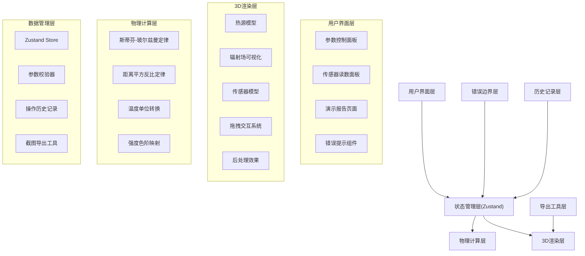
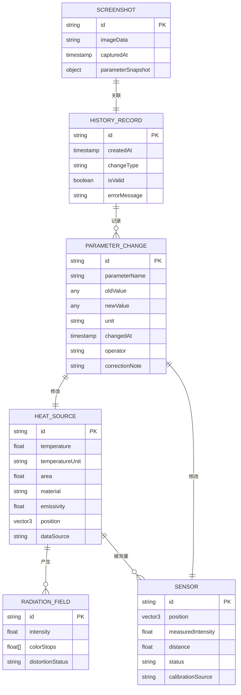

## 1. 架构设计



## 2. 技术描述

- **前端框架**: React 18 + TypeScript
- **构建工具**: Vite 5
- **样式方案**: TailwindCSS 3 + CSS Variables
- **状态管理**: Zustand 4
- **3D渲染**: Three.js 0.160
- **React Three Fiber**: @react-three/fiber 8
- **3D工具库**: @react-three/drei 9
- **后处理**: @react-three/postprocessing 2
- **路由**: React Router DOM 6
- **图标**: Lucide React
- **导出**: html2canvas
- **数据源**: 内置物理常数 + 材料参数Mock数据

## 3. 路由定义

| 路由 | 页面 | 用途 |
|------|------|------|
| `/` | 主交互页 | 3D场景 + 参数控制 + 传感器读数 |
| `/report` | 演示报告页 | 操作历史 + 修正痕迹 + 截图导出 |

## 4. 数据模型

### 4.1 数据模型ER图



### 4.2 TypeScript 类型定义

```typescript
// 温度单位
type TemperatureUnit = 'celsius' | 'kelvin' | 'fahrenheit';

// 材料类型
interface Material {
  id: string;
  name: string;
  emissivity: number; // 发射率 0-1
  dataSource: string; // 数据来源
}

// 热源
interface HeatSource {
  id: string;
  temperature: number;
  temperatureUnit: TemperatureUnit;
  area: number; // m²
  position: [number, number, number];
  material: Material;
  dataSource: string;
}

// 传感器
interface Sensor {
  id: string;
  position: [number, number, number];
  measuredIntensity: number; // W/m²
  distance: number; // m
  status: 'normal' | 'warning' | 'error';
  calibrationSource: string;
}

// 参数校验结果
interface ValidationResult {
  valid: boolean;
  level: 'info' | 'warning' | 'error';
  message: string;
  correction?: string;
  parameterName: string;
}

// 操作历史记录
interface HistoryRecord {
  id: string;
  timestamp: number;
  parameterName: string;
  oldValue: any;
  newValue: any;
  unit?: string;
  isValid: boolean;
  validationMessage?: string;
  operator: 'user' | 'system' | 'correction';
  correctionNote?: string;
  dataSource?: string;
}

// 截图快照
interface Snapshot {
  id: string;
  imageData: string;
  timestamp: number;
  heatSource: HeatSource;
  sensor: Sensor;
  intensity: number;
  validationResults: ValidationResult[];
}

// 应用状态
interface AppState {
  heatSource: HeatSource;
  sensor: Sensor;
  validationResults: ValidationResult[];
  history: HistoryRecord[];
  snapshots: Snapshot[];
  currentPage: 'main' | 'report';
}
```

## 5. 核心物理公式

### 5.1 斯蒂芬-玻尔兹曼定律

黑体总辐射出射度：
\[ M = \sigma T^4 \]

其中：
- \( \sigma = 5.670374419 \times 10^{-8} \, W/(m^2 \cdot K^4) \) 斯蒂芬-玻尔兹曼常数
- \( T \) 为热力学温度（开尔文 K）

考虑发射率的实际物体辐射：
\[ M = \varepsilon \sigma T^4 \]

### 5.2 距离平方反比定律

传感器位置的辐射强度：
\[ I = \frac{M \cdot A}{4 \pi r^2} = \frac{\varepsilon \sigma T^4 A}{4 \pi r^2} \]

其中：
- \( A \) 为辐射面积 (m²)
- \( r \) 为距离 (m)
- \( \varepsilon \) 为材料发射率

### 5.3 温度单位转换

摄氏度 → 开尔文：\( T(K) = T(°C) + 273.15 \)
华氏度 → 开尔文：\( T(K) = (T(°F) - 32) \times 5/9 + 273.15 \)

## 6. 错误边界处理策略

| 错误类型 | 检测条件 | 处理方式 | 提示级别 |
|----------|----------|----------|----------|
| 温度单位错误 | 转换后出现负数开尔文温度 | 阻止计算，高亮输入框，给出正确范围 | 🔴 错误 |
| 距离为零 | r ≤ 0.001m | 距离锁定为最小值0.001m，显示警告 | 🟡 警告 |
| 色阶失真 | 强度超出预设色阶映射范围10倍以上 | 自动调整色阶范围，提示用户 | 🟡 警告 |
| 面积为负 | A ≤ 0 | 阻止计算，提示面积必须为正 | 🔴 错误 |
| 发射率越界 | ε < 0 或 ε > 1 | 钳位到[0,1]范围，显示修正痕迹 | 🟡 警告 |
| 温度过高 | T > 6000K（太阳表面温度） | 警告：超出常规材料范围，计算仍进行 | 🟡 警告 |
