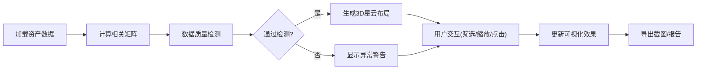

## 1. 产品概述

资产相关性星云是一个Web3D可视化工具，专为基金研究员设计，用于直观展示股票、债券、商品和币种之间的相关性网络。通过3D星云图呈现复杂的资产关联关系，支持多维度筛选、时间窗口切换和研究报告导出，帮助研究员理清资产配置的真实逻辑。

## 2. 核心功能

### 2.1 用户角色

| 角色 | 注册方式 | 核心权限 |
|------|----------|----------|
| 基金研究员 | 无需注册 | 3D可视化浏览、数据筛选、报告导出、数据修正记录 |

### 2.2 功能模块

1. **3D星云主界面**：资产节点3D渲染、相关性连线、力导向布局、视角控制
2. **数据筛选面板**：资产类型筛选、边权阈值筛选、行业标签筛选、时间窗口切换
3. **信息交互模块**：节点悬浮详情、连线信息展示、聚类高亮显示
4. **数据质量管理**：矩阵对称性检测、时间窗口校验、节点密度预警
5. **报告导出系统**：截图导出、修正痕迹记录、分类统计报告（未处理/已修正/待确认）

### 2.3 页面详情

| 页面名称 | 模块名称 | 功能描述 |
|----------|----------|----------|
| 主页面 | 3D星云画布 | Three.js渲染的3D力导向图，支持旋转、缩放、拖拽 |
| 主页面 | 左侧筛选面板 | 资产类型、相关系数阈值、时间窗口、行业标签的多维度筛选 |
| 主页面 | 右侧信息面板 | 选中节点详情、相关性分析、数据来源追踪 |
| 主页面 | 顶部工具栏 | 视角重置、自动旋转、截图导出、报告生成按钮 |
| 主页面 | 底部状态栏 | 数据质量提示、异常警告、加载状态 |
| 报告弹窗 | 导出报告 | 分类统计、修正历史、数据来源、截图预览 |

## 3. 核心流程

## 4. 用户界面设计

### 4.1 设计风格

- **主色调**：深空蓝 (#0a1628) 作为背景，霓虹青 (#00f5d4) 作为主强调色，金融金 (#ffd700) 作为数据高亮
- **辅助色**：股票红 (#ff6b6b)、债券绿 (#4ecdc4)、商品橙 (#ff9f43)、外汇紫 (#a55eea)
- **按钮风格**：微玻璃拟态，圆角8px，悬停发光效果
- **字体**：Space Mono（显示字体/数据）、Inter（正文字体）
- **布局风格**：深色科技风，左侧固定筛选面板，右侧浮动信息面板，中心3D画布
- **视觉效果**：粒子背景光晕、连线发光、节点呼吸动画

### 4.2 页面设计概述

| 页面名称 | 模块名称 | UI元素 |
|----------|----------|--------|
| 主页面 | 3D星云画布 | 深色空间背景、发光节点、半透明连线、光晕效果、粒子系统 |
| 主页面 | 左侧筛选面板 | 玻璃拟态卡片、滑块控件、下拉选择、复选框组、折叠面板 |
| 主页面 | 右侧信息面板 | 数据表格、来源标签、修正历史时间线、进度指示器 |
| 主页面 | 顶部工具栏 | 图标按钮、分割线、工具提示 |
| 主页面 | 底部状态栏 | 警告徽章、状态指示灯、统计数字 |
| 报告弹窗 | 导出报告 | 分类卡片、饼图统计、截图预览、下载按钮 |

### 4.3 响应式

- 桌面端（>1200px）：三栏布局，左右面板固定宽度
- 平板端（768-1200px）：面板可折叠，画布自适应
- 移动端（<768px）：面板转为抽屉式，简化交互

### 4.4 3D场景指引

- **环境**：深空黑色背景，微弱星空粒子，环境光+点光源组合
- **光照**：AmbientLight(0x404040, 0.5) + PointLight(0x00f5d4, 1, 100)，节点自发光材质
- **相机**：PerspectiveCamera，初始距离20，启用OrbitControls，阻尼效果
- **构图**：力导向布局自动分布节点，中心放置核心资产，外围放置边缘资产
- **交互**：节点悬停放大+高亮，点击选中详情，滚轮缩放，右键拖拽平移
- **后处理**：Bloom效果增强发光，轻微FXAA抗锯齿
- **性能**：节点数限制200以内，使用InstancedMesh优化渲染，LOD策略
