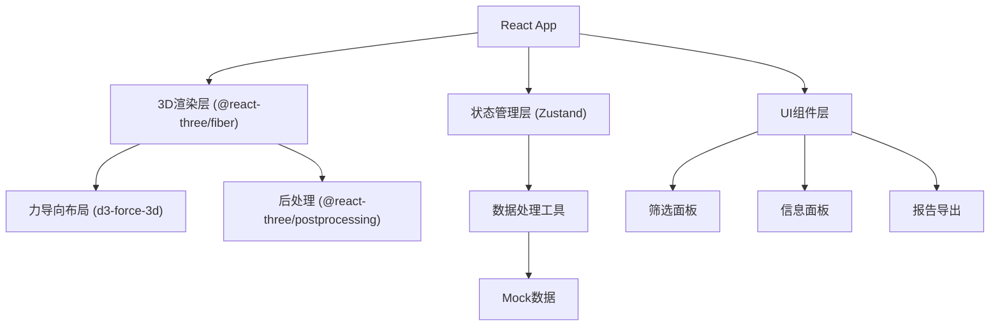
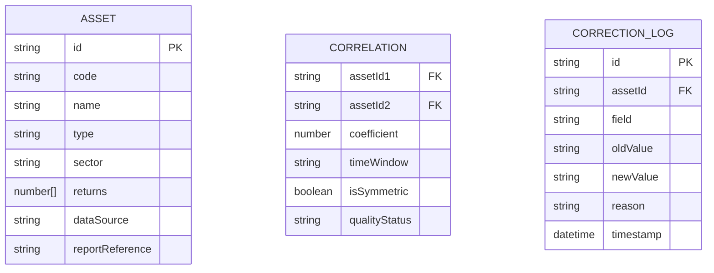

## 1. 架构设计



## 2. 技术描述

- **前端框架**: React@18 + TypeScript + Vite
- **3D引擎**: three@0.160 + @react-three/fiber@8 + @react-three/drei@9
- **后处理**: @react-three/postprocessing@2
- **力导向布局**: d3-force-3d
- **状态管理**: zustand
- **样式方案**: tailwindcss@3
- **图表库**: recharts (用于报告统计图表)
- **截图导出**: html2canvas + three.js Canvas截图
- **后端**: 无 (纯前端应用，使用Mock数据)
- **数据格式**: JSON格式资产数据，内置模拟数据集

## 3. 目录结构

```
src/
├── components/
│   ├── NebulaCanvas/        # 3D星云画布组件
│   ├── FilterPanel/         # 左侧筛选面板
│   ├── InfoPanel/           # 右侧信息面板
│   ├── Toolbar/             # 顶部工具栏
│   ├── StatusBar/           # 底部状态栏
│   └── ReportModal/         # 报告导出弹窗
├── store/
│   └── useAssetStore.ts     # Zustand状态管理
├── hooks/
│   ├── useForceLayout.ts    # 3D力导向布局hook
│   └── useDataQuality.ts    # 数据质量检测hook
├── utils/
│   ├── correlation.ts       # 相关性计算工具
│   ├── dataQuality.ts       # 数据质量检测工具
│   └── export.ts            # 导出工具
├── data/
│   └── mockAssets.ts        # Mock资产数据
├── types/
│   └── index.ts             # TypeScript类型定义
└── App.tsx                  # 主应用入口
```

## 4. 路由定义

| Route | Purpose |
|-------|---------|
| / | 主页面 - 3D星云可视化界面 |

## 5. 数据模型

### 5.1 数据模型定义



### 5.2 TypeScript类型定义

```typescript
// 资产类型
type AssetType = 'stock' | 'bond' | 'commodity' | 'currency';

// 数据质量状态
type QualityStatus = 'raw' | 'corrected' | 'pending_review';

// 时间窗口
type TimeWindow = '1m' | '3m' | '6m' | '1y' | '3y' | '5y';

// 资产数据
interface Asset {
  id: string;
  code: string;
  name: string;
  type: AssetType;
  sector: string;
  returns: Record<TimeWindow, number[]>;
  dataSource: string;
  reportReference: string;
  qualityStatus: QualityStatus;
  correctionHistory: CorrectionLog[];
}

// 相关性边
interface CorrelationEdge {
  source: string;
  target: string;
  coefficient: number;
  timeWindow: TimeWindow;
  isSymmetric: boolean;
  qualityStatus: QualityStatus;
}

// 修正记录
interface CorrectionLog {
  id: string;
  timestamp: Date;
  field: string;
  oldValue: string;
  newValue: string;
  reason: string;
  operator: string;
}

// 数据质量检测结果
interface DataQualityReport {
  isSymmetric: boolean;
  asymmetricPairs: string[];
  timeWindowErrors: string[];
  nodeDensity: number;
  isOverDense: boolean;
  rawCount: number;
  correctedCount: number;
  pendingReviewCount: number;
}

// 筛选状态
interface FilterState {
  assetTypes: AssetType[];
  sectors: string[];
  minCorrelation: number;
  maxCorrelation: number;
  timeWindow: TimeWindow;
}
```
