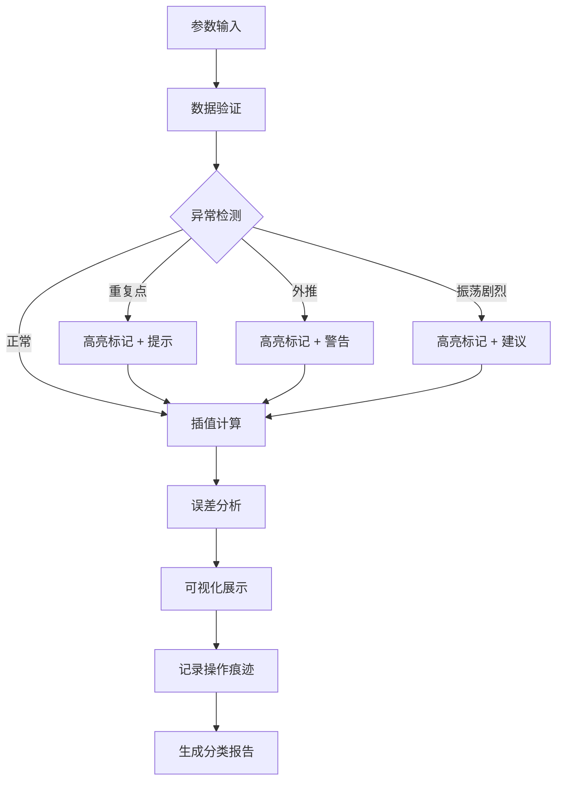

## 1. 产品概述

多项式插值课堂器是一款面向数学教学的交互式Web应用，帮助学生直观理解多项式插值中的龙格现象——当插值点增多时，高次多项式在区间边缘产生剧烈振荡的问题。应用支持参数实时调整、异常智能检测、课堂痕迹追踪和教学报告生成。

- **目标用户**：大学/高中数学教师、数值分析课程学生
- **核心价值**：将抽象的数值分析理论转化为可视化、可交互的教学体验
- **解决痛点**：传统教学仅靠公式背诵，学生无法直观理解振荡成因；缺乏教学过程追踪和异常数据标注工具

## 2. 核心功能

### 2.1 用户角色

| 角色 | 注册方式 | 核心权限 |
|------|----------|----------|
| 教师用户 | 无需注册，本地保存 | 导入样例、调整参数、保存预设、导出报告和截图 |
| 学生用户 | 无需注册 | 调整参数、查看插值结果和误差曲线、理解龙格现象 |

### 2.2 功能模块

1. **主工作台**：插值图表区域、参数控制面板、异常提示区
2. **样例管理**：预设样例导入、自定义样例创建、来源信息追踪
3. **计算引擎**：多项式插值计算、误差分析、异常检测
4. **历史痕迹**：参数修改记录、修正操作日志、版本对比
5. **报告导出**：分类统计报告、截图导出、数据导出

### 2.3 页面详情

| 页面名称 | 模块名称 | 功能描述 |
|----------|----------|----------|
| 主工作台 | 图表展示区 | 绘制原函数曲线、插值多项式曲线、误差曲线，支持缩放平移 |
| 主工作台 | 参数控制面板 | 拖拽调整插值点数、插值阶数、采样范围，实时更新计算结果 |
| 主工作台 | 异常提示区 | 高亮显示重复点、区间外推、振荡剧烈等异常情况 |
| 主工作台 | 备注区 | 记录课堂笔记，与参数快照关联保存 |
| 样例库 | 预设样例 | 提供龙格函数等经典教学样例，一键加载 |
| 样例库 | 导入功能 | 支持从文件/剪贴板导入插值点数据和函数表达式 |
| 历史面板 | 操作痕迹 | 记录每次参数调整和修正，支持回退和对比 |
| 报告中心 | 分类统计 | 按未处理、已修正、需人工确认分类展示异常数据 |
| 报告中心 | 导出功能 | 生成PDF报告、导出截图、导出计算数据 |

## 3. 核心流程

### 3.1 典型教学流程
教师加载预设样例（如龙格函数）→ 逐步增加插值点数 → 学生观察振荡现象 → 调整插值阶数对比效果 → 标记异常区域 → 添加课堂备注 → 保存预设或导出报告

### 3.2 数据处理流程
输入参数验证 → 异常检测（重复点/外推/振荡）→ 标记异常并给出提示 → 执行插值计算 → 计算误差曲线 → 可视化展示 → 记录操作痕迹

## 4. 用户界面设计

### 4.1 设计风格
- **主色调**：深邃蓝 (#0F172A) 作为背景，搭配学术感的靛蓝 (#3B82F6) 作为主色
- **强调色**：异常警示使用暖橙 (#F59E0B) 和玫红 (#EC4899)，正常数据使用翠绿 (#10B981)
- **字体**：标题使用 Lora（学术衬线体），正文使用 JetBrains Mono（等宽代码字体，便于展示数学表达式）
- **布局**：三栏式布局，左侧参数控制、中间图表展示、右侧历史/备注
- **交互**：滑块拖拽实时计算、悬停显示数值、点击标记异常点
- **整体调性**：学术科技感，克制而专业，避免花哨装饰

### 4.2 页面设计概述

| 页面名称 | 模块名称 | UI 元素 |
|----------|----------|----------|
| 主工作台 | 图表区 | 深色画布、网格背景、曲线渐变描边、异常点闪烁标记、悬停数据提示 |
| 主工作台 | 参数面板 | 卡片式分组、磨砂玻璃效果、滑动条带数值显示、步进按钮微调 |
| 主工作台 | 异常提示 | 醒目警示条、图标+文字说明、可折叠详情、一键修正建议 |
| 历史面板 | 痕迹列表 | 时间线布局、版本对比高亮、参数差异标注、回退按钮 |
| 报告中心 | 统计卡片 | 三色分类卡片（未处理/已修正/需确认）、数据可视化、导出按钮 |

### 4.3 响应式设计
- **桌面端**（1200px+）：三栏完整布局，图表区域占60%宽度
- **平板端**（768-1199px）：上下布局，图表在上，控制面板在下可折叠
- **移动端**（<768px）：单栏流式布局，核心功能保留，高级功能折叠

## 5. 功能优先级说明

### 5.1 必须实现（P0）
1. **插值计算引擎**：支持拉格朗日/牛顿插值，实时计算
2. **异常检测**：重复点检测、区间外推检测、振荡幅度检测
3. **参数拖拽**：插值点数、阶数、采样范围实时调整
4. **图表展示**：原函数、插值曲线、误差曲线同图对比
5. **预设保存**：保存当前参数配置为可复用预设

### 5.2 重要实现（P1）
1. **样例导入**：支持JSON格式导入样例数据
2. **截图导出**：将当前图表区域导出为PNG
3. **来源追踪**：记录数据来源和修改历史
4. **分类报告**：按未处理/已修正/需人工确认统计

### 5.3 可选实现（P2）
1. **多种插值方法对比**：支持分段线性、样条插值对比
2. **多人协作**：通过链接共享预设配置
3. **3D展示**：高维插值可视化
