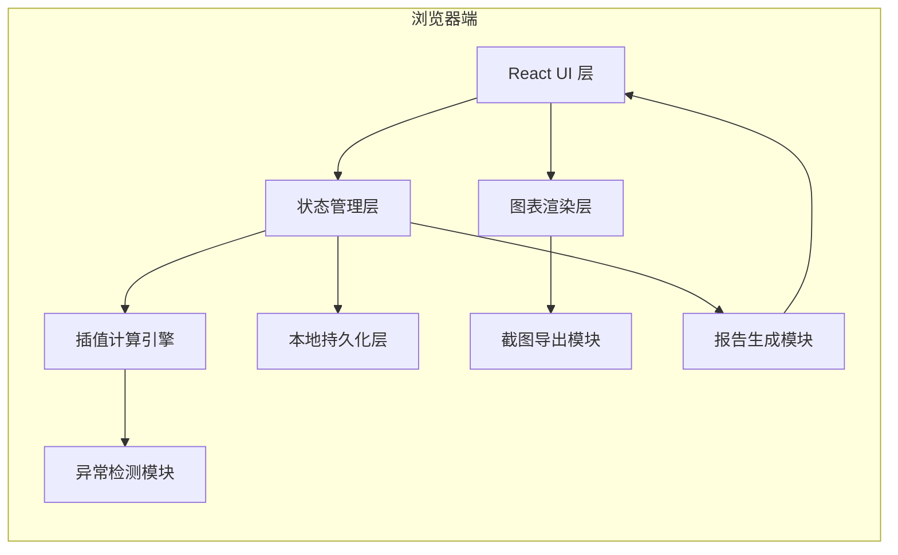
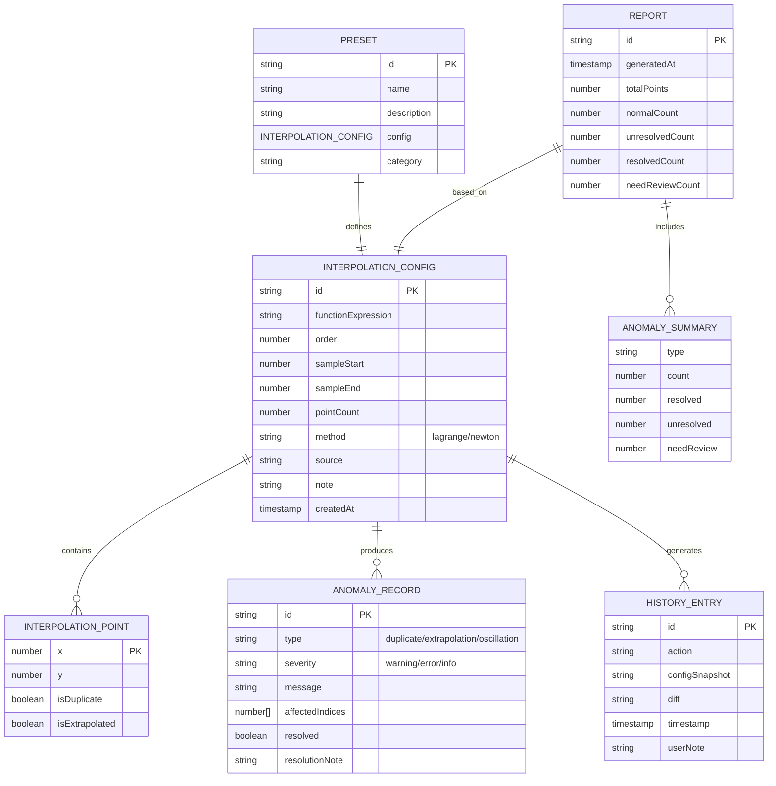

## 1. 架构设计

本应用采用纯前端单页应用架构，所有计算和数据存储均在客户端完成，无需后端服务。



## 2. 技术描述

### 2.1 核心技术栈
- **前端框架**：React@18 + TypeScript@5
- **构建工具**：Vite@5
- **样式方案**：TailwindCSS@3.4
- **图表渲染**：Recharts@2.12（React生态友好的图表库）
- **数学计算**：mathjs@12（表达式解析和数值计算）
- **图标**：lucide-react@0.344
- **截图导出**：html2canvas@1.4
- **状态管理**：React Context + useReducer（无额外依赖）

### 2.2 项目结构

```
src/
├── components/          # UI组件
│   ├── ChartArea.tsx    # 图表展示区
│   ├── ControlPanel.tsx # 参数控制面板
│   ├── AlertPanel.tsx   # 异常提示区
│   ├── HistoryPanel.tsx # 历史痕迹面板
│   ├── NotePanel.tsx    # 备注区
│   ├── ReportModal.tsx  # 报告弹窗
│   └── SampleLibrary.tsx# 样例库
├── engine/              # 计算引擎
│   ├── interpolation.ts # 插值算法（拉格朗日/牛顿）
│   ├── anomalyDetector.ts # 异常检测
│   └── types.ts         # 类型定义
├── store/               # 状态管理
│   ├── AppContext.tsx   # 全局上下文
│   └── reducer.ts       # 状态更新逻辑
├── utils/               # 工具函数
│   ├── export.ts        # 导出功能（截图/报告）
│   ├── storage.ts       # 本地存储
│   └── presets.ts       # 预设样例数据
├── App.tsx
└── main.tsx
```

## 3. 路由定义

| 路由 | 用途 |
|------|------|
| `/` | 主工作台 - 包含所有核心功能 |

*本应用为单页应用，所有功能在同一页面内通过面板切换实现，无需多路由。*

## 4. 数据模型

### 4.1 核心数据结构



### 4.2 TypeScript 类型定义

```typescript
// 插值点
interface InterpolationPoint {
  x: number;
  y: number;
  isDuplicate?: boolean;
  isExtrapolated?: boolean;
  anomalyType?: 'duplicate' | 'extrapolation' | 'oscillation';
}

// 插值配置
interface InterpolationConfig {
  id: string;
  functionExpression: string;
  order: number;
  sampleStart: number;
  sampleEnd: number;
  pointCount: number;
  method: 'lagrange' | 'newton';
  source: string;
  note: string;
  createdAt: number;
}

// 异常记录
interface AnomalyRecord {
  id: string;
  type: 'duplicate' | 'extrapolation' | 'oscillation';
  severity: 'warning' | 'error' | 'info';
  message: string;
  affectedIndices: number[];
  resolved: boolean;
  resolutionNote?: string;
  timestamp: number;
}

// 历史记录
interface HistoryEntry {
  id: string;
  action: string;
  configSnapshot: InterpolationConfig;
  diff: Partial<InterpolationConfig>;
  timestamp: number;
  userNote?: string;
  screenshot?: string;
}

// 预设样例
interface Preset {
  id: string;
  name: string;
  description: string;
  category: 'classic' | 'custom';
  config: InterpolationConfig;
}

// 报告数据
interface ReportData {
  id: string;
  generatedAt: number;
  config: InterpolationConfig;
  anomalies: AnomalyRecord[];
  statistics: {
    totalPoints: number;
    normalCount: number;
    unresolvedCount: number;
    resolvedCount: number;
    needReviewCount: number;
    byType: {
      duplicate: { count: number; resolved: number; unresolved: number; needReview: number };
      extrapolation: { count: number; resolved: number; unresolved: number; needReview: number };
      oscillation: { count: number; resolved: number; unresolved: number; needReview: number };
    };
  };
  history: HistoryEntry[];
}

// 计算结果
interface CalculationResult {
  originalPoints: InterpolationPoint[];
  interpolatedPoints: { x: number; y: number; error: number }[];
  anomalies: AnomalyRecord[];
  maxError: number;
  avgError: number;
  oscillationIntensity: number;
}
```

## 5. 核心模块设计

### 5.1 插值计算引擎
- **拉格朗日插值**：适用于低阶插值，计算直观
- **牛顿插值**：支持增量计算，便于调整点数
- **误差计算**：计算每个采样点的绝对误差和相对误差
- **振荡检测**：通过二阶导数分析振荡幅度

### 5.2 异常检测模块
- **重复点检测**：检查x坐标是否重复（精度阈值内）
- **外推检测**：检查插值范围是否超出原始数据区间
- **振荡检测**：分析边缘区域的振幅，超过阈值则标记

### 5.3 状态管理
- 使用 React Context 提供全局状态
- useReducer 管理复杂状态更新
- 支持撤销/重做操作（历史记录栈）

### 5.4 本地持久化
- localStorage 保存用户预设和历史记录
- IndexedDB 存储截图等大数据
- 自动保存当前工作状态
