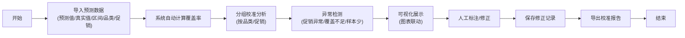

## 1. 产品概述

预测区间校准面板是为数据分析师和业务团队打造的销量预测质量监控工具。核心解决"预测区间是否偏窄"的问题，通过可视化方式呈现预测覆盖率、分组校准效果，并自动标注促销异常、区间覆盖不足、品类样本少等问题。

- **目标用户**：数据分析师、业务运营人员
- **核心价值**：将反复出错的预测流程标准化，提供可追溯的异常说明和修正痕迹
- **设计原则**：功能精简聚焦，避免说明书式堆砌，优先保证核心流程顺畅

## 2. 核心功能

### 2.1 用户角色

| 角色 | 核心权限 |
|------|----------|
| 数据分析师 | 上传数据、调整参数、导出报告、查看修正历史 |
| 业务人员 | 查看校准结果、异常提示、导出报告 |

### 2.2 功能模块

1. **数据概览面板**：核心指标卡片、覆盖率统计、异常总览
2. **预测区间分析**：时间序列图表、置信区间带、真实值对比
3. **分组校准分析**：按品类/促销维度分组、覆盖率对比、样本量统计
4. **异常标注中心**：三类异常自动识别（促销异常、覆盖不足、样本偏少）、可追溯的修正记录
5. **报告导出**：校准报告生成、历史版本对比、数据来源追溯

### 2.3 页面详情

| 页面名称 | 模块名称 | 功能描述 |
|-----------|-------------|---------------------|
| 校准面板主页 | 指标卡片区 | 显示总体覆盖率、预测点数、异常数量、品类覆盖数 |
| 校准面板主页 | 时间序列图 | 预测区间与真实销量对比，支持缩放、hover显示详情 |
| 校准面板主页 | 分组统计表 | 按品类/促销分组的覆盖率、样本量、异常数表格 |
| 校准面板主页 | 异常列表 | 三类异常分类展示，点击高亮图表对应位置 |
| 校准面板主页 | 修正记录 | 显示每次校准的操作人、时间、修正内容、数据来源 |
| 数据导入面板 | 文件上传 | 支持CSV/JSON格式，包含字段映射和数据校验 |
| 报告导出面板 | 报告生成 | 一键导出校准报告，支持PDF/Excel格式 |

## 3. 核心流程

**关键异常路径**：
- 数据格式错误 → 提示具体字段问题，提供样本格式参考
- 覆盖率过低（<80%）→ 红色警示，建议检查区间设置
- 某品类样本量过少（<30）→ 黄色警告，标注统计不可靠
- 促销期间预测偏差大 → 特殊标记，单独分析

## 4. 用户界面设计

### 4.1 设计风格
- **主色调**：深蓝色系（#1e3a5f），体现专业数据分析属性
- **辅助色**：绿色（#10b981）表示正常，红色（#ef4444）表示异常，黄色（#f59e0b）表示警告
- **字体**：采用现代无衬线字体，数字使用等宽字体保证对齐
- **布局**：卡片式模块化布局，清晰的视觉层级，避免信息过载
- **交互**：图表联动高亮，悬停显示详情，平滑过渡动画

### 4.2 页面设计概览

| 页面名称 | 模块名称 | UI Elements |
|-----------|-------------|-------------|
| 校准面板 | 指标卡片 | 圆角卡片、渐变背景、数字动画、状态颜色编码 |
| 校准面板 | 主图表 | 交互式折线图、置信区间半透明填充、异常点高亮 |
| 校准面板 | 分组表格 | 斑马纹、条件格式化、排序功能、筛选下拉 |
| 校准面板 | 异常列表 | 分类标签、时间戳、展开详情、快速跳转 |
| 校准面板 | 修正记录 | 时间线布局、来源标记、版本对比 |

### 4.3 响应式
- **桌面优先**：1280px及以上为最优体验，四栏布局
- **平板适配**：1024px切换为两栏布局，表格简化显示
- **触屏优化**：按钮最小44px，图表支持手势缩放

## 5. 功能优先级说明

**P0 必须实现**：
- 覆盖率计算与展示
- 按品类/促销分组校准
- 三类异常自动标注
- 图表联动交互
- 校准报告导出

**P1 建议实现**：
- 数据上传与校验
- 修正记录追溯
- 数据来源标记

**P2 可选实现**：
- 多版本对比
- 自定义分组维度
- 邮件报告推送
