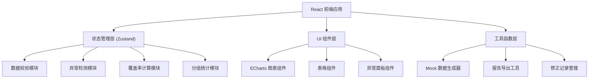

## 1. 架构设计



## 2. 技术描述

- **前端框架**：React@18 + TypeScript
- **构建工具**：Vite@5
- **样式方案**：TailwindCSS@3
- **状态管理**：Zustand（轻量级，适合中小型应用）
- **图表库**：ECharts@5（功能强大，支持复杂交互）
- **UI组件**：Headless UI（无样式，高度可定制）
- **图标**：Lucide React
- **数据处理**：纯函数工具集，无后端依赖
- **报告导出**：jsPDF（PDF）、xlsx（Excel）

**设计原则**：
- 纯前端应用，内置Mock数据，可独立运行
- 模块化架构，各功能松耦合
- 类型安全，完整的TypeScript类型定义
- 性能优先，避免不必要的重渲染

## 3. 路由定义

| Route | 页面/组件 | 用途 |
|-------|-----------|------|
| / | 校准面板主页 | 主仪表板，包含所有核心功能 |
| /import | 数据导入页面 | 数据上传与字段映射 |
| /report | 报告导出页面 | 生成和下载校准报告 |

## 4. 数据模型

### 4.1 核心数据结构

```typescript
// 单条预测记录
interface PredictionRecord {
  id: string;
  date: string;
  category: string;
  predictedValue: number;
  lowerBound: number;
  upperBound: number;
  actualValue: number;
  isPromotion: boolean;
  source: string;
  confidenceLevel: number;
}

// 分组统计结果
interface GroupStats {
  groupKey: string;
  groupName: string;
  totalCount: number;
  coveredCount: number;
  coverageRate: number;
  avgError: number;
  anomalyCount: number;
  promotionCount: number;
}

// 异常记录
interface AnomalyRecord {
  id: string;
  recordId: string;
  type: 'promotion' | 'coverage' | 'sample';
  severity: 'warning' | 'error';
  description: string;
  timestamp: string;
  resolved: boolean;
  resolution?: string;
}

// 修正记录
interface CorrectionRecord {
  id: string;
  timestamp: string;
  operator: string;
  type: 'adjustment' | 'annotation' | 'exclusion';
  targetRecordIds: string[];
  beforeValue: any;
  afterValue: any;
  reason: string;
  source: string;
}

// 校准报告
interface CalibrationReport {
  id: string;
  generatedAt: string;
  period: { start: string; end: string };
  overallCoverage: number;
  targetCoverage: number;
  groupStats: GroupStats[];
  anomalies: AnomalyRecord[];
  corrections: CorrectionRecord[];
  summary: string;
}
```

### 4.2 异常检测规则

1. **促销异常（promotion）**：
   - 触发条件：`isPromotion === true` 且 `actualValue > upperBound * 1.2`
   - 严重程度：error

2. **覆盖不足（coverage）**：
   - 触发条件：`actualValue < lowerBound || actualValue > upperBound`
   - 严重程度：warning（单点）/ error（连续3点以上）

3. **样本偏少（sample）**：
   - 触发条件：分组内记录数 `< 30`
   - 严重程度：warning

## 5. 核心算法

### 5.1 覆盖率计算

```typescript
function calculateCoverage(records: PredictionRecord[]): number {
  const covered = records.filter(r => 
    r.actualValue >= r.lowerBound && r.actualValue <= r.upperBound
  ).length;
  return records.length > 0 ? covered / records.length : 0;
}
```

### 5.2 分组校准

```typescript
function groupByCategory(records: PredictionRecord[]): GroupStats[] {
  const groups = _.groupBy(records, 'category');
  return Object.entries(groups).map(([key, items]) => ({
    groupKey: key,
    groupName: key,
    totalCount: items.length,
    coveredCount: items.filter(isCovered).length,
    coverageRate: items.filter(isCovered).length / items.length,
    // ... 其他统计
  }));
}
```

## 6. 目录结构

```
src/
├── components/
│   ├── dashboard/
│   │   ├── MetricCard.tsx
│   │   ├── CoverageChart.tsx
│   │   ├── GroupTable.tsx
│   │   ├── AnomalyPanel.tsx
│   │   └── CorrectionTimeline.tsx
│   ├── common/
│   │   ├── StatusBadge.tsx
│   │   ├── DataTable.tsx
│   │   └── ExportButton.tsx
│   └── layout/
│       ├── Header.tsx
│       └── Sidebar.tsx
├── store/
│   ├── useDataStore.ts
│   └── useUINotificationStore.ts
├── utils/
│   ├── calculations.ts
│   ├── anomalyDetection.ts
│   ├── mockData.ts
│   ├── export.ts
│   └── formatters.ts
├── types/
│   └── index.ts
├── App.tsx
└── main.tsx
```

## 7. 启动与测试说明

### 7.1 快速启动

```bash
# 安装依赖
npm install

# 启动开发服务器（自动加载Mock数据）
npm run dev

# 访问 http://localhost:5173
```

### 7.2 数据准备

- **内置Mock数据**：应用启动时自动生成3个月的模拟数据，包含：
  - 5个品类（电子产品、服装、食品、家居、美妆）
  - 20%促销标记
  - 可控的覆盖率（默认85%）
  - 预设异常场景

- **自定义数据**：支持CSV格式上传，字段要求：
  - date, category, predicted_value, lower_bound, upper_bound, actual_value, is_promotion

### 7.3 主要操作路径

1. **查看整体校准情况** → 首页指标卡片
2. **深入分析时间趋势** → 主时间序列图，支持缩放和筛选
3. **按品类检查** → 分组统计表，点击排序/筛选
4. **处理异常** → 异常面板点击条目，图表自动定位
5. **添加修正说明** → 选中异常点，填写修正原因
6. **导出报告** → 点击导出按钮，选择PDF/Excel格式

### 7.4 异常路径测试

| 测试场景 | 操作步骤 | 预期结果 |
|----------|----------|----------|
| 低覆盖率告警 | 调整Mock数据覆盖率至75%以下 | 指标卡片变红，显示警告 |
| 小样本警告 | 筛选某品类，数据量<30 | 表格行变黄，显示提示 |
| 促销异常 | 点击促销异常条目 | 图表跳转到对应日期并高亮 |
| 数据格式错误 | 上传格式错误的CSV | 显示具体字段错误信息 |
