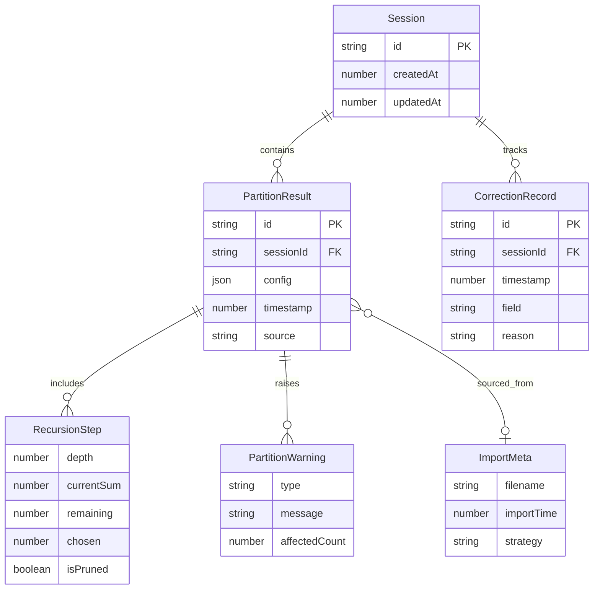

## 1. 架构设计

```mermaid
graph TB
    subgraph "前端层"
        "React SPA" --> "Zustand 状态管理"
        "Zustand 状态管理" --> "核心算法模块"
        "Zustand 状态管理" --> "历史记录持久化(IndexedDB)"
    end
    subgraph "核心算法层"
        "核心算法模块" --> "递归拆分生成器"
        "核心算法模块" --> "去重排序器"
        "核心算法模块" --> "条件过滤器"
        "核心算法模块" --> "异常检测器"
    end
    subgraph "导出层"
        "html2canvas" --> "截图导出"
        "JSON 序列化" --> "材料导入/导出"
    end
```

## 2. 技术说明

- **前端**：React@18 + TypeScript + Tailwind CSS@3 + Vite
- **初始化工具**：vite-init (react-ts 模板)
- **后端**：无（纯前端应用，所有计算在客户端完成）
- **数据库**：IndexedDB（通过 idb 库）持久化历史记录和会话数据
- **状态管理**：Zustand
- **截图导出**：html2canvas
- **字体**：LXGW WenKai + Noto Sans SC（通过 Google Fonts CDN 加载）

## 3. 路由定义

| 路由 | 用途 |
|------|------|
| / | 工作台主页面，包含输入、生成、展示、导出全部功能 |
| /history | 历史记录页面，包含会话列表、来源追溯、修正时间线、会话对比 |

## 4. API 定义

无后端 API。所有数据通过 Zustand store 管理，历史记录通过 IndexedDB 持久化。

### 4.1 核心数据类型

```typescript
interface PartitionConfig {
  targetNumber: number;
  mode: "ordered" | "unordered";
  minAddend: number;
  maxAddend: number;
  minCount: number;
  maxCount: number;
  allowDuplicate: boolean;
  customPredicates: string[];
}

interface PartitionResult {
  id: string;
  config: PartitionConfig;
  allPartitions: number[][];
  filteredPartitions: number[][];
  removedPartitions: { partition: number[]; reason: string }[];
  warnings: PartitionWarning[];
  recursionSteps: RecursionStep[];
  timestamp: number;
  source: "manual" | "import";
  importMeta?: ImportMeta;
}

interface PartitionWarning {
  type: "explosion" | "duplicate_permutation" | "condition_unused";
  message: string;
  detail: string;
  affectedCount: number;
}

interface RecursionStep {
  depth: number;
  currentSum: number;
  remaining: number;
  chosen: number;
  branch: number[];
  isPruned: boolean;
  pruneReason?: string;
}

interface Session {
  id: string;
  results: PartitionResult[];
  corrections: CorrectionRecord[];
  createdAt: number;
  updatedAt: number;
}

interface CorrectionRecord {
  id: string;
  sessionId: string;
  timestamp: number;
  field: string;
  oldValue: unknown;
  newValue: unknown;
  reason: string;
}

interface ImportMeta {
  filename: string;
  importTime: number;
  strategy: "ignore" | "overwrite" | "append";
  fieldsImported: string[];
}

interface MaterialImport {
  targetNumber?: number;
  constraints?: Partial<PartitionConfig>;
  presetSchemes?: number[][];
  studentAnswers?: number[][];
  notes?: string;
  screenshots?: string[];
}
```

## 5. 服务端架构图

不适用（纯前端应用）

## 6. 数据模型

### 6.1 数据模型定义



### 6.2 数据定义语言

使用 IndexedDB 存储，对象仓库定义：

- **sessions**: 主键 `id`，索引 `createdAt`
- **results**: 主键 `id`，索引 `sessionId`、`timestamp`
- **corrections**: 主键 `id`，索引 `sessionId`、`timestamp`
