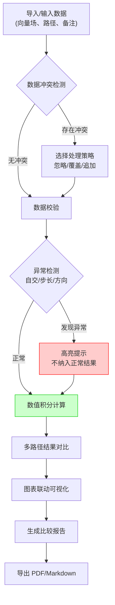

## 1. 产品概述

本工具专为大学数学助教设计，用于演示同一向量场沿不同路径积分结果的变化规律。支持批量处理正常数据与脏数据，保留数据来源与每次修正痕迹，对路径自交、步长过大、方向反转等异常情况提供清晰提示。

- **核心问题**：曲线积分教学中缺乏直观的路径对比与误差可视化工具
- **目标用户**：大学数学助教、微积分教师、理工科学生
- **产品价值**：将抽象的曲线积分概念转化为可交互、可对比的可视化教学工具

## 2. 核心功能

### 2.1 功能模块

1. **向量场编辑器**：支持自定义二维向量场表达式，预设常见向量场模板
2. **路径编辑器**：交互式节点编辑，支持添加/删除/拖拽路径节点
3. **数值积分引擎**：基于采样步长的数值积分计算，支持多种积分方法
4. **异常检测系统**：路径自交检测、步长合理性检查、方向反转提示
5. **图表联动可视化**：向量场热力图 + 路径曲线图 + 积分结果柱状图联动
6. **数据导入系统**：批量导入向量场、路径、学生备注，支持数据冲突处理（忽略/覆盖/追加）
7. **修订痕迹系统**：记录数据来源、每次修改操作与修正说明
8. **比较报告导出**：生成 PDF/Markdown 格式的路径积分对比报告

### 2.2 页面详情

| 页面名称 | 模块名称 | 功能描述 |
|----------|----------|----------|
| 主工作台 | 向量场配置区 | 输入向量场表达式，调整显示范围，选择预设模板 |
| 主工作台 | 路径编辑区 | 可视化路径编辑，节点拖拽，多条路径并行管理 |
| 主工作台 | 积分计算区 | 配置积分参数，启动计算，显示积分结果 |
| 主工作台 | 异常提示区 | 高亮显示路径自交、步长问题、方向错误等警告 |
| 主工作台 | 图表可视化区 | 向量场可视化、路径曲线、积分结果对比图表 |
| 主工作台 | 数据导入区 | 批量导入数据，选择冲突处理策略 |
| 主工作台 | 修订历史区 | 查看数据来源和修改记录，支持回滚 |
| 报告导出 | 报告生成器 | 配置报告内容，导出 PDF/Markdown 格式报告 |

## 3. 核心流程

**用户操作流程**：
1. 助教导入或手动输入向量场表达式和多条路径数据
2. 系统自动检测数据异常，高亮显示问题路径
3. 助教可在路径编辑器中交互式调整路径节点
4. 配置采样步长和积分方法后启动计算
5. 查看多条路径的积分结果对比图表
6. 系统自动记录所有操作痕迹和数据来源
7. 导出包含对比分析的教学报告

## 4. 用户界面设计

### 4.1 设计风格

- **设计基调**：学术专业风 + 数学可视化
- **主色调**：深蓝 `#1e3a5f`（理性、专业） + 琥珀橙 `#f59e0b`（警告、提示） + 翠绿 `#10b981`（正常、通过）
- **字体**：显示字体使用 `JetBrains Mono`（等宽、适合数学符号），正文字体使用 `Noto Sans SC`（清晰易读）
- **布局风格**：三栏式工具布局，左侧配置区 + 中间可视化区 + 右侧结果/历史区
- **按钮风格**：圆角矩形，细边框，hover 时轻微上浮 + 阴影变化
- **图标风格**：使用 lucide-react 线性图标，保持简洁一致

### 4.2 页面设计概览

| 页面名称 | 模块名称 | UI 元素 |
|----------|----------|----------|
| 主工作台 | 向量场配置 | 数学表达式输入框、预设模板下拉、范围滑块、实时预览 |
| 主工作台 | 路径编辑 | SVG 画布、可拖拽节点、路径列表、添加/删除按钮 |
| 主工作台 | 积分计算 | 步长输入框、方法选择下拉、计算按钮、进度条 |
| 主工作台 | 异常提示 | 带图标的警告卡片、颜色编码、展开查看详情 |
| 主工作台 | 图表区 | 向量场热力图、路径曲线图、积分结果柱状图（联动） |
| 主工作台 | 导入区 | 文件拖拽区域、策略选择单选按钮、预览表格 |
| 主工作台 | 历史区 | 时间线布局、修订条目、来源标签、回滚按钮 |

### 4.3 响应式设计

- **桌面端优先**：三栏布局，充分利用大屏幕空间
- **平板端**：左右两栏布局，底部展开历史记录
- **移动端**：单栏堆叠，通过 Tab 切换不同功能区
- **触摸优化**：节点拖拽支持触摸操作，按钮最小尺寸 44px

### 4.4 动效设计

- **页面加载**：各区域按顺序淡入，可视化区域最后出现
- **异常提示**：警告卡片滑入 + 轻微抖动，吸引注意力
- **图表联动**：路径选中时，对应图表高亮并平滑过渡
- **节点拖拽**：磁吸效果，释放时弹性动画
- **计算过程**：进度条动画 + 采样点逐步绘制
