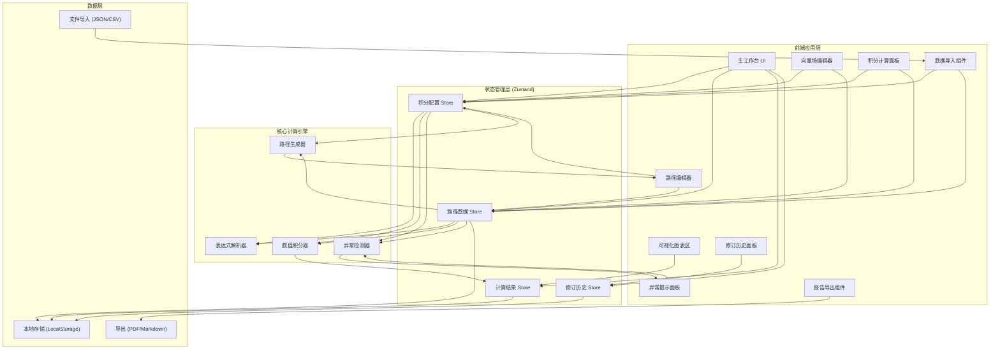
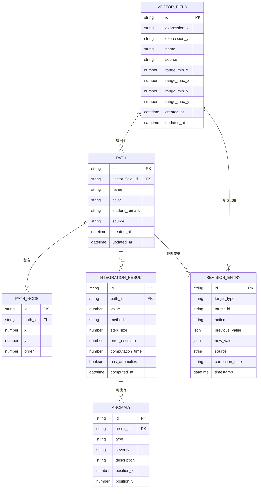

## 1. 架构设计



## 2. 技术栈说明

- **前端框架**：React@18 + TypeScript
- **构建工具**：Vite@5
- **样式方案**：TailwindCSS@3
- **状态管理**：Zustand
- **图表可视化**：自定义 SVG + Canvas 2D（无需额外图表库，保持轻量）
- **图标库**：lucide-react
- **表达式解析**：mathjs
- **文件导出**：html2canvas + jspdf (PDF)，自定义 Markdown 生成
- **数据持久化**：LocalStorage

## 3. 目录结构

```
src/
├── components/
│   ├── VectorFieldEditor.tsx      # 向量场编辑器
│   ├── PathEditor.tsx              # 路径编辑器
│   ├── PathNode.tsx                # 可拖拽路径节点
│   ├── IntegrationPanel.tsx        # 积分计算面板
│   ├── AlertPanel.tsx              # 异常提示面板
│   ├── VisualizationCanvas.tsx     # 可视化画布
│   ├── VectorFieldPlot.tsx         # 向量场绘制
│   ├── PathPlot.tsx                # 路径曲线绘制
│   ├── ResultChart.tsx             # 积分结果柱状图
│   ├── DataImportModal.tsx         # 数据导入模态框
│   ├── RevisionTimeline.tsx        # 修订时间线
│   └── ReportExport.tsx            # 报告导出组件
├── hooks/
│   ├── useVectorField.ts           # 向量场计算 Hook
│   ├── usePathInterpolation.ts     # 路径插值 Hook
│   ├── useNumericalIntegration.ts  # 数值积分 Hook
│   ├── useAnomalyDetection.ts      # 异常检测 Hook
│   └── useRevisionHistory.ts       # 修订历史 Hook
├── store/
│   ├── integrationStore.ts         # 积分配置 Store
│   ├── pathStore.ts                # 路径数据 Store
│   ├── resultStore.ts              # 计算结果 Store
│   └── revisionStore.ts            # 修订历史 Store
├── utils/
│   ├── math/
│   │   ├── expressionParser.ts     # 表达式解析
│   │   ├── numericalIntegration.ts # 数值积分算法
│   │   ├── pathGeometry.ts         # 路径几何计算
│   │   └── anomalyDetection.ts     # 异常检测算法
│   ├── export/
│   │   ├── pdfGenerator.ts         # PDF 生成
│   │   └── markdownGenerator.ts    # Markdown 生成
│   └── import/
│       ├── dataParser.ts           # 数据解析
│       └── conflictResolver.ts     # 冲突处理
├── types/
│   ├── index.ts                    # 类型定义
│   └── api.ts                      # API 类型
├── pages/
│   └── Workbench.tsx               # 主工作台页面
├── shared/
│   └── constants.ts                # 共享常量
└── App.tsx
```

## 4. 核心数据模型



## 5. 核心算法说明

### 5.1 数值积分算法

| 算法名称 | 适用场景 | 精度 | 计算量 |
|---------|---------|------|-------|
| 梯形法 (Trapezoidal) | 平滑曲线 | O(h²) | 低 |
| Simpson 法 | 光滑函数 | O(h⁴) | 中 |
| 自适应 Simpson 法 | 变化剧烈区域 | 自适应 | 高 |
| 高斯-勒让德求积 | 高精度需求 | O(h²ⁿ) | 高 |

### 5.2 异常检测算法

1. **路径自交检测**：
   - 检查每对非相邻线段是否相交
   - 使用叉积法判断线段相交
   - 记录交点坐标和涉及的线段

2. **步长合理性检查**：
   - 计算路径总长度 L
   - 建议步长 h ≤ L / 50
   - 若 h > L / 10，发出严重警告

3. **方向反转检测**：
   - 计算相邻线段的方向向量
   - 检测方向角突变 (> 150°)
   - 标记可能的方向反转点

## 6. 数据导入格式

### 6.1 JSON 格式示例

```json
{
  "version": "1.0",
  "source": "2024春季学期作业提交",
  "vectorFields": [
    {
      "id": "vf_001",
      "name": "保守场示例",
      "expression_x": "x",
      "expression_y": "y",
      "range": { "minX": -5, "maxX": 5, "minY": -5, "maxY": 5 }
    }
  ],
  "paths": [
    {
      "id": "path_001",
      "vectorFieldId": "vf_001",
      "name": "直线路径",
      "color": "#3b82f6",
      "studentRemark": "学生A提交",
      "source": "作业第3题",
      "nodes": [
        { "x": 0, "y": 0 },
        { "x": 1, "y": 1 },
        { "x": 2, "y": 0 }
      ]
    }
  ]
}
```

### 6.2 CSV 格式示例

```csv
type,id,name,vectorFieldId,expression_x,expression_y,nodes,studentRemark,source
vectorField,vf_001,保守场示例,,x,y,,,
path,path_001,直线路径,vf_001,,,"(0,0);(1,1);(2,0)",学生A提交,作业第3题
```

## 7. 冲突处理策略

| 策略 | 行为 | 适用场景 |
|-----|------|---------|
| 忽略 (Ignore) | 保留现有数据，跳过冲突项 | 已有正确数据，不希望被覆盖 |
| 覆盖 (Overwrite) | 用新数据替换现有数据 | 修正数据，使用最新版本 |
| 追加 (Append) | 重命名新数据（添加后缀）并同时保留 | 需要对比不同版本的数据 |
