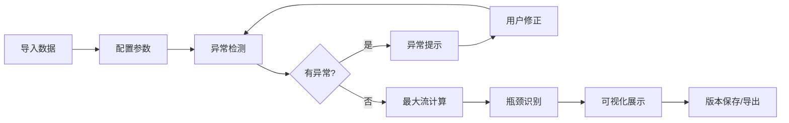

## 1. 产品概述

物流网络瓶颈分析工具，帮助物流规划师可视化仓网最大吞吐的瓶颈环节，提供图表联动和可追溯的异常说明，替代传统的表格和截图拼接工作方式。

- 核心目的：精准识别仓网最大吞吐的瓶颈边，提供可解释的分析结果
- 解决问题：避免仅依赖总流量数字，提供具体的瓶颈定位和异常追溯
- 目标用户：物流规划师、供应链分析师
- 价值：提升规划效率，降低决策风险，保留分析过程的可追溯性

## 2. 核心功能

### 2.1 用户角色

| 角色 | 注册方式 | 核心权限 |
|------|----------|----------|
| 物流规划师 | 本地工具使用 | 数据导入、分析计算、图表查看、导出报告 |

### 2.2 功能模块

1. **数据管理面板**：节点管理、线路管理、需求点配置、禁用线路设置
2. **情景版本管理**：版本保存、切换、对比、导入导出
3. **网络分析引擎**：最大流计算、瓶颈识别、异常检测
4. **可视化仪表盘**：网络图可视化、瓶颈高亮、流量热力图、图表联动
5. **报告导出**：瓶颈清单、异常说明、对比分析、历史记录

### 2.3 页面详情

| 页面名称 | 模块名称 | 功能描述 |
|-----------|-------------|---------------------|
| 主工作台 | 数据导入区 | 支持JSON/CSV导入，处理重复数据（忽略/覆盖/追加） |
| 主工作台 | 网络图视窗 | 交互式网络拓扑图，节点拖拽，瓶颈高亮 |
| 主工作台 | 分析控制面板 | 运行分析、参数配置、异常提示 |
| 主工作台 | 瓶颈详情面板 | 瓶颈边列表、流量利用率、可追溯说明 |
| 主工作台 | 情景版本栏 | 版本列表、对比功能、历史记录 |
| 导出模态框 | 导出配置 | 选择导出内容、格式选择、来源标注 |

## 3. 核心流程

用户导入仓库节点、线路容量、需求点数据 → 配置禁用线路和情景参数 → 运行最大流分析 → 系统自动检测异常（零容量、孤立节点、禁用未生效） → 可视化展示网络流量和瓶颈边 → 用户可点击瓶颈追溯详情 → 保存情景版本或导出分析报告

## 4. 用户界面设计

### 4.1 设计风格
- 主色调：深蓝 #1e3a5f（专业、稳重），配橙色 #f97316 强调瓶颈
- 辅助色：绿色 #10b981（正常）、黄色 #f59e0b（警告）、红色 #ef4444（错误）
- 按钮风格：圆角 6px，轻微阴影，hover 有颜色过渡
- 字体：标题使用 Roboto Slab（专业感），正文使用 Inter（清晰易读）
- 布局：左侧导航 + 中央画布 + 右侧详情面板的三栏布局
- 图标风格：线性简约图标，统一 24px 尺寸

### 4.2 页面设计概述

| 页面名称 | 模块名称 | UI 元素 |
|-----------|-------------|----------|
| 主工作台 | 顶部导航栏 | Logo、情景选择器、操作按钮（导入/导出/保存） |
| 主工作台 | 左侧边栏 | 节点列表、线路列表、异常提示区 |
| 主工作台 | 中央画布 | 可缩放的网络图、选中高亮、悬浮提示 |
| 主工作台 | 右侧面板 | 分析结果、瓶颈详情、流量统计图表 |
| 主工作台 | 底部状态栏 | 当前版本信息、计算耗时、数据来源 |

### 4.3 响应式
- 桌面端优先（1280px+）：三栏完整布局
- 平板端（768px-1279px）：左右面板可折叠
- 移动端（<768px）：垂直堆叠布局，画布优先

### 4.4 交互动效
- 节点/线路 hover：轻微放大 + 发光效果
- 瓶颈识别：脉冲动画吸引注意力
- 面板切换：平滑滑动过渡（200ms ease）
- 数据导入：进度条 + 成功/失败状态反馈
