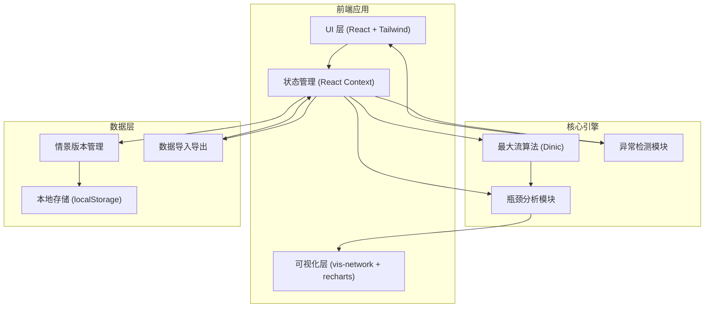
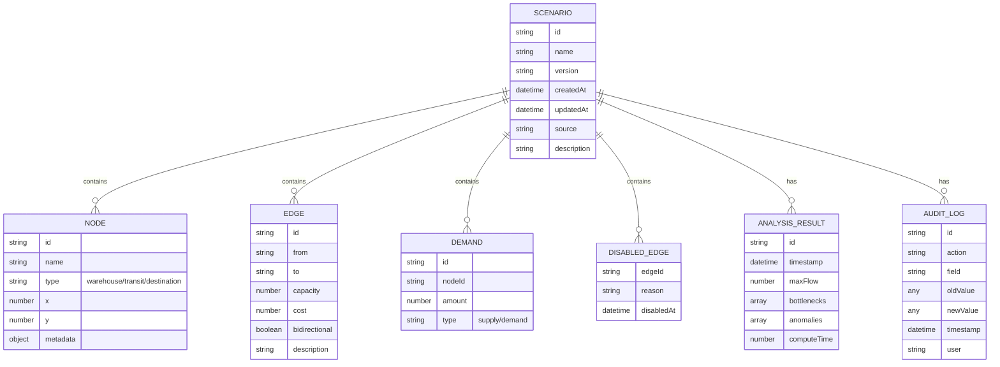

## 1. 架构设计



## 2. 技术描述

- **前端框架**：React@18 + TypeScript + Vite
- **样式方案**：TailwindCSS@3 + CSS 变量
- **可视化**：vis-network（网络图）、recharts（统计图表）
- **状态管理**：React Context + useReducer
- **本地存储**：localStorage + 版本序列化
- **构建工具**：Vite@5

## 3. 路由定义

| 路由 | 用途 |
|-------|---------|
| / | 主工作台（唯一页面） |

## 4. 数据模型

### 4.1 核心数据结构



### 4.2 TypeScript 类型定义

```typescript
// 节点类型
type NodeType = 'warehouse' | 'transit' | 'destination' | 'source';

interface NetworkNode {
  id: string;
  name: string;
  type: NodeType;
  x?: number;
  y?: number;
  metadata?: Record<string, any>;
}

// 线路类型
interface NetworkEdge {
  id: string;
  from: string;
  to: string;
  capacity: number;
  cost?: number;
  bidirectional?: boolean;
  description?: string;
  disabled?: boolean;
  disabledReason?: string;
}

// 需求/供应点
interface DemandPoint {
  id: string;
  nodeId: string;
  amount: number;
  type: 'supply' | 'demand';
}

// 分析结果
interface BottleneckEdge {
  edgeId: string;
  flow: number;
  capacity: number;
  utilization: number;
  impact: number;
  explanation: string;
}

interface Anomaly {
  type: 'zero_capacity' | 'isolated_node' | 'disabled_ineffective' | 'unreachable_demand';
  severity: 'error' | 'warning' | 'info';
  targetId: string;
  message: string;
  suggestion: string;
}

interface AnalysisResult {
  maxFlow: number;
  bottlenecks: BottleneckEdge[];
  anomalies: Anomaly[];
  edgeFlows: Record<string, number>;
  computeTime: number;
  timestamp: number;
}

// 情景版本
interface Scenario {
  id: string;
  name: string;
  version: string;
  nodes: NetworkNode[];
  edges: NetworkEdge[];
  demands: DemandPoint[];
  source: string;
  description: string;
  createdAt: number;
  updatedAt: number;
  lastAnalysis?: AnalysisResult;
  auditLog: AuditLogEntry[];
}

interface AuditLogEntry {
  id: string;
  action: 'create' | 'update' | 'delete' | 'import' | 'analyze';
  targetType: 'node' | 'edge' | 'demand' | 'scenario';
  targetId: string;
  field?: string;
  oldValue?: any;
  newValue?: any;
  timestamp: number;
  source?: string;
}
```

## 5. 核心算法

### 5.1 Dinic 最大流算法
- 时间复杂度：O(E * V²)，实际中对于单位容量网络为 O(E*sqrt(V))
- 实现要点：BFS 构建层次图 + DFS 寻找阻塞流

### 5.2 瓶颈识别方法
1. 计算每条边的流量利用率 (flow/capacity)
2. 利用率 > 90% 标记为高风险瓶颈
3. 利用率 70%-90% 标记为潜在瓶颈
4. 计算瓶颈影响度：剩余可挖掘流量 * 单位重要性

### 5.3 异常检测规则
- **零容量检测**：edge.capacity === 0 且未被禁用
- **孤立节点检测**：节点无任何入边和出边
- **禁用未生效检测**：禁用的边不在任何最小割路径上
- **不可达需求检测**：需求点无法从源点到达
