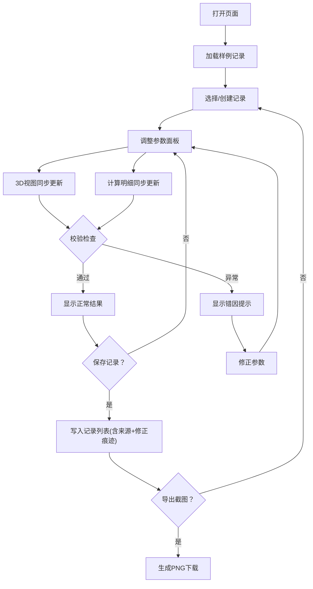

## 1. 产品概述

滑轮组省力计算器是一款面向初中物理教师和学生的交互式可视化工具，通过 3D 滑轮组模型与侧边计算明细的实时联动，帮助用户直观理解拉力、绳长与机械效率的关系。工具内置绳段数校验、效率越界检测和单位混用警告，确保计算结果的物理合理性，同时保留数据来源与修正痕迹，方便课堂复盘。

- 目标用户：初中物理教师（课堂教学）、初中学生（实验探究）
- 核心价值：将抽象的滑轮组力学计算转化为可操作、可验证的可视化实验，降低教学中的常见错误率

## 2. 核心功能

### 2.1 用户角色

| 角色 | 使用方式 | 核心权限 |
|------|----------|----------|
| 教师 | 直接使用 | 配置参数、查看/修正记录、导出截图与报告 |
| 学生 | 直接使用 | 调整参数、查看计算结果与错因提示 |

### 2.2 功能模块

1. **主工作台页面**：3D 滑轮组视图、参数控制面板、计算明细侧栏、记录列表、错因提示、截图导出

### 2.3 页面明细

| 页面名称 | 模块名称 | 功能描述 |
|----------|----------|----------|
| 主工作台 | 3D 滑轮组视图 | 三维渲染滑轮组，拖动旋转，实时反映参数变化；绳段高亮标注；支持截图导出 |
| 主工作台 | 参数控制面板 | 滑轮数量（1-6）、物体重量、摩擦系数、绳长的输入/滑块；单位选择器（N/kg、cm/m） |
| 主工作台 | 计算明细侧栏 | 实时显示拉力、绳段数、机械效率计算过程；标注数据来源与修正历史 |
| 主工作台 | 记录列表 | 存储3条样例记录（正常/边界/坏数据）；支持新增、筛选、对比 |
| 主工作台 | 错因提示区 | 绳段数异常、效率超过100%、单位混用的醒目警告，附带物理解释 |
| 主工作台 | 截图导出按钮 | 将当前3D视图和计算结果导出为PNG图片 |

## 3. 核心流程

用户打开页面后，默认加载正常样例记录。用户可在参数面板调整滑轮数量、物体重量、摩擦系数、绳长，3D 视图与侧边计算明细同步刷新。系统自动校验输入合法性：若绳段数与滑轮数不匹配、效率越界或单位混用，立即弹出错因提示。用户可将当前配置保存为新记录，每条记录保留来源标注和修正轨迹。教师可导出截图用于课堂报告。

## 4. 用户界面设计

### 4.1 设计风格

- 主色调：深蓝灰（#1a2332）配亮橙（#ff6b35）强调色，营造科技实验室氛围
- 辅助色：青绿（#00d4aa）用于正常状态、红色（#ef4444）用于警告
- 按钮风格：圆角矩形，微阴影，hover 时微发光
- 字体：标题使用 JetBrains Mono（等宽科技感），正文使用 Noto Sans SC
- 布局：左侧3D视图（约60%宽度）+ 右侧面板（约40%宽度），顶部工具栏
- 图标风格：线性图标（Lucide）

### 4.2 页面设计概览

| 页面名称 | 模块名称 | UI 元素 |
|----------|----------|----------|
| 主工作台 | 3D 滑轮组视图 | 深色背景、网格地面、金属质感滑轮、橙色绳索、拖拽旋转控制、截图按钮浮层 |
| 主工作台 | 参数控制面板 | 滑块+数字输入框、单位切换开关、滑轮数量选择器(1-6按钮组) |
| 主工作台 | 计算明细侧栏 | 卡片式布局、公式展示区、数据来源标签、修正历史时间线 |
| 主工作台 | 记录列表 | 紧凑列表、状态色标（绿/黄/红）、筛选下拉 |
| 主工作台 | 错因提示区 | 顶部滑入式警告条、图标+文字、物理解释折叠区 |

### 4.3 响应式设计

- 桌面优先（1280px+）：左右分栏布局
- 平板（768-1280px）：3D视图上方，面板下方
- 手机（<768px）：全栈垂直布局，面板折叠为抽屉

### 4.4 3D 场景指引

- 环境：深色实验室环境，柔和环境光 + 方向光
- 灯光：暖白色主光源从左上方照射，冷色补光从右下方
- 相机：透视相机，默认斜45度俯视，用户可拖拽旋转/缩放
- 构图：滑轮组居中，重物悬挂在底部，绳索路径清晰可见
- 交互：鼠标拖拽旋转视角，滚轮缩放，参数变化时平滑过渡动画
- 后期处理：轻微辉光效果（Bloom），增加科技感
- 资源：程序化生成几何体，无外部模型依赖

## 5. 样例数据

### 5.1 正常记录
- 滑轮数量：2（1动1定）
- 物体重量：20 N
- 摩擦系数：0.05
- 绳长：3 m
- 预期结果：绳段数n=2，拉力F≈10.5 N，效率η≈95.2%

### 5.2 边界记录
- 滑轮数量：6（3动3定）
- 物体重量：5 N
- 摩擦系数：0.30
- 绳长：0.5 m
- 预期结果：绳段数n=6，拉力F≈2.08 N，效率η≈40.1%（低效但物理合理）

### 5.3 坏数据记录
- 滑轮数量：3
- 物体重量：50 g（单位混用）
- 摩擦系数：-0.1（无效值）
- 绳长：50（无单位）
- 预期触发：单位混用警告 + 摩擦系数越界 + 绳长无单位 + 效率无法计算
