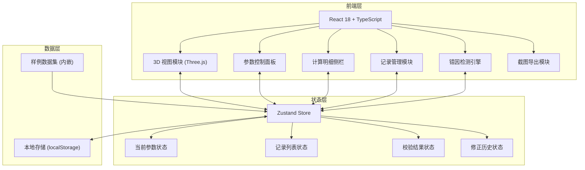
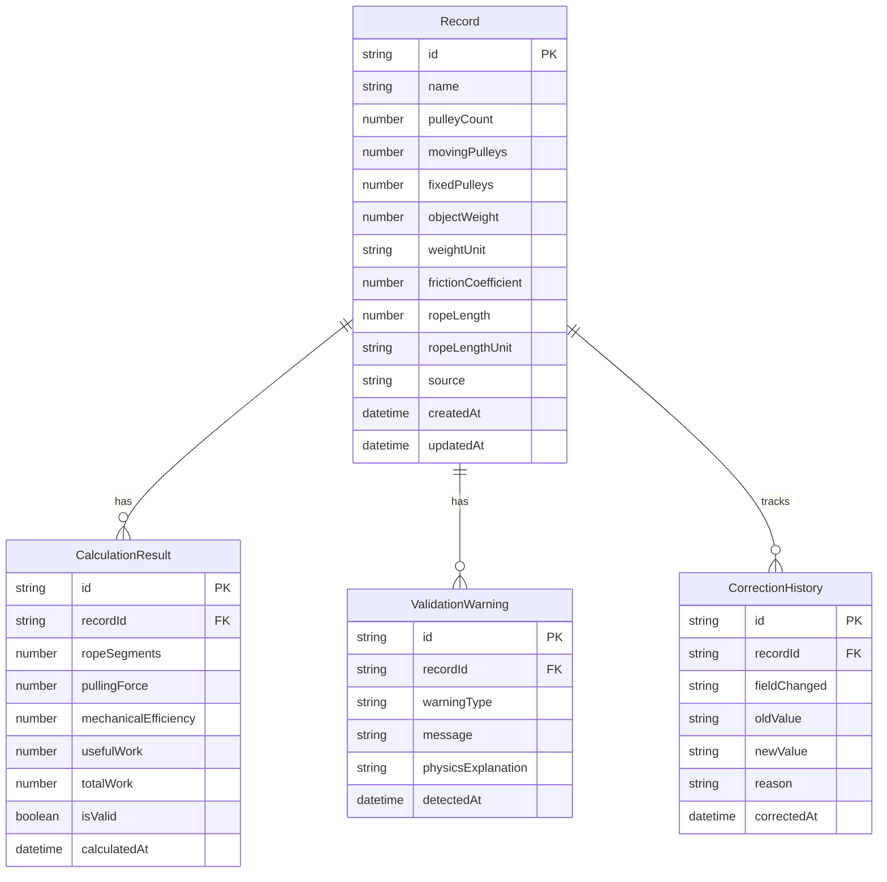

## 1. 架构设计



## 2. 技术说明

- 前端：React@18 + TypeScript + Tailwind CSS@3 + Vite
- 3D 渲染：Three.js + @react-three/fiber + @react-three/drei + @react-three/postprocessing
- 状态管理：Zustand
- 初始化工具：vite-init (react-ts 模板)
- 后端：无（纯前端应用）
- 数据库：localStorage 持久化 + 内嵌样例数据

## 3. 路由定义

| 路由 | 用途 |
|------|------|
| / | 主工作台页面，包含3D视图、参数面板、计算明细、记录列表 |

## 4. 数据模型

### 4.1 数据模型定义



### 4.2 核心计算公式

- **绳段数**：n = 2 × 动滑轮数（标准滑轮组配置）
- **理想拉力**：F_ideal = G / n
- **实际拉力**：F_actual = G / (n × (1 - μ))，其中 μ 为摩擦系数
- **有用功**：W_useful = G × h
- **总功**：W_total = F_actual × n × h = F_actual × s（s 为绳端移动距离）
- **机械效率**：η = W_useful / W_total = G / (n × F_actual) × 100%

### 4.3 校验规则

| 校验项 | 条件 | 警告级别 |
|--------|------|----------|
| 绳段数异常 | n ≠ 2 × 动滑轮数 | 错误 |
| 效率超过100% | η > 100% | 错误 |
| 效率接近100% | η > 95% | 提示 |
| 单位混用 | 重量单位与默认单位不一致 | 警告 |
| 摩擦系数越界 | μ < 0 或 μ ≥ 1 | 错误 |
| 绳长无单位 | 绳长值为数字但无单位标注 | 警告 |
| 绳长过短 | 绳长 < n × 滑轮周长估算 | 提示 |

## 5. 组件结构

```
src/
├── components/
│   ├── Scene3D.tsx            # Three.js 3D 滑轮组场景
│   ├── PulleyModel.tsx        # 滑轮3D模型组件
│   ├── RopePath.tsx           # 绳索路径3D组件
│   ├── WeightBlock.tsx        # 重物3D组件
│   ├── ParamPanel.tsx         # 参数控制面板
│   ├── CalcDetail.tsx         # 计算明细侧栏
│   ├── RecordList.tsx         # 记录列表
│   ├── WarningBar.tsx         # 错因提示条
│   ├── CorrectionTimeline.tsx # 修正历史时间线
│   └── ExportButton.tsx       # 截图导出按钮
├── hooks/
│   ├── usePulleyCalc.ts      # 滑轮组计算逻辑
│   └── useValidation.ts      # 校验逻辑
├── store/
│   └── pulleyStore.ts        # Zustand 状态管理
├── utils/
│   ├── calculations.ts       # 纯计算函数
│   ├── validators.ts         # 校验函数
│   └── sampleData.ts         # 样例数据
├── types/
│   └── index.ts              # TypeScript 类型定义
├── pages/
│   └── Workbench.tsx         # 主工作台页面
├── App.tsx
└── main.tsx
```
