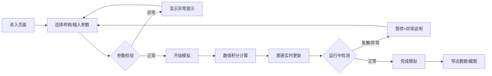

## 1. 产品概述

雨滴终端速度模拟工具，专为气象科普教学设计，通过数值积分计算雨滴下落过程中的速度变化，直观展示雨滴大小、空气密度和阻力系数对终端速度的影响。

- 核心目标：帮助气象科普老师清晰展示雨滴下落物理规律
- 解决问题：半径单位错误、速度发散、阻力模型不适用等常见计算异常
- 目标用户：气象科普教师、学生及气象爱好者

## 2. 核心特性

### 2.1 用户角色
| 角色 | 注册方式 | 核心权限 |
|------|----------|----------|
| 访客用户 | 无需注册 | 使用所有模拟功能、导出数据、保存截图 |

### 2.2 功能模块
1. **参数输入面板**：雨滴半径、空气密度、阻力系数、初速度、下落高度、数据来源
2. **实时模拟计算**：数值积分求解、终端速度计算、异常检测与保护
3. **图表联动展示**：速度-时间曲线、位置-时间曲线、终端速度对比
4. **异常说明系统**：单位错误提示、速度发散警告、模型适用范围说明
5. **数据导出功能**：曲线数据导出、截图保存、模拟报告生成
6. **样例数据模块**：正常记录、边界记录、坏数据三条预置样例

### 2.3 页面详情
| 页面名称 | 模块名称 | 功能描述 |
|-----------|-------------|---------------------|
| 主页面 | 参数控制面板 | 滑块+数值输入、实时参数校验、来源记录 |
| 主页面 | 图表展示区 | Chart.js多图联动、实时更新、交互缩放 |
| 主页面 | 模拟结果区 | 终端速度显示、到达时间、物理量计算 |
| 主页面 | 异常提示区 | 红色警告标识、详细异常说明、修正建议 |
| 主页面 | 样例选择区 | 一键加载三类样例数据 |
| 主页面 | 操作工具栏 | 开始/暂停/重置、数据导出、截图保存 |

## 3. 核心流程

用户进入页面 → 选择样例或手动输入参数 → 系统实时校验参数 → 点击开始模拟 → 数值积分计算 → 图表实时更新 → 异常检测并提示 → 导出数据或截图 → 查看模拟报告

## 4. 用户界面设计

### 4.1 设计风格
- **主色调**：深蓝色(#1e3a5f) 代表天空和专业感
- **辅助色**：天蓝色(#3b82f6) 用于交互元素，橙色(#f59e0b) 用于警告，红色(#ef4444) 用于错误
- **背景**：浅蓝渐变+细腻噪点纹理，营造气象科学氛围
- **按钮风格**：圆角矩形、悬停微放大、点击凹陷效果
- **字体**：标题使用 Orbitron（科技感），正文使用 Noto Sans SC（易读性）
- **布局**：卡片式布局、左侧参数区+右侧图表区的双栏结构
- **图标风格**：线性图标+微妙渐变，配合雨滴、云朵、图表等气象元素

### 4.2 页面设计概述
| 页面名称 | 模块名称 | UI元素 |
|-----------|-------------|-------------|
| 主页面 | 头部标题 | 大字体科技感标题、副标题说明、雨滴动画装饰 |
| 主页面 | 参数面板 | 卡片式容器、滑块控件、数值输入框、单位标签 |
| 主页面 | 图表区域 | 深色背景图表、网格线、数据点高亮、图例 |
| 主页面 | 异常提示 | 红色边框卡片、警告图标、详细文字说明 |
| 主页面 | 操作按钮 | 渐变填充按钮、悬停发光效果、图标+文字组合 |
| 主页面 | 结果展示 | 大号终端速度数字、单位标注、关键指标卡片 |

### 4.3 响应式设计
- **桌面端**：双栏布局（参数区35% + 图表区65%）
- **平板端**：上下布局，参数区在上，图表区在下
- **移动端**：单列滚动布局，图表自适应屏幕宽度
- **触控优化**：增大按钮最小点击区域（48px），优化滑块拖拽体验

### 4.4 动效设计
- 页面加载：元素淡入+轻微上浮动画
- 参数调整：图表曲线平滑过渡动画
- 异常出现：警告框弹跳出现+红色脉冲效果
- 按钮交互：悬停放大+阴影加深，点击缩放反馈
- 数据更新：数字滚动动画效果
