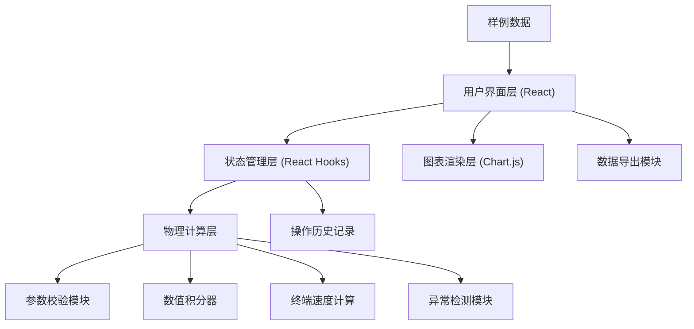

## 1. 架构设计



## 2. 技术选型

- **前端框架**：React@18 + TypeScript
- **构建工具**：Vite@5
- **样式方案**：TailwindCSS@3
- **图表库**：Chart.js@4 + react-chartjs-2
- **状态管理**：React Hooks (useState, useReducer, useRef)
- **截图导出**：html2canvas
- **数据导出**：CSV 原生生成 + JSON 导出

## 3. 页面路由

| 路由 | 页面名称 | 功能说明 |
|-------|---------|----------|
| / | 主页面 | 雨滴终端速度模拟器主界面 |

## 4. 核心数据模型

### 4.1 模拟参数类型
```typescript
interface SimulationParams {
  id: string;
  source: string;           // 数据来源
  timestamp: number;        // 创建时间戳
  radius: number;           // 雨滴半径 (mm)
  airDensity: number;       // 空气密度 (kg/m³)
  dragCoefficient: number;  // 阻力系数
  initialVelocity: number;  // 初速度 (m/s)
  height: number;           // 下落高度 (m)
  modificationHistory: ModificationRecord[];
}

interface ModificationRecord {
  timestamp: number;
  field: string;
  oldValue: number;
  newValue: number;
  reason: string;
}
```

### 4.2 模拟结果类型
```typescript
interface SimulationResult {
  timeSeries: number[];     // 时间序列
  velocitySeries: number[]; // 速度序列
  positionSeries: number[]; // 位置序列
  terminalVelocity: number; // 终端速度
  timeToTerminal: number;   // 达到终端速度时间
  timeToGround: number;     // 落地时间
  anomalies: AnomalyRecord[];
  status: 'running' | 'completed' | 'error' | 'divergent';
}

interface AnomalyRecord {
  type: 'unit_error' | 'velocity_divergence' | 'model_not_applicable' | 'parameter_out_of_range';
  severity: 'warning' | 'error';
  message: string;
  suggestion: string;
  timestamp: number;
}
```

### 4.3 样例数据
```typescript
const sampleData = {
  normal: {
    name: '正常雨滴',
    description: '典型中雨雨滴参数',
    params: { radius: 1.5, airDensity: 1.225, dragCoefficient: 0.47, initialVelocity: 0, height: 1000, source: '气象科普教材' }
  },
  boundary: {
    name: '边界情况',
    description: '接近模型适用上限的大雨滴',
    params: { radius: 5.0, airDensity: 1.225, dragCoefficient: 0.47, initialVelocity: 0, height: 2000, source: '极端天气观测记录' }
  },
  badData: {
    name: '异常数据',
    description: '超出合理范围的参数',
    params: { radius: 50.0, airDensity: 0.5, dragCoefficient: 2.5, initialVelocity: -100, height: 5000, source: '错误输入样例' }
  }
};
```

## 5. 物理计算模块

### 5.1 核心公式
- **重力**：Fg = m * g = (4/3)πr³ρ_water * g
- **空气阻力**：Fd = 0.5 * Cd * ρ_air * A * v² = 0.5 * Cd * ρ_air * πr² * v²
- **终端速度**：vt = sqrt(8 * r * ρ_water * g / (3 * Cd * ρ_air))
- **运动方程**：dv/dt = g - (3 * Cd * ρ_air * v²) / (16 * r * ρ_water)

### 5.2 参数校验规则
- 雨滴半径：0.05mm ~ 6mm（超出提示单位错误或模型不适用）
- 空气密度：0.5 ~ 1.5 kg/m³（标准值1.225）
- 阻力系数：0.2 ~ 1.0（球体标准值0.47）
- 初速度：-50 ~ 50 m/s（负值表示向上）
- 下落高度：1 ~ 10000 m

### 5.3 异常检测逻辑
- **单位错误**：半径 > 10mm 时怀疑单位错误（可能是微米输入）
- **速度发散**：连续3步速度变化超过50%时判定发散
- **模型不适用**：半径 > 6mm 时（大雨滴会变形，球体阻力模型不适用）
- **参数越界**：各参数超出合理范围时提示

## 6. 性能优化
- 使用 requestAnimationFrame 控制模拟帧率
- 数据点抽稀优化大数量级渲染
- Canvas 渲染图表，保证 60fps 流畅度
- 计算密集型操作使用 Web Worker 避免阻塞 UI
