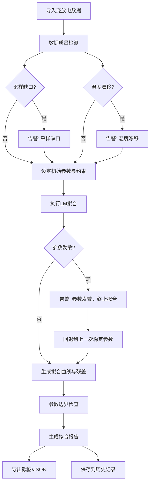

## 1. 产品概述

新能源实验室电池RC等效电路模型拟合工具——将充放电曲线拟合为电池RC等效模型参数，辅助健康状态（SOH）估算。
- 解决当前反复出错的拟合流程，提供采样缺口、温度漂移、参数发散的明确告警
- 目标用户：新能源方向研究生、电池测试工程师

## 2. 核心功能

### 2.1 用户角色
| 角色 | 使用方式 | 核心权限 |
|------|----------|----------|
| 实验人员 | 直接打开页面使用 | 导入数据、拟合、查看诊断、导出截图、查看历史 |

### 2.2 功能模块
1. **拟合工作台页**：3D模型可视化、曲线拟合、残差诊断、参数边界、数据输入、悬浮信息
2. **历史记录页**：拟合历史列表、来源追溯、修正痕迹、状态一致性校验

### 2.3 页面详情
| 页面名称 | 模块名称 | 功能描述 |
|----------|----------|----------|
| 拟合工作台 | 3D RC模型场景 | 展示电池RC等效电路3D模型，电阻/电容组件可交互，悬浮显示参数值 |
| 拟合工作台 | 数据输入面板 | 导入电压曲线、电流、采样间隔、温度、初始参数；支持CSV粘贴与手动输入 |
| 拟合工作台 | 曲线拟合区 | Levenberg-Marquardt拟合，实时显示拟合曲线与原始数据叠加 |
| 拟合工作台 | 残差诊断 | 残差图、残差统计（均值/标准差/自相关），异常区域高亮 |
| 拟合工作台 | 参数边界检查 | 参数物理约束（R>0, C>0, τ在合理范围），越界红色告警 |
| 拟合工作台 | 告警中心 | 采样缺口、温度漂移、参数发散的三级告警（警告/严重/致命） |
| 拟合工作台 | 导出工具栏 | 拟合曲线截图PNG、参数报告JSON、残差图导出 |
| 拟合工作台 | 拟合报告 | 来源标记、修正痕迹、参数变化时间线 |
| 历史记录 | 历史列表 | 按时间倒序列出所有拟合记录，含状态标签（正常/有警告/有严重告警） |
| 历史记录 | 详情回放 | 选中历史记录可回放拟合过程、查看当时告警和残差 |
| 历史记录 | 一致性校验 | 校验历史记录间参数和状态无冲突，冲突项标红 |

## 3. 核心流程

用户导入充放电数据 → 系统自动检测采样缺口/温度漂移 → 用户设定初始参数和约束 → 执行RC模型拟合 → 实时显示拟合曲线与残差 → 系统检查参数边界和发散 → 生成拟合报告（含来源和修正痕迹） → 用户导出截图/报告 → 记录保存到历史

## 4. 用户界面设计

### 4.1 设计风格
- 主色调：深灰（#1a1a2e）+ 电光蓝（#00d4ff）作为科技感强调色 + 琥珀橙（#ff8c00）作为告警色
- 次要色：冷灰系列用于面板背景，暗蓝灰用于边框
- 按钮风格：圆角8px，半透明毛玻璃效果，hover发光
- 字体：JetBrains Mono（数据/代码区）+ Outfit（标题/正文）
- 布局：左侧3D场景 + 右侧功能面板，面板可折叠
- 图标：Lucide线性图标，配合色阶表达状态
- 告警样式：左侧色条（黄/橙/红）+ 闪烁图标

### 4.2 页面设计概览
| 页面名称 | 模块名称 | UI元素 |
|----------|----------|--------|
| 拟合工作台 | 3D RC模型场景 | Three.js场景，电池3D外壳 + 内部R/C组件，旋转/缩放交互，悬浮tooltip |
| 拟合工作台 | 数据输入面板 | 可折叠侧面板，CSV文本域 + 参数输入框 + 温度滑块 |
| 拟合工作台 | 曲线拟合区 | Chart.js叠加图：原始点（散点）+ 拟合线（实线），实时更新 |
| 拟合工作台 | 残差诊断 | 下方残差散点图 + 统计卡片，异常区域红色半透明覆盖 |
| 拟合工作台 | 参数面板 | 参数卡片组，每张显示当前值/边界/状态，越界红框 |
| 拟合工作台 | 告警中心 | 顶部横幅，三级颜色条，可展开详情 |
| 拟合工作台 | 导出工具栏 | 底部工具条，截图/JSON/报告三个按钮 |
| 历史记录 | 历史列表 | 卡片式列表，状态色标，时间戳 + 参数摘要 |
| 历史记录 | 详情回放 | 模态窗口，回放拟合曲线动画 + 当时告警 |
| 历史记录 | 一致性校验 | 侧面板，冲突项红字标注 |

### 4.3 响应式
- 桌面优先（1920×1080基准），3D场景占左60%，面板占右40%
- 平板：3D场景上方40%，面板下方60%
- 移动端：全屏切换3D/面板模式

### 4.4 3D场景指导
- 环境：深色实验室场景，微弱蓝光环境光
- 灯光：冷白色主光 + 蓝色点光（数据健康时）/ 橙色点光（有告警时）
- 相机：45度俯视，可旋转缩放，默认聚焦电池模型中心
- 焦点元素：电池外壳（半透明）+ 内部RC电路拓扑（发光线条）
- 交互：悬浮组件显示参数tooltip，点击组件高亮对应曲线段
- 后处理：Bloom效果让电路线条发光，SSAO增加深度感
- 性能预算：60fps，三角面数<50k

## 5. 数据来源与追溯

| 数据类型 | 来源标记 | 修正追踪 |
|----------|----------|----------|
| 电压曲线 | 原始文件名+时间戳 | 插值/裁切操作记录 |
| 电流 | 原始文件名+时间戳 | 单位转换记录 |
| 采样间隔 | 自动检测/手动输入 | 补值操作记录 |
| 温度 | 传感器ID+时间范围 | 漂移修正记录 |
| 初始参数 | 用户输入/上次结果 | 每次调整记录 |
| 拟合报告 | 算法生成 | 参数迭代历史 |
