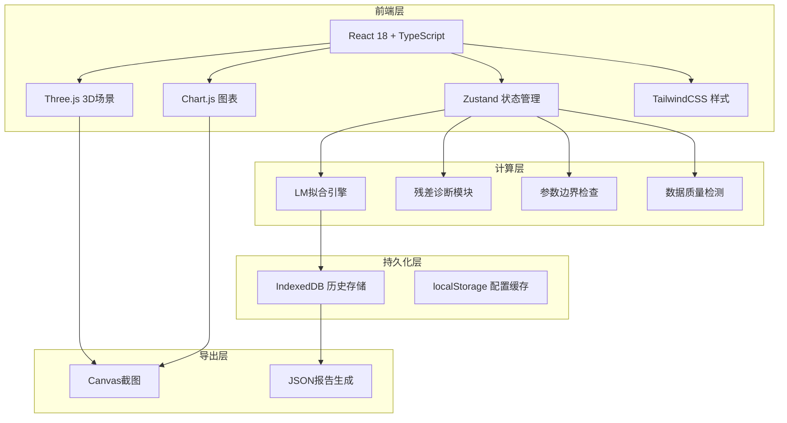
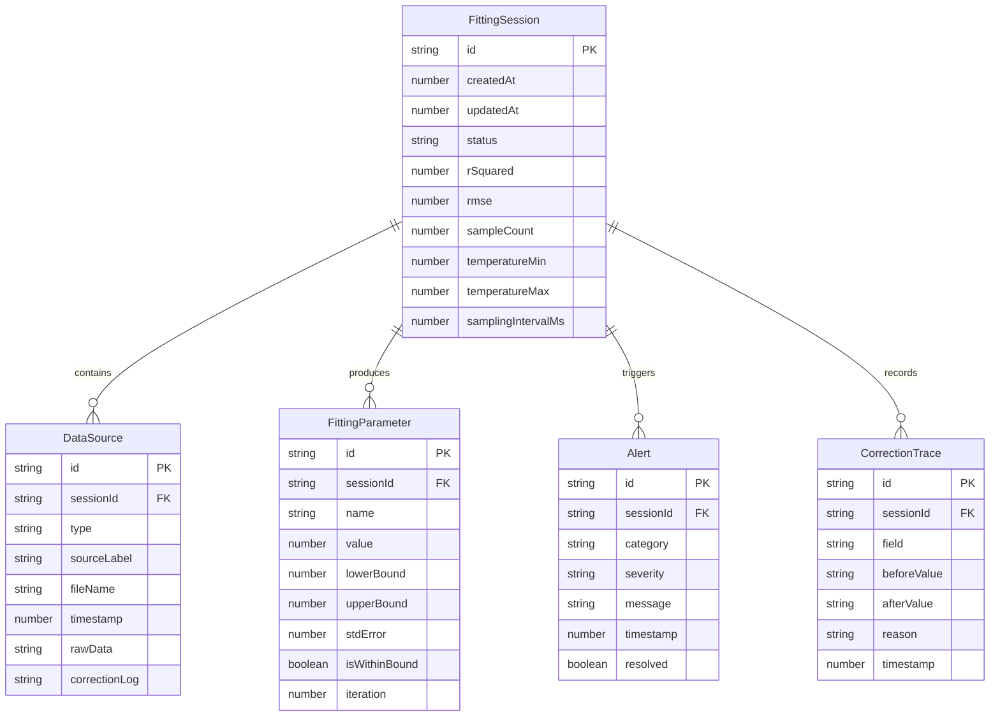

## 1. 架构设计



## 2. 技术说明

- 前端：React@18 + TypeScript + Vite + TailwindCSS@3
- 初始化工具：vite-init
- 3D渲染：three + @react-three/fiber + @react-three/drei + @react-three/postprocessing
- 图表：chart.js + react-chartjs-2
- 状态管理：zustand
- 数据存储：IndexedDB（Dexie.js）用于历史记录，localStorage用于用户配置
- 拟合算法：纯前端Levenberg-Marquardt实现
- 导出：html2canvas截图 + FileSaver.js下载

## 3. 路由定义

| 路由 | 用途 |
|------|------|
| / | 拟合工作台主页面 |
| /history | 历史记录页面 |

## 4. 数据模型

### 4.1 数据模型定义



### 4.2 数据定义语言（IndexedDB Schema via Dexie）

```typescript
interface FittingSession {
  id: string;
  createdAt: number;
  updatedAt: number;
  status: 'normal' | 'warning' | 'critical';
  rSquared: number;
  rmse: number;
  sampleCount: number;
  temperatureMin: number;
  temperatureMax: number;
  samplingIntervalMs: number;
}

interface DataSource {
  id: string;
  sessionId: string;
  type: 'voltage' | 'current' | 'temperature' | 'sampling_interval' | 'initial_params' | 'report';
  sourceLabel: string;
  fileName?: string;
  timestamp: number;
  rawData: string;
  correctionLog: string;
}

interface FittingParameter {
  id: string;
  sessionId: string;
  name: string;
  value: number;
  lowerBound: number;
  upperBound: number;
  stdError: number;
  isWithinBound: boolean;
  iteration: number;
}

interface Alert {
  id: string;
  sessionId: string;
  category: 'sampling_gap' | 'temperature_drift' | 'parameter_divergence';
  severity: 'warning' | 'severe' | 'fatal';
  message: string;
  timestamp: number;
  resolved: boolean;
}

interface CorrectionTrace {
  id: string;
  sessionId: string;
  field: string;
  beforeValue: string;
  afterValue: string;
  reason: string;
  timestamp: number;
}
```

## 5. 核心算法

### 5.1 RC等效电路模型

采用一阶RC模型：V(t) = OCV - I·R0 - I·R1·(1 - e^(-t/τ1))

其中 τ1 = R1·C1

参数列表：R0（欧姆内阻）、R1（极化电阻）、C1（极化电容）、τ1（时间常数）

### 5.2 Levenberg-Marquardt拟合

- 初始参数由用户提供或从上次结果继承
- 阻尼因子λ自适应调整
- 迭代收敛条件：|Δχ²/χ²| < 1e-6 或达到最大迭代次数
- 参数发散检测：连续3次迭代残差增大则终止，回退到上次稳定参数

### 5.3 数据质量检测

- **采样缺口**：相邻采样点时间差 > 2×标称间隔，标记缺口位置和长度
- **温度漂移**：滑动窗口（30点）内温度变化率 > 0.5°C/min，标记漂移区间
- **参数发散**：拟合过程中参数变化率 > 10×/迭代，立即终止并告警

## 6. 状态一致性保障

- 每次拟合生成唯一sessionId
- 所有数据修改通过CorrectionTrace记录
- 历史记录加载时校验：sessionId对应的参数/告警/修正记录完整性
- 导出JSON包含完整数据链（源数据→修正→参数→告警→报告）
- 前后状态冲突时：以最早记录为准，冲突项在历史详情中标红提示
