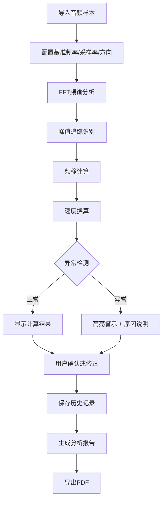

## 1. 产品概述

声波多普勒测速系统是一款面向物理课堂教学的交互式音频分析工具。通过导入音频样本，自动进行频谱分析、峰值追踪和多普勒效应计算，帮助学生直观理解频移现象与速度估算的物理原理。

- 核心价值：将抽象的物理概念转化为可视化、可操作的实验工具
- 目标用户：物理教师、高中及大学物理学生
- 解决问题：缺乏直观的多普勒效应演示工具，实验数据难以快速获取和验证

## 2. 核心功能

### 2.1 用户角色
| 角色 | 注册方式 | 核心权限 |
|------|----------|----------|
| 教师/学生 | 无需注册 | 导入音频、分析计算、查看历史、导出报告 |

### 2.2 功能模块
1. **分析工作台**：音频导入、参数配置、实时频谱显示、计算结果展示
2. **历史记录**：分析历史列表、版本对比、修正痕迹追溯
3. **报告导出**：PDF报告生成、数据汇总、异常标注

### 2.3 页面详情
| 页面名称 | 模块名称 | 功能描述 |
|----------|----------|----------|
| 分析工作台 | 音频导入区 | 支持拖拽/点击上传音频文件，显示文件信息（时长、采样率） |
| 分析工作台 | 参数配置区 | 设置基准频率、采样率、移动方向、噪声阈值 |
| 分析工作台 | 频谱可视化区 | 实时波形图、频谱图，峰值标记，频移高亮 |
| 分析工作台 | 计算结果区 | 显示频移值、计算速度、置信度，异常状态警示 |
| 历史记录 | 历史列表 | 按时间展示分析记录，包含文件来源、计算结果、状态标记 |
| 历史记录 | 详情追溯 | 查看单次分析的完整参数、修改历史、修正备注 |
| 报告导出 | 报告预览 | 生成包含图表、数据、异常说明的分析报告 |
| 报告导出 | 下载功能 | 支持PDF格式导出，保留完整分析痕迹 |

## 3. 核心流程

用户导入音频样本 → 配置物理参数 → 系统执行FFT频谱分析 → 自动识别峰值并计算频移 → 进行速度换算 → 检测异常情况并给出提示 → 用户可修正参数重新计算 → 生成分析报告并导出 → 所有操作自动保存到历史记录

## 4. 界面设计

### 4.1 设计风格
- **设计基调**：科学实验室风格，深蓝灰色调配科技蓝点缀
- **主色**：#165DFF（科技蓝）、#0E42D2（深蓝）
- **辅色**：#FF4D4F（错误警示）、#FAAD14（警告）、#52C41A（正常）
- **中性色**：#0F172A（深灰背景）、#1E293B（卡片背景）、#94A3B8（次要文字）
- **字体**：JetBrains Mono（等宽字体，数据显示）、Inter（界面文字）
- **布局**：三栏式工作台，左侧参数、中间可视化、右侧结果
- **交互**：悬停微动效、数据刷新过渡动画、异常状态闪烁提示
- **图标**：线性简约风格，统一24px网格

### 4.2 页面设计概览
| 页面名称 | 模块名称 | UI元素 |
|----------|----------|--------|
| 分析工作台 | 频谱可视化 | Canvas波形图、频谱柱状图、峰值标记线、频移高亮区 |
| 分析工作台 | 参数配置 | 数字输入框带单位、方向选择器、滑块调参、实时校验提示 |
| 分析工作台 | 异常提示 | 红色警示卡片、问题说明、修正建议、快速修复按钮 |
| 历史记录 | 时间线 | 纵向时间轴、状态标签、修正标记、来源信息 |
| 报告导出 | 报告预览 | 模拟PDF布局、数据表格、频谱缩略图、异常标注 |

### 4.3 响应式设计
- 桌面端（1280px+）：三栏完整布局
- 平板（768px-1279px）：上下分栏，参数与结果合并
- 移动端（<768px）：单页滚动布局，简化频谱显示
