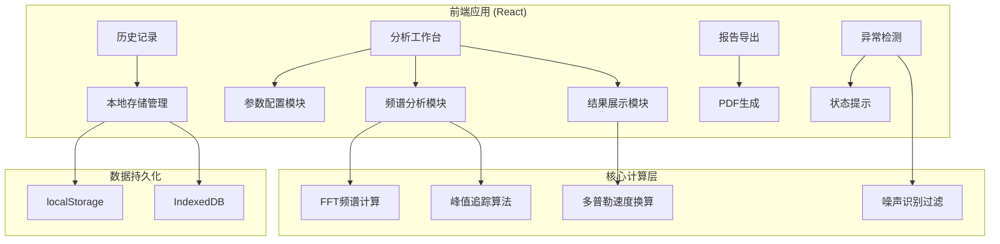

## 1. 架构设计



## 2. 技术选型说明

- **前端框架**: React@18 + TypeScript + Vite@5
- **样式方案**: TailwindCSS@3 + CSS Variables
- **频谱可视化**: Canvas API + Web Audio API
- **信号处理**: dsp.js（FFT计算）
- **PDF导出**: jspdf + html2canvas
- **数据存储**: localStorage（历史记录） + IndexedDB（音频缓存）
- **状态管理**: React Context + useReducer
- **图标**: Lucide React

## 3. 路由定义

| 路由 | 页面 | 功能描述 |
|------|------|----------|
| / | 分析工作台 | 主工作区：音频导入、参数配置、频谱分析、结果展示 |
| /history | 历史记录 | 历史分析列表、详情查看、版本对比 |
| /report/:id | 报告预览 | 单条记录的报告预览与导出 |

## 4. 核心数据模型

### 4.1 分析记录数据结构

```typescript
interface AnalysisRecord {
  id: string;
  createdAt: number;
  updatedAt: number;
  source: {
    fileName: string;
    fileSize: number;
    duration: number;
    sampleRate: number;
    importedFrom: string;
  };
  parameters: {
    baseFrequency: number;
    sampleRate: number;
    direction: 'approaching' | 'receding';
    noiseThreshold: number;
  };
  results: {
    observedFrequency: number;
    frequencyShift: number;
    velocity: number;
    confidence: number;
    peaks: FrequencyPeak[];
  };
  anomalies: Anomaly[];
  corrections: Correction[];
  status: 'pending' | 'calculating' | 'completed' | 'error';
}

interface FrequencyPeak {
  frequency: number;
  amplitude: number;
  isNoise: boolean;
  index: number;
}

interface Anomaly {
  type: 'sample_rate_mismatch' | 'noise_peak' | 'direction_error' | 'low_confidence';
  severity: 'warning' | 'error';
  message: string;
  suggestion: string;
  timestamp: number;
}

interface Correction {
  field: string;
  oldValue: number | string;
  newValue: number | string;
  reason: string;
  timestamp: number;
}
```

## 5. 核心算法模块

### 5.1 多普勒效应计算公式

```
f' = f0 * (v_sound / (v_sound ± v_source))

其中：
- f': 观测频率
- f0: 基准频率
- v_sound: 声速（343 m/s @ 20°C）
- v_source: 波源速度
- 接近时用减号，远离时用加号

逆运算（速度换算）：
v_source = v_sound * |f' - f0| / f0
```

### 5.2 异常检测规则

| 异常类型 | 检测条件 | 处理方式 |
|----------|----------|----------|
| 采样率不匹配 | 文件采样率 ≠ 配置采样率 | 红色警示，禁止计算，强制修正 |
| 噪声峰误判 | 峰值振幅 < 噪声阈值 | 黄色警告，标记为噪声，不参与计算 |
| 方向符号反 | 频移方向与配置方向矛盾 | 红色警示，提示方向可能错误 |
| 低置信度 | 峰值信噪比 < 2:1 | 黄色警告，提示结果不可靠 |

## 6. 项目目录结构

```
src/
├── components/
│   ├── AudioUploader/      # 音频上传组件
│   ├── SpectrumAnalyzer/   # 频谱可视化
│   ├── ParameterPanel/     # 参数配置面板
│   ├── ResultPanel/        # 结果展示面板
│   ├── AnomalyAlert/       # 异常提示组件
│   ├── HistoryList/        # 历史记录列表
│   └── ReportPreview/      # 报告预览
├── hooks/
│   ├── useAudioAnalysis.ts # 音频分析Hook
│   ├── useFFT.ts           # FFT计算Hook
│   ├── useHistory.ts       # 历史记录管理
│   └── useAnomalyDetection.ts # 异常检测
├── utils/
│   ├── doppler.ts          # 多普勒计算
│   ├── fft.ts              # FFT算法
│   ├── peakDetection.ts    # 峰值检测
│   └── pdfExport.ts        # PDF导出
├── types/
│   └── index.ts            # 类型定义
├── store/
│   └── AnalysisContext.tsx # 全局状态
├── pages/
│   ├── Workbench.tsx       # 工作台页面
│   ├── History.tsx         # 历史页面
│   └── Report.tsx          # 报告页面
└── App.tsx
```
