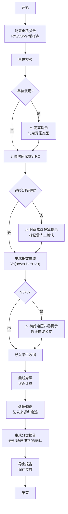

## 1. 产品概述

电容充放电课堂API是一款面向电子实验教学的交互式可视化工具，帮助教师批量生成RC充放电理论曲线，并与学生实验数据进行智能对照分析。解决传统教学中时间常数误算、单位混用、数据修正痕迹丢失等痛点问题。

- **核心价值**：将抽象的RC充放电指数模型转化为直观的3D动态可视化，提供严谨的误差分析和可追溯的数据修正机制
- **目标用户**：电子电路实验教师、理工科学生
- **市场定位**：实验教学辅助工具，填补教学软件在数据可追溯性和异常智能检测方面的空白

## 2. 核心特性

### 2.1 用户角色

| 角色 | 登录方式 | 核心权限 |
|------|---------|----------|
| 教师用户 | 本地存储，无需登录 | 配置电路参数、导入学生数据、生成对照报告、导出教学资料 |
| 学生用户 | 本地存储，无需登录 | 查看理论曲线、导入个人实验数据、查看误差分析 |

### 2.2 功能模块

1. **主工作台**：3D电路可视化 + 2D曲线图 + 参数控制面板 + 侧边明细栏
2. **参数配置模块**：电阻、电容、电源电压、采样点、初始电压设置
3. **曲线计算模块**：RC充放电指数模型、时间常数计算、单位自动转换
4. **异常检测模块**：时间常数误算检测、单位混用提示、初始电压非零警告
5. **数据管理模块**：学生数据导入、理论曲线批量生成、参数保存加载
6. **修正追踪模块**：数据来源记录、修正历史版本、操作痕迹保留
7. **误差分析模块**：均方误差、相对误差、最大偏差统计
8. **报告导出模块**：分类展示未处理/已修正/需人工确认数据

### 2.3 页面详情

| 页面名称 | 模块名称 | 功能描述 |
|---------|---------|----------|
| 主工作台 | 3D可视化区 | 交互式RC电路3D模型，充放电动态效果，拖动旋转查看，参数变化实时同步 |
| 主工作台 | 2D曲线图区 | 充放电曲线叠加展示，理论曲线vs学生数据，缩放平移，采样点标注 |
| 主工作台 | 参数控制面板 | 滑块/输入框双模式调节，单位选择，预设参数快速加载 |
| 主工作台 | 侧边明细栏 | 计算结果明细，异常提示列表，修正历史记录，数据来源追踪 |
| 主工作台 | 报告生成区 | 误差统计图表，分类数据列表，一键导出PDF/CSV |

## 3. 核心流程

**典型使用流程**：
1. 教师打开应用，设置电阻、电容、电源电压等参数
2. 系统自动检测单位一致性和参数合理性，如有异常即时提示
3. 生成理论充放电曲线，3D视图同步展示电路工作状态
4. 导入全班学生实验数据，系统自动进行曲线配准和误差计算
5. 教师对异常数据进行修正，系统记录每次修改的来源和时间
6. 生成分类报告，清晰区分未处理、已修正、需人工确认的数据
7. 导出报告用于课堂讲解和成绩评定

## 4. 用户界面设计

### 4.1 设计风格

- **整体风格**：科技学术风 - 深色主题配合电路元素，专业严谨但不失现代感
- **主色调**：电子蓝 `#00D4FF`（电流流动、能量感）、电路绿 `#00FF88`（正常状态）、警告橙 `#FF8800`（异常提示）、错误红 `#FF3366`（严重错误）
- **背景**：深炭灰 `#0A0E17` 配合细微网格纹理和电路路径装饰
- **字体**：
  - 标题：`Orbitron` - 科技感显示字体，适合电路/工程类应用
  - 正文：`JetBrains Mono` - 等宽字体，数据展示清晰专业
- **按钮风格**：扁平化设计，细边框，hover时有发光效果，点击有微缩反馈
- **图标风格**：线性电路图标，配合SVG动画效果

### 4.2 页面设计概述

| 页面名称 | 模块名称 | UI元素 |
|---------|---------|--------|
| 主工作台 | 3D可视化区 | 透视布局，电路元件悬浮展示，电流粒子流动效，环境光+点光源，鼠标拖动旋转 |
| 主工作台 | 2D曲线图区 | 深色背景图表，网格线半透明，不同曲线用对比色区分，数据点悬停显示详情 |
| 主工作台 | 参数控制面板 | 卡片式布局，左侧标签右侧滑块+数值输入，单位下拉选择，异常参数边框变色 |
| 主工作台 | 侧边明细栏 | 可折叠面板，异常列表带图标标记，修正历史可展开查看差异，时间线展示 |
| 主工作台 | 报告生成区 | 三栏分类卡片（未处理/已修正/需确认），统计环形图，导出按钮组 |

### 4.3 响应式设计

- **桌面优先**：1920×1080为基准设计，四栏布局（3D视图+曲线+控制面板+侧边栏）
- **平板适配**：自动变为两栏布局，控制面板可折叠为抽屉
- **移动适配**：单栏垂直滚动，3D视图简化为2D示意图，核心功能保留
- **触摸优化**：滑块增大触摸区域，双击缩放图表，长按查看详情

### 4.4 3D场景设计

- **环境设置**：深色空间背景，微弱网格地面，营造实验室氛围
- **光照方案**：主光（冷白色，45°斜射）+ 补光（蓝色，电路元件边缘）+ 点光源（随电流流动移动）
- **相机设置**：PerspectiveCamera，初始视角45°俯视，支持OrbitControls拖动旋转缩放
- **电路元件建模**：
  - 电阻：标准电阻色环模型，阻值变化时色环同步更新
  - 电容：平行板或电解电容模型，充放电时极板间电场可视化
  - 电源：电池或直流电源模型，电压变化时显示数值
  - 导线：发光管体，电流流动时粒子动画
- **动画系统**：
  - 充电过程：电子粒子从电源正极流向电容正极
  - 放电过程：电子粒子从电容正极流向电阻
  - 电压变化：电容颜色渐变（低电压→蓝色，高电压→红色）
- **后处理**：Bloom效果（发光导线和元件），轻微晕影，增强科技感
- **性能控制**：元件面数优化，粒子数量限制，Lod层级细节

