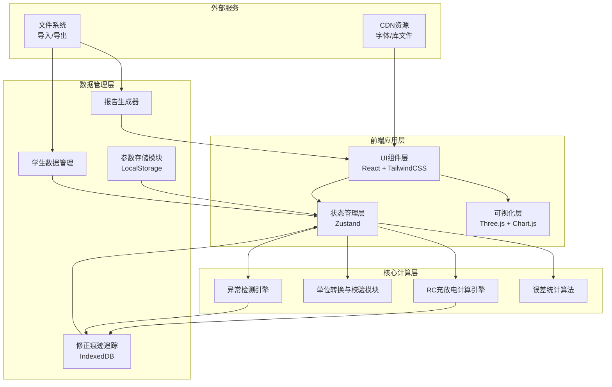

## 1. 架构设计



## 2. 技术描述

- **前端框架**：React@18 + TypeScript + Vite@5
- **样式方案**：TailwindCSS@3.4 + CSS变量（主题系统）
- **3D可视化**：three@0.160 + @react-three/fiber@8 + @react-three/drei@9 + @react-three/postprocessing@2
- **2D图表**：chart.js@4 + react-chartjs-2@5
- **状态管理**：zustand@4（轻量级状态管理，支持时间旅行调试）
- **本地存储**：LocalStorage（参数配置）+ IndexedDB（修正历史、学生数据）
- **数学计算**：mathjs@12（精确数值计算、单位转换）
- **报告导出**：jspdf@2 + jspdf-autotable@3（PDF导出）+ papaparse@5（CSV导出）
- **动画库**：framer-motion@10（UI过渡动画）
- **初始化工具**：pnpm create vite@5 . --template react-ts

## 3. 路由定义

| 路由 | 页面/组件 | 功能说明 |
|------|----------|----------|
| `/` | `App.tsx` | 主工作台 - 整合所有功能模块 |
| `/workspace` | `pages/Workspace.tsx` | 实验工作台（默认路由） |
| `/reports` | `pages/Reports.tsx` | 报告查看与管理 |
| `/history` | `pages/History.tsx` | 修正历史与数据追溯 |

## 4. 核心数据模型

### 4.1 TypeScript 类型定义

```typescript
// 电路参数
interface CircuitParams {
  id: string;
  name: string;
  resistance: number;      // 电阻值
  resistanceUnit: 'Ω' | 'kΩ' | 'MΩ';
  capacitance: number;     // 电容值
  capacitanceUnit: 'F' | 'μF' | 'nF' | 'pF';
  sourceVoltage: number;   // 电源电压
  voltageUnit: 'V' | 'mV' | 'kV';
  initialVoltage: number;  // 初始电压
  samplePoints: number;    // 采样点数
  timeRange: number;       // 时间范围（秒）
  createdAt: string;
  updatedAt: string;
  source: 'manual' | 'preset' | 'import';
}

// 计算结果
interface CalculationResult {
  paramsId: string;
  timeConstant: number;    // 时间常数 τ = RC
  timeConstantUnit: string;
  chargeCurve: DataPoint[];
  dischargeCurve: DataPoint[];
  warnings: Warning[];
  status: 'normal' | 'warning' | 'error' | 'needs_review';
}

// 数据点
interface DataPoint {
  time: number;
  voltage: number;
  current?: number;
  source: 'theoretical' | 'student' | 'corrected';
}

// 学生数据
interface StudentData {
  id: string;
  studentId: string;
  studentName: string;
  experimentId: string;
  dataPoints: DataPoint[];
  paramsSnapshot: CircuitParams;
  errorAnalysis?: ErrorStats;
  corrections: CorrectionRecord[];
  status: 'raw' | 'processed' | 'corrected' | 'needs_review';
  importedAt: string;
  source: string;
}

// 修正记录
interface CorrectionRecord {
  id: string;
  timestamp: string;
  field: string;
  oldValue: any;
  newValue: any;
  reason: string;
  operator: string;
  dataSource: string;
  version: number;
}

// 异常警告
interface Warning {
  id: string;
  type: 'unit_mismatch' | 'time_constant_error' | 'nonzero_initial' | 'out_of_range' | 'data_anomaly';
  severity: 'info' | 'warning' | 'error';
  message: string;
  field?: string;
  value?: any;
  suggestion?: string;
}

// 误差统计
interface ErrorStats {
  mse: number;           // 均方误差
  rmse: number;          // 均方根误差
  mae: number;           // 平均绝对误差
  maxError: number;      // 最大误差
  maxErrorPoint: DataPoint;
  correlation: number;   // 相关系数
}

// 报告数据
interface ReportData {
  id: string;
  generatedAt: string;
  experimentName: string;
  totalStudents: number;
  rawData: StudentData[];      // 未处理
  correctedData: StudentData[]; // 已修正
  needsReview: StudentData[];   // 需人工确认
  errorSummary: {
    averageMSE: number;
    errorDistribution: Record<string, number>;
    warningCounts: Record<string, number>;
  };
}
```

### 4.2 数据存储设计

**LocalStorage 存储（键值对）：**
- `rc-lab:params:current` - 当前电路参数
- `rc-lab:params:presets` - 预设参数列表
- `rc-lab:ui:preferences` - 用户界面偏好

**IndexedDB 数据库：**
- 数据库名：`RCLabDB`
- 版本：1
- 对象仓库：
  - `studentData` - 学生实验数据（主键：id，索引：studentId, experimentId, status）
  - `corrections` - 修正记录（主键：id，索引：studentDataId, timestamp）
  - `reports` - 生成的报告（主键：id，索引：generatedAt）
  - `experiments` - 实验配置（主键：id，索引：name, createdAt）

## 5. 核心算法

### 5.1 RC充放电指数模型

```
充电过程：Vc(t) = Vs + (V0 - Vs) * e^(-t/τ)
放电过程：Vc(t) = V0 * e^(-t/τ)
其中 τ = R * C 为时间常数
```

### 5.2 单位转换校验

- 电阻：Ω ↔ kΩ ↔ MΩ（10^3 进制）
- 电容：F ↔ μF ↔ nF ↔ pF（10^6, 10^3, 10^3 进制）
- 电压：V ↔ mV ↔ kV（10^3 进制）
- 时间常数自动匹配单位（s, ms, μs）

### 5.3 异常检测规则

| 异常类型 | 检测条件 | 处理方式 |
|---------|---------|---------|
| 单位混用 | 同一参数多次修改使用不同单位 | 高亮提示，记录转换过程 |
| 时间常数误算 | τ < 1μs 或 τ > 1000s（教学场景异常） | 红色警告，标记需人工确认 |
| 初始电压非零 | V0 ≠ 0 | 橙色提示，修正公式，记录修正原因 |
| 数据点异常 | 学生数据点偏离理论曲线 > 3σ | 黄色标记，建议教师检查 |

### 5.4 误差统计算法

- MSE = Σ(yi - ŷi)² / n
- RMSE = √MSE
- MAE = Σ|yi - ŷi| / n
- 相关系数 r = Σ((xi-x̄)(yi-ȳ)) / √(Σ(xi-x̄)²Σ(yi-ȳ)²)

## 6. 组件架构

```mermaid
graph TD
    App["App.tsx<br/>根组件"] --> Layout["components/Layout.tsx<br/>布局容器"]
    
    Layout --> Header["components/Header.tsx<br/>顶部导航"]
    Layout --> Main["components/MainGrid.tsx<br/>主网格布局"]
    
    Main --> View3D["components/View3D/index.tsx<br/>3D可视化区"]
    View3D --> Scene3D["components/View3D/Scene.tsx"]
    View3D --> Resistor3D["components/View3D/Resistor.tsx"]
    View3D --> Capacitor3D["components/View3D/Capacitor.tsx"]
    View3D --> Circuit3D["components/View3D/Circuit.tsx"]
    View3D --> Particles3D["components/View3D/Particles.tsx"]
    
    Main --> Chart2D["components/Chart2D/index.tsx<br/>2D曲线图区"]
    Chart2D --> ChargeChart["components/Chart2D/ChargeChart.tsx"]
    Chart2D --> DischargeChart["components/Chart2D/DischargeChart.tsx"]
    Chart2D --> DataOverlay["components/Chart2D/DataOverlay.tsx"]
    
    Main --> ControlPanel["components/ControlPanel/index.tsx<br/>参数控制面板"]
    ControlPanel --> ResistanceSlider["components/ControlPanel/ResistanceSlider.tsx"]
    ControlPanel --> CapacitanceSlider["components/ControlPanel/CapacitanceSlider.tsx"]
    ControlPanel --> VoltageSlider["components/ControlPanel/VoltageSlider.tsx"]
    ControlPanel --> PresetSelector["components/ControlPanel/PresetSelector.tsx"]
    
    Main --> Sidebar["components/Sidebar/index.tsx<br/>侧边明细栏"]
    Sidebar --> ResultDetails["components/Sidebar/ResultDetails.tsx"]
    Sidebar --> WarningList["components/Sidebar/WarningList.tsx"]
    Sidebar --> CorrectionHistory["components/Sidebar/CorrectionHistory.tsx"]
    Sidebar --> StudentDataList["components/Sidebar/StudentDataList.tsx"]
    
    Layout --> ReportModal["components/ReportModal/index.tsx<br/>报告弹窗"]
    ReportModal --> ReportSummary["components/ReportModal/Summary.tsx"]
    ReportModal --> ReportCategories["components/ReportModal/Categories.tsx"]
    ReportModal --> ReportExport["components/ReportModal/Export.tsx"]
    
    App --> Store["store/useStore.ts<br/>状态管理"]
    Store --> CalcEngine["utils/calculator.ts<br/>计算引擎"]
    Store --> UnitUtils["utils/units.ts<br/>单位工具"]
    Store --> WarningEngine["utils/warnings.ts<br/>异常检测"]
    Store --> Storage["utils/storage.ts<br/>数据存储"]
```



## 7. 性能优化策略

1. **3D渲染优化**：
   - 使用 InstancedMesh 批量渲染电流粒子
   - 实现 LOD（细节层次）根据距离切换模型精度
   - 限制最大帧率为 60fps，非活动状态降至 30fps

2. **计算优化**：
   - Web Worker 处理批量学生数据的误差计算
   - 曲线数据缓存，参数未变化时复用计算结果
   - 采样点智能降采样，大数据集自动优化显示

3. **内存管理**：
   - IndexedDB 分页加载历史数据
   - 组件卸载时清理 Three.js 资源和事件监听
   - 使用 React.memo 和 useMemo 避免不必要重渲染

4. **懒加载**：
   - 报告模块动态导入，减少首屏体积
   - 3D模型按需加载，首屏显示简化版本

