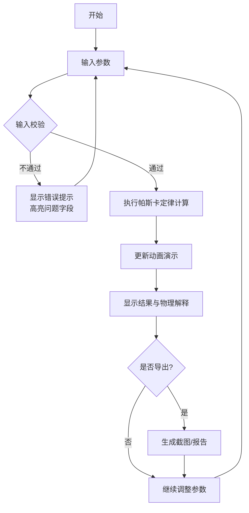

## 1. 产品概述

液压千斤顶课堂器是面向机械基础课程的交互式教学计算工具，帮助学生通过调整活塞面积和输入力，直观理解液压放大原理和行程代价关系。

- 核心用途：机械基础课程液压传动章节的教学演示与学生自主探索
- 解决问题：抽象液压公式难以理解、单位错误频发、效率概念模糊
- 目标用户：机械基础课教师、本科/高职机械类专业学生
- 价值：让液压原理可视化、可交互、可验证，降低学习门槛

## 2. 核心功能

### 2.1 功能模块
1. **主计算页面**：参数输入、实时计算、动画演示、结果解释
2. **输入校验系统**：实时检测非法输入并给出明确错误提示
3. **报告生成**：计算结果截图导出、计算过程报告
4. **版本痕迹**：保留计算来源和每次修正的历史记录

### 2.2 页面详情
| 页面名称 | 模块名称 | 功能描述 |
|----------|----------|----------|
| 主计算页 | 参数输入区 | 大小活塞面积、输入力、行程、效率输入，支持单位选择 |
| 主计算页 | 实时校验区 | 即时检测面积单位错误、效率>1、行程不守恒等问题 |
| 主计算页 | 动画演示区 | 液压千斤顶工作原理动画，大小活塞联动展示 |
| 主计算页 | 结果解释区 | 输出力、放大倍数、行程变化、能量守恒解释 |
| 主计算页 | 报告导出区 | 截图保存、计算报告生成、历史记录查看 |

## 3. 核心流程

### 3.1 正常计算流程
1. 用户输入参数（活塞面积、输入力、行程、效率）
2. 系统实时校验输入合法性
3. 校验通过后自动计算输出力、放大倍数等结果
4. 动画同步演示活塞运动
5. 显示详细公式推导和物理解释
6. 用户可导出截图或报告

### 3.2 异常处理流程
1. 输入非法值（效率>1、面积为负等）
2. 系统立即高亮错误字段并显示具体错误原因
3. 暂停计算直至错误修正
4. 保留错误历史痕迹供教学参考

### 3.3 流程图

## 4. 用户界面设计

### 4.1 设计风格
- **主题色**：工业蓝（#165DFF）为主色调，机械灰（#4E5969）为辅助色，警示红（#F53F3F）用于错误提示
- **按钮风格**：圆角矩形、微立体效果、悬停动画
- **字体**：标题使用思源黑体Bold，正文使用思源黑体Regular，数字使用等宽字体
- **布局风格**：三栏卡片式布局，左侧输入、中间动画、右侧结果
- **图标风格**：线性图标，简洁工业风，使用SVG动画

### 4.2 页面设计概览
| 页面名称 | 模块名称 | UI 元素 |
|----------|----------|---------|
| 主计算页 | 参数输入区 | 卡片式容器、带单位选择的输入框、滑动条快捷调整 |
| 主计算页 | 错误提示区 | 红色边框高亮、错误图标、具体错误原因文字 |
| 主计算页 | 动画演示区 | SVG动画、活塞上下运动、液体流动效果、力的箭头标注 |
| 主计算页 | 结果解释区 | 公式展示、放大倍数高亮、能量守恒说明、单位标注 |
| 主计算页 | 操作区 | 重置按钮、截图按钮、历史记录抽屉 |

### 4.3 响应式
- Desktop-first 设计，适配1280px及以上屏幕
- 平板端（768-1279px）：两栏布局，输入与结果合并
- 移动端（<768px）：单栏流式布局，简化动画展示

### 4.4 动画设计
- 活塞运动：平滑过渡动画，速度与计算出的行程成比例
- 液体流动：渐变填充动画，展示液压传递过程
- 力的放大：箭头尺寸变化，直观展示力的放大效果
- 错误出现：抖动动画+红色渐显，引起注意
- 页面加载：元素渐入动画，按输入→动画→结果顺序出现
