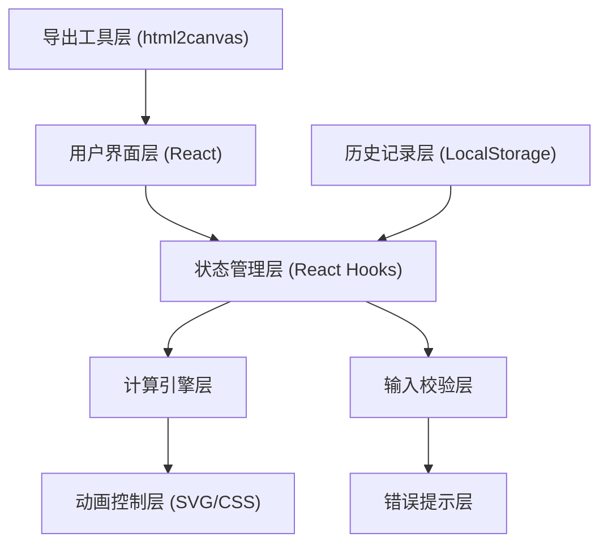

## 1. 架构设计



## 2. 技术选型

- **前端框架**：React@18 + TypeScript
- **构建工具**：Vite@5
- **样式方案**：TailwindCSS@3 + CSS Modules
- **状态管理**：React Hooks (useState, useReducer)
- **动画方案**：CSS Transitions + SVG Animations
- **截图导出**：html2canvas
- **数据持久化**：LocalStorage

## 3. 目录结构

```
hydraulic-jack-calculator/
├── src/
│   ├── components/
│   │   ├── InputPanel/          # 参数输入面板
│   │   ├── AnimationPanel/      # 动画演示面板
│   │   ├── ResultPanel/         # 结果解释面板
│   │   ├── ErrorMessage/        # 错误提示组件
│   │   └── HistoryDrawer/       # 历史记录抽屉
│   ├── hooks/
│   │   ├── useCalculation.ts    # 计算逻辑Hook
│   │   ├── useValidation.ts     # 输入校验Hook
│   │   └── useHistory.ts        # 历史记录Hook
│   ├── utils/
│   │   ├── calculator.ts        # 液压计算公式
│   │   ├── validator.ts         # 校验规则
│   │   ├── exporter.ts          # 截图导出工具
│   │   └── constants.ts         # 物理常量
│   ├── types/
│   │   └── index.ts             # TypeScript类型定义
│   ├── App.tsx
│   ├── main.tsx
│   └── index.css
├── public/
├── package.json
├── tsconfig.json
├── vite.config.ts
└── tailwind.config.js
```

## 4. 核心数据模型

### 4.1 输入参数类型
```typescript
interface CalculationInput {
  smallPistonArea: number;      // 小活塞面积
  smallPistonAreaUnit: AreaUnit; // 面积单位
  largePistonArea: number;      // 大活塞面积
  largePistonAreaUnit: AreaUnit; // 面积单位
  inputForce: number;           // 输入力
  inputForceUnit: ForceUnit;    // 力单位
  inputStroke: number;          // 输入行程
  inputStrokeUnit: LengthUnit;  // 长度单位
  efficiency: number;           // 效率 (0-1)
  source: string;               // 材料来源
}
```

### 4.2 计算结果类型
```typescript
interface CalculationResult {
  pressure: number;             // 液体压强
  outputForce: number;          // 输出力
  amplificationRatio: number;   // 放大倍数
  outputStroke: number;         // 输出行程
  strokeRatio: number;          // 行程比
  inputWork: number;            // 输入功
  outputWork: number;           // 输出功
  energyLoss: number;           // 能量损失
  isValid: boolean;             // 计算是否有效
}
```

### 4.3 校验错误类型
```typescript
interface ValidationError {
  field: string;                // 错误字段
  code: ErrorCode;              // 错误代码
  message: string;              // 错误信息
  suggestion: string;           // 修正建议
  severity: 'warning' | 'error';
}
```

### 4.4 历史记录类型
```typescript
interface HistoryRecord {
  id: string;
  timestamp: number;
  input: CalculationInput;
  result: CalculationResult;
  errors: ValidationError[];
  corrections: Correction[];    // 修正痕迹
}

interface Correction {
  field: string;
  oldValue: string;
  newValue: string;
  reason: string;
  timestamp: number;
}
```

## 5. 核心计算公式

### 5.1 帕斯卡定律
```
压强 P = F₁ / A₁  (小活塞压强)
输出力 F₂ = P × A₂ × η = F₁ × (A₂ / A₁) × η
```

### 5.2 行程守恒（体积守恒）
```
V₁ = A₁ × S₁  (小活塞排出体积)
V₂ = A₂ × S₂  (大活塞吸入体积)
理想状态: V₁ = V₂
实际: S₂ = S₁ × (A₁ / A₂) × η_volume
```

### 5.3 能量关系
```
输入功 W₁ = F₁ × S₁
输出功 W₂ = F₂ × S₂
效率 η = W₂ / W₁ × 100%
```

## 6. 校验规则清单

| 校验项 | 规则 | 错误提示 |
|--------|------|----------|
| 面积有效性 | 面积 > 0 | 面积必须为正数 |
| 面积单位一致性 | 提醒单位不同的情况 | 两个活塞面积单位不同，已自动转换 |
| 效率范围 | 0 < 效率 ≤ 1 | 效率不能超过100%，实际系统必有能量损失 |
| 输入力 | 力 > 0 | 输入力必须为正数 |
| 行程 | 行程 > 0 | 行程必须为正数 |
| 放大比合理性 | A₂/A₁ 合理范围 | 面积比过大，实际难以实现 |

## 7. API 设计（纯前端，无后端）

所有计算和数据存储均在前端完成，使用 LocalStorage 持久化历史记录。
