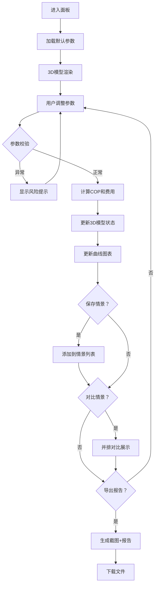

## 1. 产品概述

热泵COP估算面板是为暖通销售人员打造的Web3D交互式工具，用于向客户直观展示不同室外温度下热泵效率（COP）和电费变化，替代传统表格和截图沟通方式。

- **核心问题**：销售依赖表格和截图难以清晰解释复杂的能效关系，客户理解成本高
- **目标用户**：暖通销售人员、潜在客户
- **核心价值**：通过3D可视化和实时计算，让能效数据更直观、决策更透明

## 2. 核心功能

### 2.1 用户角色
| 角色 | 登录方式 | 核心权限 |
|------|----------|----------|
| 销售人员 | 无需登录 | 输入参数、查看估算、对比情景、导出报告 |
| 客户查看 | 无需登录 | 查看演示、理解能效变化 |

### 2.2 功能模块
1. **3D热泵模型展示**：交互式3D模型、旋转缩放、部件悬浮信息
2. **参数配置面板**：室外温度、供水温度、机组参数、电价设置、负荷需求
3. **COP估算引擎**：实时计算、温度越界检测、数据完整性校验
4. **费用曲线图表**：年度/月度电费趋势、多情景对比曲线
5. **情景比较功能**：保存多种参数组合、并排对比差异
6. **风险提示系统**：温度越界警告、负荷缺失提醒、峰谷电价错误提示
7. **报告导出模块**：截图导出、估算报告生成、参数痕迹保留

### 2.3 页面详情
| 页面名称 | 模块名称 | 功能描述 |
|---------|---------|----------|
| 主面板 | 3D模型区 | 热泵3D模型展示、旋转交互、部件悬浮提示 |
| 主面板 | 参数配置区 | 温度滑块、机组参数下拉、电价输入、负荷设置 |
| 主面板 | 估算结果区 | COP实时数值、效率曲线、费用估算表 |
| 主面板 | 情景对比区 | 已保存情景列表、选择对比、差异高亮 |
| 主面板 | 风险提示区 | 异常参数醒目提示、修正建议 |
| 主面板 | 导出操作区 | 截图按钮、报告生成、数据溯源显示 |

## 3. 核心流程

## 4. 界面设计

### 4.1 设计风格
- **主色调**：科技蓝 (#165DFF) - 代表专业、冷静、技术
- **辅助色**：橙色警告 (#FF7D00)、绿色正常 (#00B42A)、红色错误 (#F53F3F)
- **中性色**：深灰背景 (#1D2129)、卡片浅灰 (#272E3B)、文字灰白 (#E5E6EB)
- **按钮风格**：圆角8px、悬停微放大、点击凹陷反馈
- **字体**：标题用 Noto Sans SC Bold，正文用 Noto Sans SC Regular
- **布局风格**：三栏式布局（3D模型居中、参数左栏、结果右栏）
- **图标风格**：线性简约图标，与科技感匹配

### 4.2 页面设计概览
| 页面名称 | 模块名称 | UI元素 |
|---------|---------|--------|
| 主面板 | 3D模型区 | 蓝色光晕环境、金属质感热泵模型、悬浮信息卡片、旋转控制提示 |
| 主面板 | 参数配置区 | 滑动条带数值显示、下拉选择框、数字输入框带单位 |
| 主面板 | 结果区 | 大号COP数值展示、渐变折线图、数据表格斑马纹 |
| 主面板 | 提示区 | 警告图标动画、彩色边框高亮、可折叠详情 |

### 4.3 响应式设计
- **桌面优先**：1920px标准宽度，三栏布局
- **平板适配**：1024px时改为上下布局（上3D，下参数+结果）
- **触控优化**：增大点击区域至44px，支持手势旋转3D模型

### 4.4 3D场景指引
- **环境/HDRI**：暗色调科技感环境，蓝色聚光灯聚焦热泵模型
- **光照设置**：主光源+环境光+边缘轮廓光，突出金属质感
- **相机设置**：初始角度45°俯视角，可360°旋转，限制上下角度
- **交互动画**：参数变化时模型部件变色/发光提示，COP高低对应颜色渐变
- **后处理效果**：轻微泛光、抗锯齿，保持性能优先
- **性能预算**：模型面数控制在5万内，保持60fps流畅度
