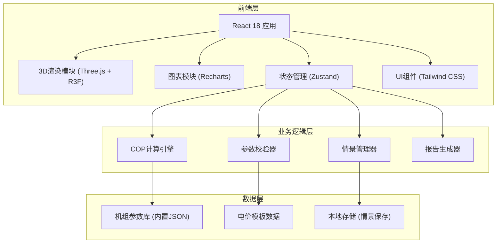

## 1. 架构设计



## 2. 技术选型

- **前端框架**：React 18 + TypeScript
- **构建工具**：Vite 5
- **样式方案**：Tailwind CSS 3
- **3D渲染**：Three.js + @react-three/fiber + @react-three/drei
- **图表库**：Recharts
- **状态管理**：Zustand（轻量型，适合单页应用）
- **导出功能**：html2canvas（截图）+ jspdf（报告）
- **图标库**：Lucide React

## 3. 路由定义
| 路由 | 用途 |
|------|------|
| / | 主面板 - 3D模型+参数+结果一体化展示 |

## 4. 数据模型

### 4.1 核心数据类型

```typescript
// 热泵机组参数
interface HeatPumpParams {
  id: string;
  model: string;
  brand: string;
  ratedCOP: number;      // 额定COP
  minOutdoorTemp: number; // 最低工作温度
  maxOutdoorTemp: number; // 最高工作温度
  ratedCapacity: number;  // 额定制热量 kW
  powerInput: number;     // 输入功率 kW
}

// 计算输入参数
interface CalculationInput {
  outdoorTemp: number;    // 室外温度 ℃
  supplyWaterTemp: number; // 供水温度 ℃
  heatPumpId: string;     // 选中热泵ID
  electricityPrice: {
    peak: number;         // 峰电价 元/kWh
    valley: number;       // 谷电价 元/kWh
    flat: number;         // 平电价 元/kWh
  };
  heatLoad: number;       // 热负荷 kW
  operatingHours: {
    peak: number;         // 峰时段运行小时
    valley: number;       // 谷时段运行小时
    flat: number;         // 平时段运行小时
  };
}

// 计算结果
interface CalculationResult {
  cop: number;            // 实际COP
  capacity: number;       // 实际制热量 kW
  powerConsumption: number; // 耗电量 kWh/h
  hourlyCost: {
    peak: number;
    valley: number;
    flat: number;
  };
  dailyCost: number;      // 日电费
  monthlyCost: number;    // 月电费估算
  annualCost: number;     // 年电费估算
}

// 情景对比项
interface Scenario {
  id: string;
  name: string;
  timestamp: number;
  input: CalculationInput;
  result: CalculationResult;
  sourceInfo: string;     // 数据来源记录
  revisionHistory: Revision[];
}

// 修订记录
interface Revision {
  id: string;
  timestamp: number;
  field: string;
  oldValue: any;
  newValue: any;
  reason?: string;
}

// 风险提示
interface RiskAlert {
  type: 'error' | 'warning' | 'info';
  field: string;
  message: string;
  suggestion: string;
}
```

### 4.2 COP计算公式

```
COP实际 = COP额定 × 温度修正系数
温度修正系数 = f(室外温度, 供水温度)

其中温度修正系数基于热泵特性曲线计算：
- 室外温度越低，COP越低
- 供水温度越高，COP越低
```

## 5. 核心计算逻辑

### 5.1 温度修正系数计算
```
修正系数 = 1 - k1 × |T室外 - T额定室外| - k2 × |T供水 - T额定供水|
保证系数在 0.4 ~ 1.2 范围内
```

### 5.2 电费计算
```
小时耗电量 = 实际制热量 / COP实际
小时电费 = 小时耗电量 × 对应时段电价
日电费 = Σ(各时段小时电费 × 各时段运行小时数)
```

## 6. 异常校验规则

| 校验项 | 异常条件 | 提示级别 |
|--------|----------|----------|
| 室外温度 | < 最低工作温度 或 > 最高工作温度 | 错误（不计算） |
| 供水温度 | < 30℃ 或 > 60℃ | 警告 |
| 热负荷 | = 0 或 为空 | 错误（不计算） |
| 峰谷电价 | 峰价 < 谷价 | 警告 |
| 运行小时 | 合计 > 24 | 错误 |
