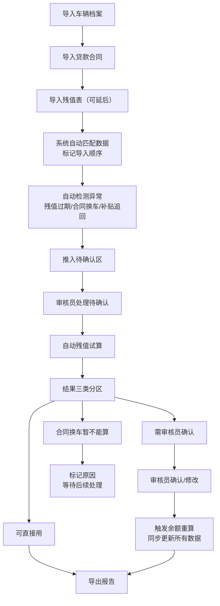

## 1. 产品概述

新能源车贷残值试算系统是面向汽车金融审核员的专业工具，解决客户提前置换时贷款余额、残值和补贴抵扣计算不清的问题。系统支持数据分批次导入、自动计算、待确认事项提醒、结果分类展示和报告导出，帮助审核员高效准确地完成残值试算工作。

- 核心目标：解决门店收车价变动快、多批次数据对齐难、补贴追回易遗漏的痛点
- 目标用户：汽车金融审核员
- 产品价值：减少返工、提高准确率、明确责任边界

## 2. 核心功能

### 2.1 用户角色
| 角色 | 注册方式 | 核心权限 |
|------|----------|----------|
| 汽车金融审核员 | 本地账号 | 数据导入、残值试算、余额重算、补贴回滚、报告导出、待确认处理 |

### 2.2 功能模块
1. **数据导入中心**: 车辆档案导入、贷款合同导入、残值表导入，显示导入顺序和时间戳
2. **待确认区**: 残值过期提醒、合同换车提醒、补贴追回预警
3. **残值试算主页**: 筛选条件、试算列表、三类结果分区展示（可直接用/需确认/暂不能算）
4. **详情编辑页**: 余额重算触发、数据修改、补贴回滚操作
5. **报告导出中心**: 导出记录、批量导出、导出状态追踪

### 2.3 页面详情
| 页面名称 | 模块名称 | 功能描述 |
|---------|----------|----------|
| 数据导入中心 | 导入任务列表 | 显示所有导入批次，按时间倒序，标注类型（车辆档案/贷款合同/残值表）和导入顺序，支持删除错误导入 |
| 数据导入中心 | 文件上传区 | 拖拽上传Excel/CSV文件，自动识别数据类型，校验字段完整性 |
| 待确认区 | 待办卡片组 | 三类待办：残值过期、合同换车、补贴追回，每项显示关联单号、预警级别、剩余天数 |
| 待确认区 | 批量处理 | 支持批量确认、批量标记已处理、批量备注 |
| 残值试算主页 | 筛选器 | 按门店、日期范围、车辆品牌、结果类型筛选 |
| 残值试算主页 | 结果分区 | 三列布局展示三类结果，卡片显示关键数据（车价、贷款余额、残值、补贴、应退/应补） |
| 残值试算主页 | 快捷操作 | 单条记录触发余额重算、查看详情、导出单条报告 |
| 详情编辑页 | 数据面板 | 展示完整的车辆、合同、残值、补贴信息，支持字段编辑（需落库） |
| 详情编辑页 | 操作区 | 余额重算按钮（触发后所有关联数据同步更新）、补贴回滚按钮、保存修改 |
| 详情编辑页 | 变更历史 | 显示所有修改记录、操作人、操作时间 |
| 报告导出中心 | 导出任务列表 | 显示所有导出任务，状态（待生成/生成中/已完成）、下载链接、生成时间 |
| 报告导出中心 | 批量导出 | 按筛选条件批量选择导出格式（Excel/PDF） |

## 3. 核心流程

### 主业务流程
1. 审核员依次导入车辆档案、贷款合同（残值表可能稍后补入）
2. 系统自动匹配关联数据，标记导入顺序
3. 系统自动检测残值过期、合同换车、补贴追回，推入待确认区
4. 审核员处理待确认事项后，系统自动试算
5. 结果按三类自动分区：可直接用、需确认、暂不能算
6. 审核员可触发余额重算，系统同步更新所有关联页面和导出数据
7. 审核员可单条或批量导出报告，所有操作落库留痕

## 4. 用户界面设计

### 4.1 设计风格
- **主色调**: 深空蓝 `#1e3a5f`，代表金融专业感和可信度
- **辅助色**: 
  - 成功绿 `#10b981`（可直接用）
  - 警告橙 `#f59e0b`（需确认）
  - 禁用灰 `#6b7280`（暂不能算）
  - 危险红 `#ef4444`（补贴追回/过期预警）
- **中性色**: 深灰 `#1f2937`、中灰 `#4b5563`、浅灰 `#f3f4f6`、纯白 `#ffffff`
- **按钮风格**: 直角矩形，2px边框，悬停时背景色加深，点击时有按压效果
- **字体**: 
  - 标题：Noto Sans SC Bold，稳重有力
  - 正文：Noto Sans SC Regular，清晰易读
  - 数据：JetBrains Mono，数字对齐
- **布局风格**: 工业风表格布局，清晰的分区线，高密度信息展示，强调功能性
- **图标风格**: Lucide线性图标，统一16px/20px尺寸，配合颜色表示状态

### 4.2 页面设计概述
| 页面名称 | 模块名称 | UI Elements |
|---------|----------|-------------|
| 数据导入中心 | 导入任务列表 | 时间线布局展示导入顺序，不同颜色标签区分数据类型，悬停显示导入详情，动画：新导入记录从左滑入 |
| 待确认区 | 待办卡片组 | 三色卡片堆叠（红/橙/灰），右上角徽标显示数量，点击展开详情，动画：卡片悬停上浮+阴影加深 |
| 残值试算主页 | 结果分区 | 三列等宽布局，每列顶部颜色条标识状态，卡片式数据展示，关键数字大号加粗，动画：页面加载时三列依次淡入 |
| 残值试算主页 | 筛选器 | 顶部固定筛选栏，标签式筛选条件，支持保存常用筛选，动画：筛选切换时内容区平滑过渡 |
| 详情编辑页 | 数据面板 | 分组折叠面板，可编辑字段有边框高亮，修改后显示变更标记，动画：面板展开/折叠的平滑过渡 |
| 报告导出中心 | 导出任务列表 | 进度条显示导出状态，完成后显示下载按钮，动画：导出进度条动画 |

### 4.3 响应式
- 桌面优先设计，主内容区最小宽度1280px
- 平板端（1024px）：三列变两列，筛选器折叠为下拉
- 移动端（768px）：单列布局，底部导航，表格横向滚动
- 所有交互元素最小48px触控尺寸

### 4.4 动效设计
- 页面加载：内容区从下往上淡入，错开100ms延迟
- 数据更新：数字变化时滚动动画，高亮闪烁1秒提示
- 按钮交互：悬停0.2s背景过渡，点击0.1s缩放反馈
- 待确认提醒：新待办项脉冲动画，持续3次
- 余额重算：全局loading遮罩，进度条显示计算进度
