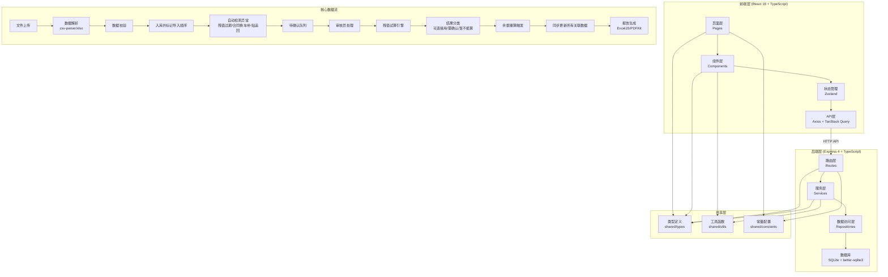
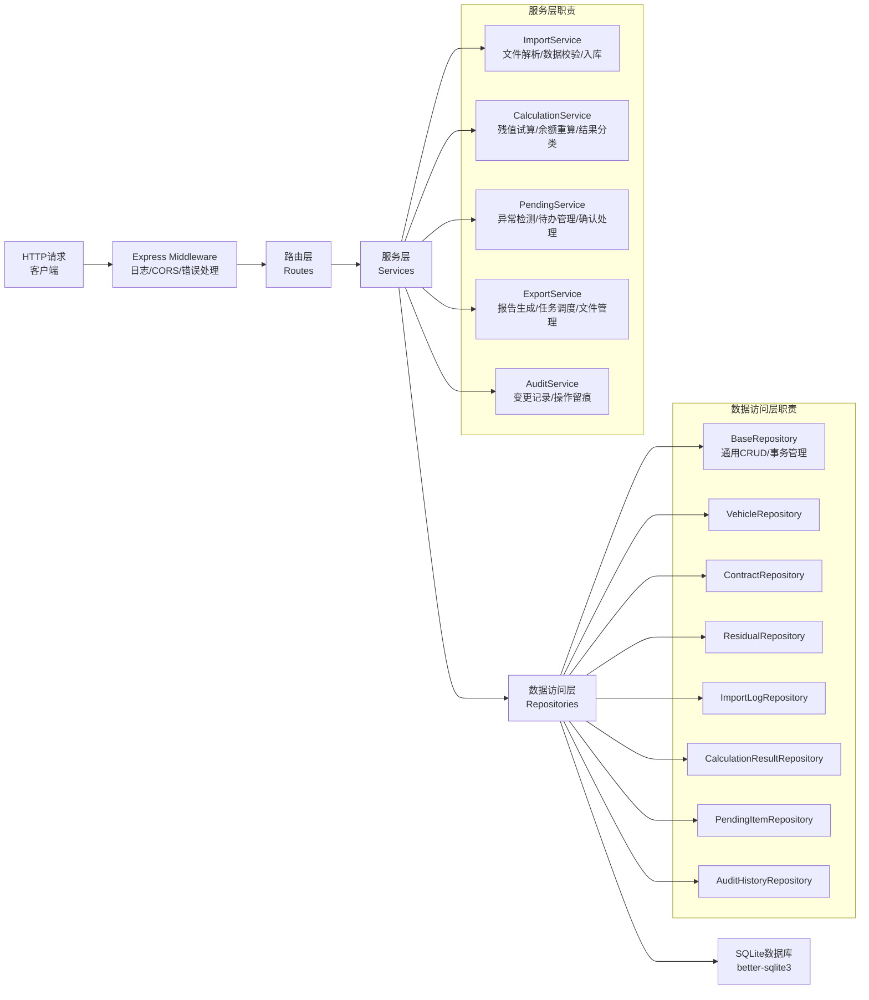

## 1. 架构设计



## 2. 技术描述

### 2.1 技术栈选型
| 层级 | 技术选型 | 版本 | 说明 |
|------|----------|------|------|
| 前端框架 | React | 18.x | UI框架，使用函数组件+Hooks |
| 前端语言 | TypeScript | 5.x | 类型安全 |
| 构建工具 | Vite | 5.x | 快速构建与开发服务器 |
| 路由 | react-router-dom | 6.x | 前端路由管理 |
| 状态管理 | zustand | 4.x | 轻量级状态管理 |
| 数据请求 | @tanstack/react-query | 5.x | 服务端状态管理、缓存 |
| UI样式 | Tailwind CSS | 3.x | 原子化CSS |
| 图标 | lucide-react | 0.344.x | 线性图标库 |
| HTTP客户端 | axios | 1.6.x | 前后端通信 |
| 后端框架 | Express | 4.x | Node.js Web框架 |
| 数据库 | SQLite + better-sqlite3 | 11.x | 本地文件数据库，无需额外服务 |
| ORM/查询 | 原生SQL + 轻量级封装 | - | 避免过度设计，直接操作SQL |
| 文件解析 | csv-parser, xlsx | 最新 | CSV/Excel文件解析 |
| 报告导出 | exceljs, pdfkit | 最新 | Excel/PDF报告生成 |
| 文件上传 | multer | 1.4.x | 后端文件上传处理 |

### 2.2 项目结构
```
y11801/
├── src/                          # 前端代码
│   ├── components/               # 可复用组件
│   │   ├── layout/              # 布局组件
│   │   ├── ui/                  # 基础UI组件
│   │   └── features/            # 业务组件
│   ├── pages/                   # 页面组件
│   │   ├── ImportCenter.tsx     # 数据导入中心
│   │   ├── PendingArea.tsx      # 待确认区
│   │   ├── ResidualHome.tsx     # 残值试算主页
│   │   ├── DetailEdit.tsx       # 详情编辑页
│   │   └── ExportCenter.tsx     # 报告导出中心
│   ├── hooks/                   # 自定义Hooks
│   ├── store/                   # Zustand状态管理
│   ├── services/                # API服务层
│   ├── utils/                   # 前端工具函数
│   ├── types/                   # 前端类型定义
│   ├── App.tsx
│   ├── main.tsx
│   └── index.css
├── api/                          # 后端代码
│   ├── routes/                  # 路由层
│   │   ├── import.ts            # 数据导入接口
│   │   ├── pending.ts           # 待确认接口
│   │   ├── calculation.ts       # 试算接口
│   │   ├── vehicle.ts           # 车辆档案接口
│   │   ├── contract.ts          # 贷款合同接口
│   │   ├── residual.ts          # 残值表接口
│   │   └── export.ts            # 导出接口
│   ├── services/                # 业务逻辑层
│   │   ├── ImportService.ts
│   │   ├── CalculationService.ts
│   │   ├── PendingService.ts
│   │   └── ExportService.ts
│   ├── repositories/            # 数据访问层
│   │   ├── BaseRepository.ts
│   │   ├── VehicleRepository.ts
│   │   ├── ContractRepository.ts
│   │   ├── ResidualRepository.ts
│   │   ├── ImportLogRepository.ts
│   │   └── CalculationResultRepository.ts
│   ├── database/                # 数据库相关
│   │   ├── index.ts             # 数据库连接
│   │   └── schema.ts            # 建表SQL
│   ├── middleware/              # Express中间件
│   ├── utils/                   # 后端工具函数
│   └── server.ts                # 服务入口
├── shared/                       # 前后端共享
│   ├── types/                   # 共享类型定义
│   ├── constants/               # 共享常量
│   └── utils/                   # 共享工具函数
├── migrations/                   # 数据库迁移
│   └── 001_init_schema.sql
├── vite.config.ts
├── tailwind.config.js
├── tsconfig.json
├── package.json
└── .env.example
```

## 3. 路由定义

### 3.1 前端路由
| 路由路径 | 页面组件 | 说明 |
|----------|----------|------|
| / | ResidualHome | 残值试算主页（默认首页） |
| /import | ImportCenter | 数据导入中心 |
| /pending | PendingArea | 待确认区 |
| /detail/:id | DetailEdit | 详情编辑页 |
| /export | ExportCenter | 报告导出中心 |

### 3.2 API路由
| 方法 | 路径 | 说明 |
|------|------|------|
| POST | /api/import/upload | 上传数据文件 |
| GET | /api/import/logs | 获取导入日志列表 |
| DELETE | /api/import/:id | 删除导入批次 |
| GET | /api/pending/items | 获取待确认列表 |
| PUT | /api/pending/:id/confirm | 确认待办项 |
| PUT | /api/pending/batch-confirm | 批量确认 |
| GET | /api/calculation/results | 获取试算结果（支持筛选） |
| POST | /api/calculation/recalculate/:id | 触发余额重算 |
| GET | /api/vehicle/:id | 获取车辆档案详情 |
| PUT | /api/vehicle/:id | 更新车辆档案 |
| GET | /api/contract/:id | 获取贷款合同详情 |
| PUT | /api/contract/:id | 更新贷款合同 |
| POST | /api/export/generate | 生成导出报告 |
| GET | /api/export/tasks | 获取导出任务列表 |
| GET | /api/export/download/:id | 下载报告文件 |
| GET | /api/audit-history/:recordId | 获取变更历史 |

## 4. API定义

### 4.1 核心类型定义
```typescript
// 共享类型 shared/types/index.ts

// 数据导入类型
export type ImportDataType = 'vehicle' | 'contract' | 'residual';

export interface ImportLog {
  id: string;
  batchId: string;
  dataType: ImportDataType;
  fileName: string;
  recordCount: number;
  importOrder: number;
  importedAt: string;
  importedBy: string;
  status: 'success' | 'failed' | 'partial';
  errorMessage?: string;
}

// 车辆档案
export interface VehicleRecord {
  id: string;
  vin: string;
  plateNumber: string;
  brand: string;
  model: string;
  purchasePrice: number;
  storePrice: number;
  storePriceUpdatedAt: string;
  storeId: string;
  storeName: string;
  createdAt: string;
  updatedAt: string;
  importBatchId: string;
}

// 贷款合同
export interface LoanContract {
  id: string;
  contractNo: string;
  vin: string;
  customerName: string;
  loanAmount: number;
  loanTerm: number;
  interestRate: number;
  monthlyPayment: number;
  remainingPrincipal: number;
  remainingInterest: number;
  startDate: string;
  endDate: string;
  isVehicleReplaced: boolean;
  replacementReason?: string;
  subsidyAmount: number;
  subsidyType: 'national' | 'local' | 'dealer';
  subsidyClawbackRequired: boolean;
  clawbackAmount?: number;
  createdAt: string;
  updatedAt: string;
  importBatchId: string;
}

// 残值表
export interface ResidualTable {
  id: string;
  vin: string;
  residualValue: number;
  residualDate: string;
  expiryDate: string;
  valuationCompany: string;
  isExpired: boolean;
  createdAt: string;
  updatedAt: string;
  importBatchId: string;
}

// 待确认项类型
export type PendingType = 'residual_expired' | 'contract_replaced' | 'subsidy_clawback';

export interface PendingItem {
  id: string;
  type: PendingType;
  relatedRecordId: string;
  relatedRecordType: 'vehicle' | 'contract' | 'residual';
  title: string;
  description: string;
  level: 'high' | 'medium' | 'low';
  remainingDays?: number;
  createdAt: string;
  confirmedAt?: string;
  confirmedBy?: string;
  note?: string;
  status: 'pending' | 'confirmed' | 'ignored';
}

// 试算结果类型
export type ResultStatus = 'ready' | 'need_confirm' | 'cannot_calculate';

export interface CalculationResult {
  id: string;
  vin: string;
  vehicleId: string;
  contractId: string;
  residualId?: string;
  vehicle: VehicleRecord;
  contract: LoanContract;
  residual?: ResidualTable;
  // 计算结果
  storePrice: number;
  remainingBalance: number;
  residualValue: number;
  subsidyDeduction: number;
  subsidyClawback: number;
  finalPayable: number;
  finalReceivable: number;
  // 状态
  status: ResultStatus;
  statusReason: string;
  pendingItems: PendingItem[];
  // 元数据
  calculatedAt: string;
  recalculatedCount: number;
  lastRecalculatedAt?: string;
  lastRecalculatedBy?: string;
}

// 余额重算请求
export interface RecalculateRequest {
  recordId: string;
  reason: string;
  operator: string;
}

// 补贴回滚请求
export interface SubsidyRollbackRequest {
  contractId: string;
  rollbackAmount: number;
  reason: string;
  operator: string;
}

// 变更历史
export interface AuditHistory {
  id: string;
  recordId: string;
  recordType: string;
  fieldName: string;
  oldValue: string;
  newValue: string;
  changedBy: string;
  changedAt: string;
  changeReason: string;
}

// 导出任务
export interface ExportTask {
  id: string;
  taskName: string;
  exportType: 'excel' | 'pdf';
  recordIds: string[];
  status: 'pending' | 'processing' | 'completed' | 'failed';
  createdAt: string;
  completedAt?: string;
  downloadUrl?: string;
  fileSize?: number;
  createdBy: string;
}
```

### 4.2 请求/响应示例
```typescript
// 获取试算结果列表
// GET /api/calculation/results?status=ready&storeId=S001&page=1&pageSize=20

export interface GetResultsRequest {
  status?: ResultStatus;
  storeId?: string;
  brand?: string;
  startDate?: string;
  endDate?: string;
  page: number;
  pageSize: number;
}

export interface GetResultsResponse {
  data: CalculationResult[];
  total: number;
  page: number;
  pageSize: number;
  summary: {
    readyCount: number;
    needConfirmCount: number;
    cannotCalculateCount: number;
    totalReceivable: number;
    totalPayable: number;
  };
}
```

## 5. 服务器架构



## 6. 数据模型

### 6.1 ER图

```mermaid
erDiagram
    IMPORT_LOG ||--o{ VEHICLE_RECORD : "imported"
    IMPORT_LOG ||--o{ LOAN_CONTRACT : "imported"
    IMPORT_LOG ||--o{ RESIDUAL_TABLE : "imported"
    
    VEHICLE_RECORD ||--|| LOAN_CONTRACT : "vin"
    VEHICLE_RECORD ||--o{ RESIDUAL_TABLE : "vin"
    VEHICLE_RECORD ||--|| CALCULATION_RESULT : "vehicle"
    LOAN_CONTRACT ||--|| CALCULATION_RESULT : "contract"
    RESIDUAL_TABLE ||--o| CALCULATION_RESULT : "residual"
    
    CALCULATION_RESULT ||--o{ PENDING_ITEM : "has"
    CALCULATION_RESULT ||--o{ AUDIT_HISTORY : "has"
    CALCULATION_RESULT ||--o{ EXPORT_TASK : "included"

    IMPORT_LOG {
        uuid id PK
        varchar batch_id UK
        varchar data_type
        varchar file_name
        int record_count
        int import_order
        datetime imported_at
        varchar imported_by
        varchar status
    }

    VEHICLE_RECORD {
        uuid id PK
        varchar vin UK
        varchar plate_number
        varchar brand
        varchar model
        decimal purchase_price
        decimal store_price
        datetime store_price_updated_at
        varchar store_id
        varchar store_name
        varchar import_batch_id FK
    }

    LOAN_CONTRACT {
        uuid id PK
        varchar contract_no UK
        varchar vin FK
        varchar customer_name
        decimal loan_amount
        int loan_term
        decimal interest_rate
        decimal monthly_payment
        decimal remaining_principal
        decimal remaining_interest
        date start_date
        date end_date
        boolean is_vehicle_replaced
        varchar replacement_reason
        decimal subsidy_amount
        varchar subsidy_type
        boolean subsidy_clawback_required
        decimal clawback_amount
        varchar import_batch_id FK
    }

    RESIDUAL_TABLE {
        uuid id PK
        varchar vin FK
        decimal residual_value
        date residual_date
        date expiry_date
        varchar valuation_company
        boolean is_expired
        varchar import_batch_id FK
    }

    PENDING_ITEM {
        uuid id PK
        varchar type
        varchar related_record_id
        varchar related_record_type
        varchar title
        text description
        varchar level
        int remaining_days
        varchar status
        datetime confirmed_at
        varchar confirmed_by
        text note
    }

    CALCULATION_RESULT {
        uuid id PK
        varchar vin
        uuid vehicle_id FK
        uuid contract_id FK
        uuid residual_id FK
        decimal store_price
        decimal remaining_balance
        decimal residual_value
        decimal subsidy_deduction
        decimal subsidy_clawback
        decimal final_payable
        decimal final_receivable
        varchar status
        text status_reason
        datetime calculated_at
        int recalculated_count
        datetime last_recalculated_at
        varchar last_recalculated_by
    }

    AUDIT_HISTORY {
        uuid id PK
        varchar record_id
        varchar record_type
        varchar field_name
        text old_value
        text new_value
        varchar changed_by
        datetime changed_at
        text change_reason
    }

    EXPORT_TASK {
        uuid id PK
        varchar task_name
        varchar export_type
        text record_ids
        varchar status
        datetime created_at
        datetime completed_at
        varchar download_url
        int file_size
        varchar created_by
    }
```


### 6.2 DDL语句
```sql
-- 001_init_schema.sql

PRAGMA foreign_keys = ON;

CREATE TABLE IF NOT EXISTS import_log (
    id TEXT PRIMARY KEY,
    batch_id TEXT UNIQUE NOT NULL,
    data_type TEXT NOT NULL CHECK (data_type IN ('vehicle', 'contract', 'residual')),
    file_name TEXT NOT NULL,
    record_count INTEGER NOT NULL DEFAULT 0,
    import_order INTEGER NOT NULL,
    imported_at DATETIME DEFAULT CURRENT_TIMESTAMP,
    imported_by TEXT NOT NULL DEFAULT 'system',
    status TEXT NOT NULL DEFAULT 'success' CHECK (status IN ('success', 'failed', 'partial')),
    error_message TEXT
);

CREATE TABLE IF NOT EXISTS vehicle_record (
    id TEXT PRIMARY KEY,
    vin TEXT UNIQUE NOT NULL,
    plate_number TEXT,
    brand TEXT NOT NULL,
    model TEXT NOT NULL,
    purchase_price DECIMAL(12,2) NOT NULL,
    store_price DECIMAL(12,2) NOT NULL,
    store_price_updated_at DATETIME DEFAULT CURRENT_TIMESTAMP,
    store_id TEXT NOT NULL,
    store_name TEXT NOT NULL,
    import_batch_id TEXT NOT NULL,
    created_at DATETIME DEFAULT CURRENT_TIMESTAMP,
    updated_at DATETIME DEFAULT CURRENT_TIMESTAMP,
    FOREIGN KEY (import_batch_id) REFERENCES import_log(batch_id)
);

CREATE TABLE IF NOT EXISTS loan_contract (
    id TEXT PRIMARY KEY,
    contract_no TEXT UNIQUE NOT NULL,
    vin TEXT NOT NULL,
    customer_name TEXT NOT NULL,
    loan_amount DECIMAL(12,2) NOT NULL,
    loan_term INTEGER NOT NULL,
    interest_rate DECIMAL(6,4) NOT NULL,
    monthly_payment DECIMAL(12,2) NOT NULL,
    remaining_principal DECIMAL(12,2) NOT NULL,
    remaining_interest DECIMAL(12,2) NOT NULL,
    start_date DATE NOT NULL,
    end_date DATE NOT NULL,
    is_vehicle_replaced BOOLEAN DEFAULT 0,
    replacement_reason TEXT,
    subsidy_amount DECIMAL(12,2) DEFAULT 0,
    subsidy_type TEXT CHECK (subsidy_type IN ('national', 'local', 'dealer')),
    subsidy_clawback_required BOOLEAN DEFAULT 0,
    clawback_amount DECIMAL(12,2) DEFAULT 0,
    import_batch_id TEXT NOT NULL,
    created_at DATETIME DEFAULT CURRENT_TIMESTAMP,
    updated_at DATETIME DEFAULT CURRENT_TIMESTAMP,
    FOREIGN KEY (import_batch_id) REFERENCES import_log(batch_id)
);

CREATE TABLE IF NOT EXISTS residual_table (
    id TEXT PRIMARY KEY,
    vin TEXT NOT NULL,
    residual_value DECIMAL(12,2) NOT NULL,
    residual_date DATE NOT NULL,
    expiry_date DATE NOT NULL,
    valuation_company TEXT NOT NULL,
    is_expired BOOLEAN DEFAULT 0,
    import_batch_id TEXT NOT NULL,
    created_at DATETIME DEFAULT CURRENT_TIMESTAMP,
    updated_at DATETIME DEFAULT CURRENT_TIMESTAMP,
    FOREIGN KEY (import_batch_id) REFERENCES import_log(batch_id)
);

CREATE TABLE IF NOT EXISTS pending_item (
    id TEXT PRIMARY KEY,
    type TEXT NOT NULL CHECK (type IN ('residual_expired', 'contract_replaced', 'subsidy_clawback')),
    related_record_id TEXT NOT NULL,
    related_record_type TEXT NOT NULL CHECK (related_record_type IN ('vehicle', 'contract', 'residual')),
    title TEXT NOT NULL,
    description TEXT,
    level TEXT NOT NULL CHECK (level IN ('high', 'medium', 'low')),
    remaining_days INTEGER,
    status TEXT NOT NULL DEFAULT 'pending' CHECK (status IN ('pending', 'confirmed', 'ignored')),
    created_at DATETIME DEFAULT CURRENT_TIMESTAMP,
    confirmed_at DATETIME,
    confirmed_by TEXT,
    note TEXT
);

CREATE TABLE IF NOT EXISTS calculation_result (
    id TEXT PRIMARY KEY,
    vin TEXT NOT NULL,
    vehicle_id TEXT NOT NULL,
    contract_id TEXT NOT NULL,
    residual_id TEXT,
    store_price DECIMAL(12,2) NOT NULL,
    remaining_balance DECIMAL(12,2) NOT NULL,
    residual_value DECIMAL(12,2) DEFAULT 0,
    subsidy_deduction DECIMAL(12,2) DEFAULT 0,
    subsidy_clawback DECIMAL(12,2) DEFAULT 0,
    final_payable DECIMAL(12,2) DEFAULT 0,
    final_receivable DECIMAL(12,2) DEFAULT 0,
    status TEXT NOT NULL CHECK (status IN ('ready', 'need_confirm', 'cannot_calculate')),
    status_reason TEXT,
    calculated_at DATETIME DEFAULT CURRENT_TIMESTAMP,
    recalculated_count INTEGER DEFAULT 0,
    last_recalculated_at DATETIME,
    last_recalculated_by TEXT,
    FOREIGN KEY (vehicle_id) REFERENCES vehicle_record(id),
    FOREIGN KEY (contract_id) REFERENCES loan_contract(id),
    FOREIGN KEY (residual_id) REFERENCES residual_table(id)
);

CREATE TABLE IF NOT EXISTS audit_history (
    id TEXT PRIMARY KEY,
    record_id TEXT NOT NULL,
    record_type TEXT NOT NULL,
    field_name TEXT NOT NULL,
    old_value TEXT,
    new_value TEXT,
    changed_by TEXT NOT NULL,
    changed_at DATETIME DEFAULT CURRENT_TIMESTAMP,
    change_reason TEXT
);

CREATE TABLE IF NOT EXISTS export_task (
    id TEXT PRIMARY KEY,
    task_name TEXT NOT NULL,
    export_type TEXT NOT NULL CHECK (export_type IN ('excel', 'pdf')),
    record_ids TEXT NOT NULL,
    status TEXT NOT NULL DEFAULT 'pending' CHECK (status IN ('pending', 'processing', 'completed', 'failed')),
    created_at DATETIME DEFAULT CURRENT_TIMESTAMP,
    completed_at DATETIME,
    download_url TEXT,
    file_size INTEGER,
    created_by TEXT NOT NULL
);

-- 索引
CREATE INDEX IF NOT EXISTS idx_vehicle_vin ON vehicle_record(vin);
CREATE INDEX IF NOT EXISTS idx_vehicle_store ON vehicle_record(store_id);
CREATE INDEX IF NOT EXISTS idx_contract_vin ON loan_contract(vin);
CREATE INDEX IF NOT EXISTS idx_contract_no ON loan_contract(contract_no);
CREATE INDEX IF NOT EXISTS idx_residual_vin ON residual_table(vin);
CREATE INDEX IF NOT EXISTS idx_pending_status ON pending_item(status);
CREATE INDEX IF NOT EXISTS idx_pending_type ON pending_item(type);
CREATE INDEX IF NOT EXISTS idx_calc_status ON calculation_result(status);
CREATE INDEX IF NOT EXISTS idx_calc_vin ON calculation_result(vin);
CREATE INDEX IF NOT EXISTS idx_audit_record ON audit_history(record_id, record_type);
CREATE INDEX IF NOT EXISTS idx_import_order ON import_log(import_order DESC);
```

### 6.3 初始化Mock数据
```typescript
// api/database/seed.ts
// 系统启动时自动初始化演示数据，包含完整的业务场景
```
