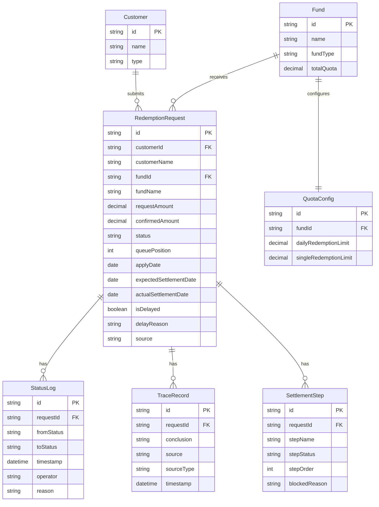

## 1. 架构设计

```mermaid
flowchart TB
    subgraph "前端层"
        "React 18 + TypeScript"
        "Zustand 状态管理"
        "Tailwind CSS"
        "React Router"
    end
    subgraph "数据层"
        "localStorage 持久化"
        "样例数据种子"
    end
    subgraph "导出层"
        "CSV 导出工具"
    end
    "React 18 + TypeScript" --> "Zustand 状态管理"
    "Zustand 状态管理" --> "localStorage 持久化"
    "localStorage 持久化" --> "样例数据种子"
    "React 18 + TypeScript" --> "CSV 导出工具"
```

## 2. 技术选型

- 前端：React 18 + TypeScript + Vite + Tailwind CSS 3
- 初始化工具：vite-init (react-ts 模板)
- 状态管理：Zustand + localStorage 持久化中间件
- 后端：无（纯前端，数据持久化到 localStorage）
- 数据库：无（localStorage 替代）
- 路由：React Router v6

## 3. 路由定义

| 路由 | 用途 |
|------|------|
| / | 排队看板主页（队列列表+规则主线） |
| /detail/:id | 赎回详情（溯源链+清算日顺延+修正） |
| /review | 复核工作台（部分确认+多笔申请复核） |
| /history | 历史记录（操作日志+状态时间线） |

## 4. 数据模型

### 4.1 数据模型定义



### 4.2 数据定义

#### RedemptionRequest（赎回申请）

| 字段 | 类型 | 说明 |
|------|------|------|
| id | string | 唯一标识 |
| customerId | string | 客户 ID |
| customerName | string | 客户名称 |
| fundId | string | 基金 ID |
| fundName | string | 基金名称 |
| requestAmount | number | 申请赎回份额 |
| confirmedAmount | number | 确认份额 |
| status | string | 状态：pending/confirmed/partial_confirmed/delayed/settled/reviewing |
| queuePosition | number | 排队位置 |
| applyDate | string | 申请日期 |
| expectedSettlementDate | string | 预计清算日 |
| actualSettlementDate | string | 实际清算日 |
| isDelayed | boolean | 是否清算日顺延 |
| delayReason | string | 顺延原因 |
| source | string | 申请来源 |

#### TraceRecord（溯源记录）

| 字段 | 类型 | 说明 |
|------|------|------|
| id | string | 唯一标识 |
| requestId | string | 关联赎回申请 ID |
| conclusion | string | 结论描述 |
| source | string | 来源描述 |
| sourceType | string | 来源类型：redemption_application / share_confirmation / quota_threshold / settlement_rule |
| timestamp | string | 记录时间 |

#### SettlementStep（清算步骤）

| 字段 | 类型 | 说明 |
|------|------|------|
| id | string | 唯一标识 |
| requestId | string | 关联赎回申请 ID |
| stepName | string | 步骤名称 |
| stepStatus | string | 步骤状态：completed/blocked/pending |
| stepOrder | number | 步骤顺序 |
| blockedReason | string | 卡点原因 |

#### StatusLog（状态日志）

| 字段 | 类型 | 说明 |
|------|------|------|
| id | string | 唯一标识 |
| requestId | string | 关联赎回申请 ID |
| fromStatus | string | 原状态 |
| toStatus | string | 新状态 |
| timestamp | string | 变更时间 |
| operator | string | 操作人 |
| reason | string | 变更原因 |

#### Fund（基金）

| 字段 | 类型 | 说明 |
|------|------|------|
| id | string | 基金 ID |
| name | string | 基金名称 |
| fundType | string | 基金类型 |
| totalQuota | number | 总额度 |

#### QuotaConfig（额度配置）

| 字段 | 类型 | 说明 |
|------|------|------|
| id | string | 唯一标识 |
| fundId | string | 基金 ID |
| dailyRedemptionLimit | number | 日赎回限额 |
| singleRedemptionLimit | number | 单笔赎回限额 |

### 4.3 样例数据

#### 顺利样例
- 客户：张明远
- 基金：华夏成长混合 A
- 申请赎回：50,000 份
- 流程：赎回申请 → 份额确认（50,000 份充足）→ 额度检查（未超阈值）→ 全额确认 → 清算日计算（T+3，无顺延）→ 预计到账
- 状态：settled

#### 清算日顺延样例
- 客户：李婉清
- 基金：博时信用债券 C
- 申请赎回：200,000 份
- 流程：赎回申请 → 份额确认（200,000 份充足）→ 额度检查（超过日赎回限额 150,000）→ 部分确认 150,000 → 运营复核 → 清算日计算（T+3，遇节假日顺延至 T+5）→ 标记卡点
- 卡点步骤：清算日计算（顺延原因：5月1日-5月3日劳动节休市）
- 状态：delayed

## 5. 状态管理

使用 Zustand 创建全局 store，通过 localStorage 持久化中间件确保刷新后数据不丢失：

- `useRedemptionStore`：赎回申请队列管理（CRUD、状态推进、排队排序）
- `useTraceStore`：溯源记录管理
- `useSettlementStore`：清算步骤管理
- `useHistoryStore`：操作日志管理
- `useConfigStore`：基金与额度配置管理
