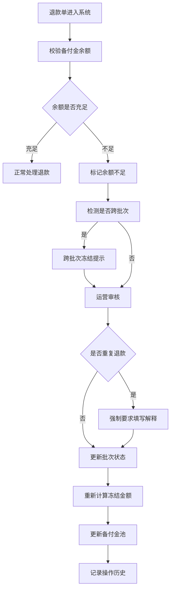

## 1. 产品概述

本产品为支付运营团队打造的"商户退款备付金"管理工作台，解决小商户促销后集中退款时备付金不足导致的跨部门对账混乱问题。核心目标是让支付运营、客服、结算同事无需再互相截图对账，所有数据留痕可追溯。

- 主要解决：备付金不足时的退款拦截、重复退款检测、跨批次冻结、余额透支预警
- 目标用户：支付运营、客服专员、结算专员
- 核心价值：所有来源数据保留原始名称，对账时无需猜测；异常路径可视化，运营无需读代码即可确认

## 2. 核心功能

### 2.1 用户角色
| 角色 | 登录方式 | 核心权限 |
|------|----------|----------|
| 支付运营 | 内部账号 | 全功能访问、修正退款单、导出数据、查看所有历史 |
| 客服专员 | 内部账号 | 添加备注、查看退款详情、标记异常 |
| 结算专员 | 内部账号 | 查看备付金池、导出对账数据 |

### 2.2 功能模块
1. **退款单列表页**：多维度筛选、状态标识、异常高亮、快捷操作
2. **退款单详情页**：完整信息展示、原始字段保留、修正功能、历史记录
3. **备付金池概览**：余额实时展示、冻结金额、透支预警、跨批次提示
4. **历史记录页**：所有操作留痕、操作人、时间、变更前后对比
5. **导出功能**：按条件导出、保留原始字段名

### 2.3 页面详情
| 页面名称 | 模块名称 | 功能描述 |
|-----------|-------------|---------------------|
| 退款单列表 | 筛选区 | 按商户、批次、状态、金额范围、时间筛选 |
| 退款单列表 | 数据表格 | 展示退款单号、商户原始名称、金额、状态、异常标识 |
| 退款单列表 | 异常告警区 | 置顶展示重复退款、透支、跨批次冻结等异常单 |
| 退款单详情 | 基础信息 | 完整展示退款单所有原始字段，保留来源系统原始名称 |
| 退款单详情 | 备付金关联 | 关联展示该退款单占用的备付金池信息 |
| 退款单详情 | 修正面板 | 修改状态、金额、备注，需填写修正原因 |
| 退款单详情 | 客服备注区 | 展示客服添加的原始备注，不可篡改 |
| 退款单详情 | 历史时间线 | 展示该退款单所有状态变更、操作人、时间 |
| 备付金池概览 | 余额卡片 | 实时余额、冻结金额、可用余额、透支阈值 |
| 备付金池概览 | 动态锁定逻辑 | 批次状态变化后自动更新冻结金额和拦截逻辑 |
| 备付金池概览 | 预警提示 | 透支、跨批次冻结时显示运营可直接转述的提示文案 |
| 历史记录 | 操作日志 | 所有操作的完整记录，支持筛选和导出 |
| 历史记录 | 变更对比 | 展示修正前后的字段值对比 |

## 3. 核心流程

## 4. 用户界面设计

### 4.1 设计风格
- **主色调**：深琥珀色 (#B45309) 代表资金警示，深 slate (#0F172A) 作为专业背景
- **辅助色**：
  - 危险红 (#DC2626)：透支、重复退款等严重异常
  - 警告橙 (#F97316)：跨批次冻结、余额不足
  - 成功绿 (#059669)：正常状态
  - 信息蓝 (#2563EB)：处理中状态
- **按钮风格**：直角硬边、2px 边框、悬停时轻微上浮阴影，体现金融系统的严谨感
- **字体**：标题使用 "JetBrains Mono" 等宽字体，正文使用 "Noto Sans SC"，所有金额数字强制等宽对齐
- **布局风格**：高密度信息展示，数据表格采用斑马纹，关键数据使用粗体和背景色块突出
- **图标风格**：使用 lucide-react 线性图标，异常状态使用实心图标增强警示

### 4.2 页面设计概述
| 页面名称 | 模块名称 | UI 元素 |
|-----------|-------------|-------------|
| 退款单列表 | 顶部导航 | 面包屑、刷新按钮、导出按钮、用户信息 |
| 退款单列表 | 异常告警条 | 置顶展示"坏掉的退款单"样例，红底白字闪烁动画 |
| 退款单列表 | 筛选卡片 | 深灰色背景、琥珀色边框、表单控件紧凑排列 |
| 退款单列表 | 数据表格 | 固定表头、斑马纹、异常行红底闪烁、状态标签 |
| 退款单详情 | 左侧信息区 | 原始字段分组展示，保留系统原始名称标签 |
| 退款单详情 | 右侧操作区 | 备付金占用情况、修正按钮、状态流转 |
| 退款单详情 | 底部时间线 | 纵向时间线，操作节点带状态色标 |
| 备付金池概览 | 余额卡片 | 大号等宽数字、实时更新动画、进度条展示使用率 |
| 备付金池概览 | 预警面板 | 带运营话术的提示框，可一键复制 |
| 历史记录 | 操作列表 | 展开/收起对比视图，高亮变更字段 |

### 4.3 响应式
- 桌面优先设计，最小支持 1280px 宽度
- 数据表格在窄屏时横向滚动，固定第一列
- 移动端适配为卡片式列表，关键信息前置

### 4.4 异常样例设计
- 在列表顶部固定展示一个"明显坏掉"的退款单样例
- 包含：重复退款标记、跨批次冻结、余额透支三重异常
- 状态标签闪烁动画，鼠标悬停显示完整异常路径说明
- 点击进入详情可看到完整的异常检测链路，无需读代码即可理解
