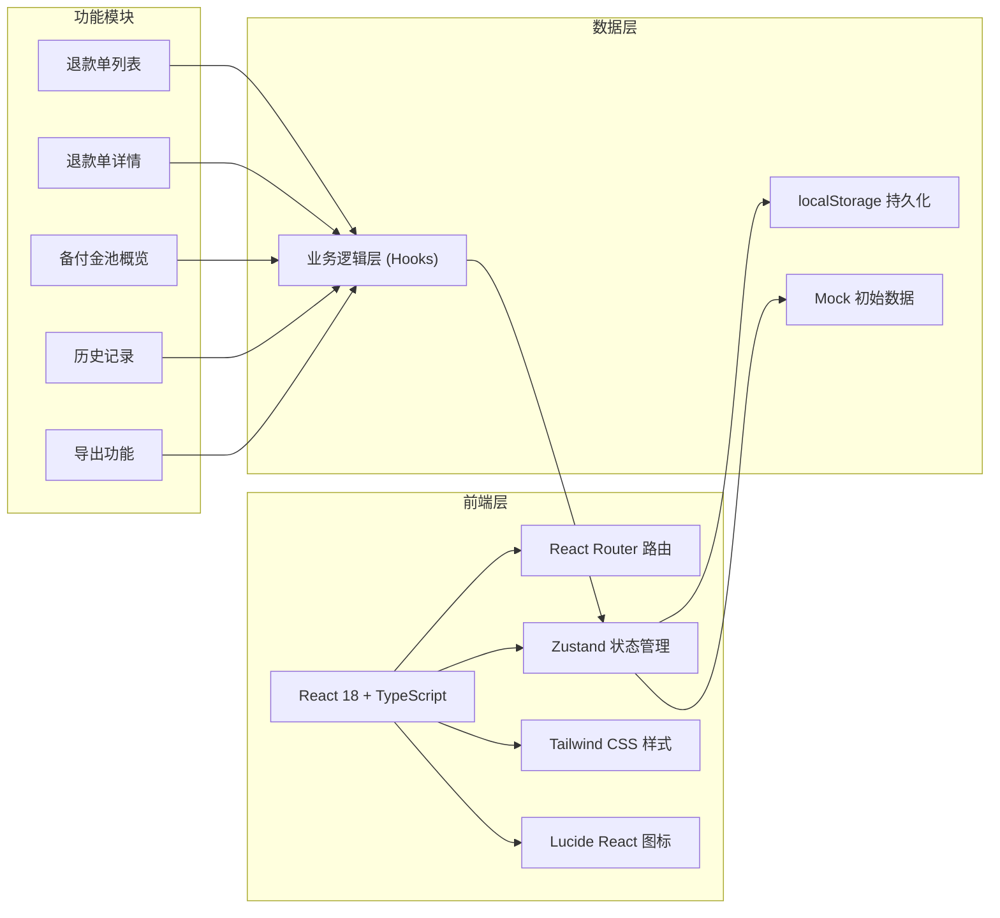
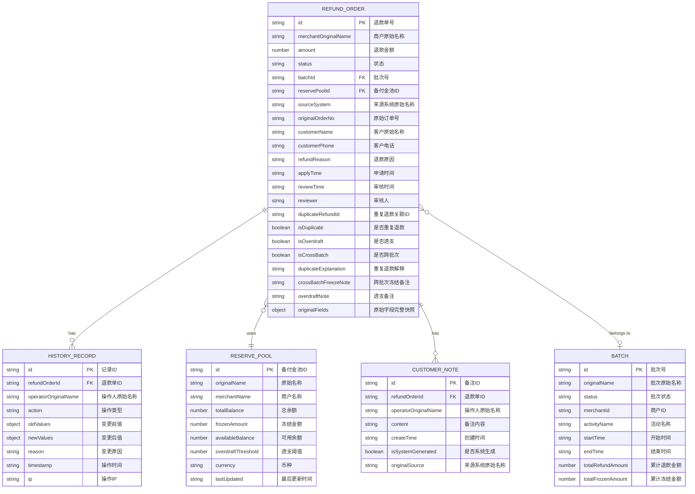

## 1. 架构设计



## 2. 技术描述

- **前端**: React@18 + TypeScript + Vite@5
- **状态管理**: Zustand@4，集成 localStorage 中间件实现数据持久化
- **路由**: React Router DOM@6
- **样式**: Tailwind CSS@3
- **图标**: Lucide React@0.344
- **初始化工具**: vite-init
- **后端**: 无，纯前端实现，数据存储在 localStorage
- **数据持久化**: localStorage，刷新后数据不丢失
- **导出功能**: 原生 CSV 导出，支持保留原始字段名

## 3. 路由定义

| 路由 | 用途 |
|-------|---------|
| / | 退款单列表页（默认首页） |
| /refund/:id | 退款单详情页 |
| /reserve | 备付金池概览页 |
| /history | 历史记录页 |

## 4. 数据模型

### 4.1 ER 图



### 4.2 类型定义

```typescript
// 退款单状态
export type RefundStatus = 'pending' | 'approved' | 'rejected' | 'frozen' | 'processed' | 'failed';

// 批次状态
export type BatchStatus = 'active' | 'completed' | 'suspended' | 'reconciled';

// 操作类型
export type HistoryAction = 
  | 'create' 
  | 'status_update' 
  | 'amount_correction' 
  | 'note_add' 
  | 'duplicate_mark' 
  | 'cross_batch_freeze' 
  | 'overdraft_warning'
  | 'unfreeze'
  | 'export';

export interface RefundOrder {
  id: string;
  merchantOriginalName: string;
  amount: number;
  status: RefundStatus;
  batchId: string;
  reservePoolId: string;
  sourceSystem: string;
  originalOrderNo: string;
  customerName: string;
  customerPhone: string;
  refundReason: string;
  applyTime: string;
  reviewTime?: string;
  reviewer?: string;
  duplicateRefundId?: string;
  isDuplicate: boolean;
  isOverdraft: boolean;
  isCrossBatch: boolean;
  duplicateExplanation?: string;
  crossBatchFreezeNote?: string;
  overdraftNote?: string;
  originalFields: Record<string, any>;
}

export interface ReservePool {
  id: string;
  originalName: string;
  merchantName: string;
  totalBalance: number;
  frozenAmount: number;
  availableBalance: number;
  overdraftThreshold: number;
  currency: string;
  lastUpdated: string;
}

export interface Batch {
  id: string;
  originalName: string;
  status: BatchStatus;
  merchantId: string;
  activityName: string;
  startTime: string;
  endTime: string;
  totalRefundAmount: number;
  totalFrozenAmount: number;
}

export interface CustomerNote {
  id: string;
  refundOrderId: string;
  operatorOriginalName: string;
  content: string;
  createTime: string;
  isSystemGenerated: boolean;
  originalSource: string;
}

export interface HistoryRecord {
  id: string;
  refundOrderId: string;
  operatorOriginalName: string;
  action: HistoryAction;
  oldValues: Record<string, any>;
  newValues: Record<string, any>;
  reason: string;
  timestamp: string;
  ip: string;
}

export interface AppState {
  refundOrders: RefundOrder[];
  reservePools: ReservePool[];
  batches: Batch[];
  customerNotes: CustomerNote[];
  historyRecords: HistoryRecord[];
  currentUser: {
    id: string;
    originalName: string;
    role: 'operation' | 'customer_service' | 'settlement';
  };
}
```

## 5. 核心业务逻辑设计

### 5.1 备付金动态锁定逻辑

```typescript
// 核心逻辑：批次状态变化触发重新计算
function recalculateFrozenAmount(batchId: string): void {
  const batch = batches.find(b => b.id === batchId);
  if (!batch) return;

  // 获取该批次所有退款单
  const batchRefunds = refundOrders.filter(r => r.batchId === batchId);
  
  // 计算应该冻结的金额
  let shouldFrozen = 0;
  
  for (const refund of batchRefunds) {
    // 非终态的退款单都要冻结
    if (refund.status !== 'processed' && refund.status !== 'rejected') {
      shouldFrozen += refund.amount;
    }
  }

  // 检测跨批次退款
  const crossBatchRefunds = batchRefunds.filter(r => r.isCrossBatch);
  for (const refund of crossBatchRefunds) {
    shouldFrozen += refund.amount * 0.5; // 跨批次额外冻结50%
  }

  // 检测重复退款
  const duplicateRefunds = batchRefunds.filter(r => r.isDuplicate);
  for (const refund of duplicateRefunds) {
    shouldFrozen += refund.amount; // 重复退款全额重复冻结
  }

  // 更新批次冻结金额
  batch.totalFrozenAmount = shouldFrozen;
  
  // 更新备付金池
  const pool = reservePools.find(p => p.merchantName === batch.merchantId);
  if (pool) {
    pool.frozenAmount = shouldFrozen;
    pool.availableBalance = pool.totalBalance - pool.frozenAmount;
    pool.lastUpdated = new Date().toISOString();
  }

  // 重新执行退款拦截检查
  recheckRefundInterceptors(batchId);
}

// 退款拦截检查（非一次性判断，批次状态变化后自动重跑）
function recheckRefundInterceptors(batchId: string): void {
  const pool = reservePools.find(p => p.merchantId === 
    batches.find(b => b.id === batchId)?.merchantId);
  
  if (!pool) return;

  const batchRefunds = refundOrders.filter(r => r.batchId === batchId);
  
  for (const refund of batchRefunds) {
    // 检查透支
    refund.isOverdraft = pool.availableBalance < refund.amount;
    
    // 更新透支备注（运营可直接转述）
    if (refund.isOverdraft) {
      refund.overdraftNote = generateOverdraftPrompt(refund, pool);
    }
    
    // 检查重复退款
    const duplicates = batchRefunds.filter(
      r => r.originalOrderNo === refund.originalOrderNo && r.id !== refund.id
    );
    refund.isDuplicate = duplicates.length > 0;
    if (refund.isDuplicate) {
      refund.duplicateRefundId = duplicates[0].id;
    }
  }
}
```

### 5.2 异常提示文案生成

```typescript
// 生成运营可直接转述的透支提示
function generateOverdraftPrompt(refund: RefundOrder, pool: ReservePool): string {
  const shortage = refund.amount - pool.availableBalance;
  return `【备付金透支提示】
商户：${refund.merchantOriginalName}
退款金额：¥${refund.amount.toFixed(2)}
备付金可用余额：¥${pool.availableBalance.toFixed(2)}
缺口：¥${shortage.toFixed(2)}
建议话术："您好，由于近期促销退款集中，您的备付金账户余额暂时不足以覆盖该笔退款。请补充 ¥${shortage.toFixed(2)} 后，我们将立即为您处理。"`;
}

// 生成跨批次冻结提示
function generateCrossBatchPrompt(refund: RefundOrder, batches: Batch[]): string {
  const currentBatch = batches.find(b => b.id === refund.batchId);
  return `【跨批次冻结提示】
该退款单关联活动「${currentBatch?.activityName}」跨批次冻结
当前批次：${currentBatch?.originalName}
冻结原因：该订单同时参与多个批次活动，需等待所有批次结算完成
建议话术："您好，您的退款订单涉及多期活动，我们需要完成跨批次对账后才能处理，请您耐心等待1-3个工作日。"`;
}

// 生成重复退款提示
function generateDuplicatePrompt(refund: RefundOrder, duplicateOrder: RefundOrder): string {
  return `【重复退款告警】
当前退款单：${refund.id}
关联重复单：${duplicateOrder.id}
原始订单：${refund.originalOrderNo}
重复金额：¥${refund.amount.toFixed(2)}
检测依据：同一原始订单号 ${refund.originalOrderNo} 下存在多笔退款申请
强制要求：必须填写重复退款解释后方可继续处理`;
}
```

## 6. 项目结构

```
src/
├── components/
│   ├── layout/
│   │   ├── Header.tsx
│   │   ├── Sidebar.tsx
│   │   └── PageContainer.tsx
│   ├── refund/
│   │   ├── RefundListTable.tsx
│   │   ├── RefundFilter.tsx
│   │   ├── RefundDetailCard.tsx
│   │   ├── RefundCorrectionModal.tsx
│   │   ├── CustomerNoteList.tsx
│   │   └── BrokenSampleAlert.tsx
│   ├── reserve/
│   │   ├── ReservePoolCard.tsx
│   │   ├── WarningPromptBox.tsx
│   │   └── BalanceProgress.tsx
│   ├── history/
│   │   ├── HistoryTimeline.tsx
│   │   └── HistoryCompareView.tsx
│   └── common/
│       ├── StatusBadge.tsx
│       ├── AmountDisplay.tsx
│       ├── CopyButton.tsx
│       └── ExportButton.tsx
├── hooks/
│   ├── useRefundOrder.ts
│   ├── useReservePool.ts
│   ├── useBatch.ts
│   ├── useHistory.ts
│   └── useExport.ts
├── store/
│   └── useAppStore.ts
├── types/
│   └── index.ts
├── utils/
│   ├── localStorage.ts
│   ├── formatters.ts
│   ├── anomalyDetection.ts
│   └── exportUtils.ts
├── data/
│   └── mockData.ts
├── pages/
│   ├── RefundList.tsx
│   ├── RefundDetail.tsx
│   ├── ReservePool.tsx
│   └── History.tsx
├── App.tsx
├── main.tsx
└── index.css
```

## 7. 状态管理设计

Zustand store 集成 localStorage 持久化：

```typescript
import { create } from 'zustand';
import { persist } from 'zustand/middleware';
import { AppState, RefundOrder, HistoryAction } from '@/types';
import { recalculateFrozenAmount, recheckRefundInterceptors } from '@/utils/anomalyDetection';

export const useAppStore = create<AppState>()(
  persist(
    (set, get) => ({
      // ... 初始状态
      
      // 更新退款单状态
      updateRefundStatus: (id: string, status: RefundStatus, reason: string) => {
        const state = get();
        const refund = state.refundOrders.find(r => r.id === id);
        if (!refund) return;

        const oldValues = { status: refund.status };
        refund.status = status;
        const newValues = { status };

        // 记录历史
        state.historyRecords.unshift({
          id: generateId(),
          refundOrderId: id,
          operatorOriginalName: state.currentUser.originalName,
          action: 'status_update',
          oldValues,
          newValues,
          reason,
          timestamp: new Date().toISOString(),
          ip: '127.0.0.1',
        });

        // 批次状态变化，重新计算冻结
        if (refund.batchId) {
          recalculateFrozenAmount(refund.batchId);
          recheckRefundInterceptors(refund.batchId);
        }

        set({ ...state });
      },

      // 修正退款单
      correctRefund: (id: string, updates: Partial<RefundOrder>, reason: string) => {
        // ... 类似逻辑，记录历史并重新计算
      },
    }),
    {
      name: 'merchant-refund-reserve-storage',
      version: 1,
    }
  )
);
```

## 8. 异常样例数据

准备一个"明显坏掉"的退款单样例，包含三重异常：

```typescript
const brokenSample: RefundOrder = {
  id: 'REFUND-BROKEN-001',
  merchantOriginalName: '小食光零食铺（618促销第三期）',
  amount: 25800.00,
  status: 'frozen',
  batchId: 'BATCH-618-003',
  reservePoolId: 'POOL-XSG-001',
  sourceSystem: '天猫交易平台v2.3',
  originalOrderNo: 'TMALL-20240618-882345',
  customerName: '张三',
  customerPhone: '138****8888',
  refundReason: '商品变质，申请全额退款',
  applyTime: '2024-06-19T14:30:00Z',
  isDuplicate: true,
  duplicateRefundId: 'REFUND-NORMAL-123',
  isOverdraft: true,
  isCrossBatch: true,
  duplicateExplanation: '',
  crossBatchFreezeNote: '该订单同时参与618第一期和第三期活动',
  overdraftNote: '备付金可用余额¥15,230.50，缺口¥10,569.50',
  originalFields: {
    'tmall_order_id': 'TMALL-20240618-882345',
    'merchant_code': 'XSG_TMALL_001',
    'promotion_batch': '618_PHASE_3',
    'refund_channel': 'alipay_escrow',
    // ... 更多原始字段
  },
};
```
