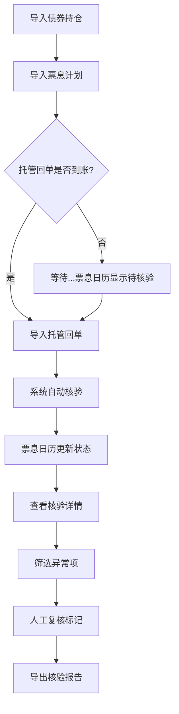

## 1. 产品概述

债券票息到账核验工具，解决资管运营中托管回单、票息计划、内部持仓表分散管理导致的到账判断难题。通过票息日历为主线，整合多源数据进行智能核验，快速识别漏付、延迟、部分到账等异常场景。

- **核心价值**：将人工核对30分钟的工作压缩到3分钟，降低操作风险
- **目标用户**：资管运营人员、债券交易后台复核岗

## 2. 核心功能

### 2.1 用户角色

| 角色 | 登录方式 | 核心权限 |
|------|----------|----------|
| 运营人员 | 本地应用 | 数据导入、核验、查看结果、导出报告 |
| 复核人员 | 本地应用 | 查看核验结果、标记复核状态 |

### 2.2 功能模块

1. **票息日历主页**：时间轴视图展示所有票息事件，状态可视化
2. **数据导入中心**：支持分批导入债券持仓、票息计划、托管回单
3. **智能核验引擎**：金额匹配、日期校验、差异自动归因
4. **结果复核面板**：筛选异常项，人工复核标记
5. **报告导出**：生成核验报告，支持Excel导出

### 2.3 页面详情

| 页面名称 | 模块名称 | 功能描述 |
|----------|----------|----------|
| 票息日历 | 时间轴视图 | 按月/周展示票息事件，颜色标记核验状态，点击查看详情 |
| 票息日历 | 数据概览卡片 | 展示本月应付息、已到账、待核验、异常项统计数字 |
| 数据导入 | 持仓导入 | 导入债券持仓表，记录导入时间，支持增量更新 |
| 数据导入 | 票息计划导入 | 导入票息计划表，关联持仓债券 |
| 数据导入 | 托管回单导入 | 导入托管行回单，支持延后补录，显示导入先后顺序 |
| 核验详情 | 金额核验 | 对比计划金额与实际到账金额，计算差异率 |
| 核验详情 | 差异归因 | 自动识别：全额到账/部分到账/未到账/持仓变更/付息日顺延 |
| 核验详情 | 关联数据展示 | 并排展示持仓、票息、回单三方数据 |
| 复核面板 | 异常筛选 | 按状态筛选：全部/正常/部分到账/未到账/顺延/持仓变更 |
| 复核面板 | 批量操作 | 批量标记复核通过，添加备注 |
| 报告导出 | 报告生成 | 生成包含统计图表和明细的核验报告 |

## 3. 核心流程

用户导入债券持仓表和票息计划 → 等待托管回单到账后导入回单 → 系统自动核验匹配 → 用户查看票息日历核验结果 → 筛选异常项进行人工复核 → 导出核验报告

## 4. 用户界面设计

### 4.1 设计风格
- **主色调**：深蓝(#1e3a5f) - 金融专业感
- **辅助色**：
  - 绿色(#10b981) - 正常/已到账
  - 橙色(#f59e0b) - 部分到账/顺延
  - 红色(#ef4444) - 异常/未到账
  - 灰色(#6b7280) - 待核验
- **按钮风格**：圆角8px，轻微阴影，hover上浮效果
- **字体**：
  - 标题：Noto Serif SC - 稳重专业
  - 正文：Noto Sans SC - 清晰易读
- **布局风格**：卡片式布局，票息日历时间轴为主视觉
- **图标风格**：线性图标，简洁专业

### 4.2 页面设计概览

| 页面名称 | 模块名称 | UI元素 |
|----------|----------|--------|
| 票息日历 | 顶部导航 | Logo、页面标题、导入按钮、导出按钮 |
| 票息日历 | 概览卡片 | 4个统计卡片横向排列，带动画数字 |
| 票息日历 | 时间轴主体 | 左侧时间轴，右侧卡片列表，支持月份切换 |
| 票息日历 | 详情侧边栏 | 右侧滑出，展示三方数据对比和核验结果 |
| 数据导入 | 导入弹窗 | 拖拽上传区域，文件预览，导入进度条 |
| 核验详情 | 数据对比 | 三栏布局：持仓/票息/回单 |
| 核验详情 | 差异展示 | 高亮差异金额，显示归因说明 |
| 复核面板 | 筛选栏 | 状态标签、日期范围、搜索框 |
| 复核面板 | 数据表格 | 可排序、可多选、可展开详情 |

### 4.3 响应式
- Desktop-first设计，优先保证1920×1080分辨率体验
- 平板端自适应调整卡片布局
- 移动端简化视图，保留核心功能

### 4.4 图表说明
- **到账率环形图**：显示已到账/待到账/异常的占比
  - 与票息计划的关系：分母为当期所有票息计划数量
- **金额差异柱状图**：按债券展示计划金额与实际金额对比
  - 与持仓的关系：柱子高度与持仓面额正相关
- **时间分布折线图**：展示票息事件在时间轴上的分布
  - 辅助识别付息高峰时段
