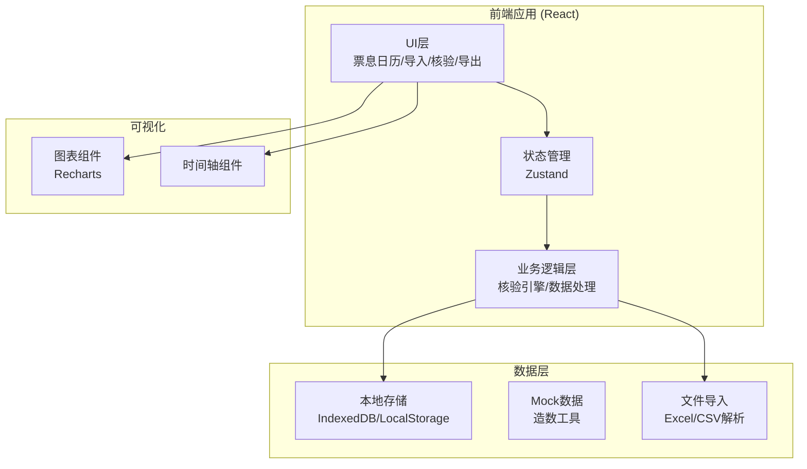
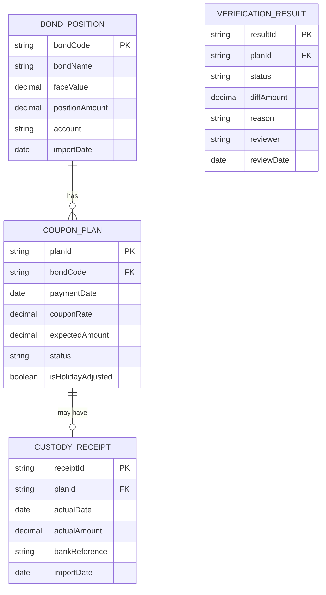

## 1. 架构设计



## 2. 技术描述

- **前端框架**: React@18 + TypeScript
- **构建工具**: Vite@5
- **样式方案**: TailwindCSS@3
- **状态管理**: Zustand
- **图表库**: Recharts
- **Excel解析**: SheetJS (xlsx)
- **图标**: Lucide React
- **本地存储**: IndexedDB (dexie.js)
- **日期处理**: date-fns

## 3. 路由定义

| 路由 | 页面名称 | 功能说明 |
|------|----------|----------|
| / | 票息日历主页 | 时间轴视图、数据概览、票息事件列表 |
| /import | 数据导入中心 | 持仓/票息/回单分批导入 |
| /verify | 核验复核面板 | 异常筛选、批量复核 |
| /export | 报告导出 | 生成并下载核验报告 |

## 4. 数据模型

### 4.1 实体关系图



### 4.2 TypeScript 类型定义

```typescript
// 债券持仓
interface BondPosition {
  bondCode: string;
  bondName: string;
  faceValue: number;
  positionAmount: number;
  account: string;
  importDate: string;
  importOrder: number;
}

// 票息计划
interface CouponPlan {
  planId: string;
  bondCode: string;
  bondName: string;
  paymentDate: string;
  couponRate: number;
  expectedAmount: number;
  daysAccrued: number;
  isHolidayAdjusted: boolean;
  originalPaymentDate?: string;
  importDate: string;
  status: 'pending' | 'verified' | 'exception';
}

// 托管回单
interface CustodyReceipt {
  receiptId: string;
  planId?: string;
  bondCode?: string;
  actualDate: string;
  actualAmount: number;
  bankReference: string;
  bankName: string;
  importDate: string;
  importOrder: number;
}

// 核验结果
interface VerificationResult {
  resultId: string;
  planId: string;
  status: 'full' | 'partial' | 'none' | 'adjusted' | 'position_changed' | 'pending';
  statusLabel: string;
  expectedAmount: number;
  actualAmount: number;
  diffAmount: number;
  diffRate: number;
  reason: string;
  reasonDetail: string;
  isReviewed: boolean;
  reviewer?: string;
  reviewDate?: string;
  reviewNote?: string;
}

// 统计概览
interface DashboardStats {
  totalPlans: number;
  totalAmount: number;
  receivedCount: number;
  receivedAmount: number;
  pendingCount: number;
  pendingAmount: number;
  exceptionCount: number;
  exceptionAmount: number;
  arrivalRate: number;
}
```

## 5. 核心模块设计

### 5.1 核验引擎模块

```typescript
// 核验规则引擎
class VerificationEngine {
  // 金额核验
  verifyAmount(expected: number, actual: number): {
    status: 'full' | 'partial' | 'none';
    diffAmount: number;
    diffRate: number;
  }
  
  // 日期核验（含节假日顺延判断）
  verifyDate(expectedDate: string, actualDate: string): {
    isAdjusted: boolean;
    daysDiff: number;
    reason: string;
  }
  
  // 持仓变更检测
  checkPositionChange(plan: CouponPlan, position: BondPosition): boolean
  
  // 主核验流程
  runVerification(plan: CouponPlan, receipt?: CustodyReceipt): VerificationResult
}
```

### 5.2 差异归因规则

| 条件组合 | 状态 | 归因说明 |
|----------|------|----------|
| 金额相等 ±0.01，日期一致 | full | 全额正常到账 |
| 金额相等 ±0.01，日期晚于计划日且为节假日后首个工作日 | adjusted | 付息日顺延 |
| 实际金额 > 0 且 < 计划金额的99% | partial | 部分到账 |
| 无回单记录且超过计划日3天 | none | 未到账（疑似漏付） |
| 核验时持仓数据与计划计算依据不一致 | position_changed | 持仓发生变更 |
| 有回单但无法匹配到计划 | unknown | 待人工匹配 |

## 6. 文件结构

```
src/
├── components/
│   ├── calendar/           # 票息日历组件
│   │   ├── Timeline.tsx
│   │   ├── EventCard.tsx
│   │   └── MonthNavigator.tsx
│   ├── import/             # 数据导入组件
│   │   ├── FileUpload.tsx
│   │   ├── ImportPreview.tsx
│   │   └── DataSourceTag.tsx
│   ├── verify/             # 核验组件
│   │   ├── VerifyDetail.tsx
│   │   ├── StatusBadge.tsx
│   │   └── ReasonPanel.tsx
│   ├── common/             # 通用组件
│   │   ├── StatCard.tsx
│   │   ├── DataTable.tsx
│   │   └── Modal.tsx
│   └── charts/             # 图表组件
│       ├── ArrivalRateChart.tsx
│       └── AmountCompareChart.tsx
├── store/                  # 状态管理
│   ├── useBondStore.ts
│   ├── useCouponStore.ts
│   └── useVerificationStore.ts
├── engine/                 # 业务引擎
│   ├── verificationEngine.ts
│   └── mockDataGenerator.ts
├── utils/                  # 工具函数
│   ├── dateUtils.ts
│   ├── amountUtils.ts
│   └── excelParser.ts
├── types/                  # 类型定义
│   └── index.ts
├── pages/                  # 页面组件
│   ├── CalendarPage.tsx
│   ├── ImportPage.tsx
│   ├── VerifyPage.tsx
│   └── ExportPage.tsx
└── App.tsx
```
