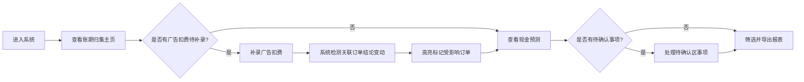

## 1. 产品概述

电商账期收款预测系统是为电商财务团队打造的本地Web应用，解决平台招商、广告扣点、退款等在账期内滚动带来的手工凑表痛点。系统以**账期归集**为主线，辅助展示现金预测和扣费拆解，帮助老板快速判断下周现金流状况，减少财务返工。

## 2. 核心功能

### 2.1 用户角色
| 角色 | 登录方式 | 核心权限 |
|------|----------|----------|
| 电商财务 | 本地访问 | 账期管理、数据补录、导出报表 |
| 老板 | 本地访问 | 查看现金流预测、待确认事项 |

### 2.2 功能模块
1. **账期归集主页**：账期列表、订单关联、状态概览
2. **现金预测面板**：按周/月展示现金流预测、断流预警
3. **扣费拆解模块**：平台扣点、广告费用明细对比
4. **待确认区**：扣点补扣、平台延迟结算、跨账期退款
5. **广告扣费补录**：手动录入广告费用并触发关联检查
6. **数据导出**：筛选后导出Excel报表

### 2.3 页面详情
| 页面名称 | 模块名称 | 功能描述 |
|----------|----------|----------|
| 账期归集主页 | 账期时间线 | 按时间轴展示各账期状态，点击展开详情 |
| 账期归集主页 | 订单关联卡片 | 展示该账期内的店铺订单、平台账单、退款记录 |
| 账期归集主页 | 改动检测标记 | 高亮显示补录广告扣费后受影响的订单结论 |
| 现金预测面板 | 现金流趋势图 | 未来4周现金流入流出预测，标注风险点 |
| 现金预测面板 | 断流预警卡片 | 红色预警可能出现现金缺口的日期 |
| 扣费拆解模块 | 费用对比表 | 平台扣点vs广告扣费，占比饼图+解释说明 |
| 待确认区 | 待处理列表 | 扣点补扣、延迟结算、跨账期退款待确认项 |
| 广告扣费补录 | 录入表单 | 支持批量录入广告费用，自动关联对应账期 |
| 数据导出 | 筛选导出 | 按时间、店铺、状态筛选后导出Excel |

## 3. 核心流程

财务人员进入系统后，首先查看账期归集主页了解整体情况。如有广告扣费需要补录，录入后系统自动检测哪些店铺订单的结论发生了变化并高亮标记。随后查看现金预测面板判断未来现金流状况，处理待确认区的扣点补扣、延迟结算和跨账期退款，最后根据需要筛选导出报表。

## 4. 用户界面设计

### 4.1 设计风格
- **主色调**：深蓝色 (#1e3a5f) 代表专业、信任，适合财务系统
- **辅助色**：橙色 (#f97316) 用于预警和高亮标记，绿色 (#10b981) 表示正常
- **按钮风格**：圆角8px，悬停有轻微阴影和颜色加深效果
- **字体**：标题使用 Noto Sans SC Bold，正文使用 Noto Sans SC Regular
- **布局风格**：三栏布局 - 左侧账期时间线(20%)、中间主内容区(55%)、右侧辅助面板(25%)
- **图标风格**：线性图标，统一24px尺寸，颜色随主题

### 4.2 页面设计概览
| 页面名称 | 模块名称 | UI元素 |
|----------|----------|--------|
| 账期归集主页 | 账期时间线 | 垂直时间轴、状态标签、点击展开动画 |
| 账期归集主页 | 订单关联卡片 | 卡片式布局、颜色编码状态、改动标记闪烁效果 |
| 现金预测面板 | 现金流趋势图 | 区域填充折线图、预警点红色标记、悬停显示详情 |
| 扣费拆解模块 | 费用对比表 | 可展开行、饼图小部件、数据解释气泡 |
| 待确认区 | 待处理列表 | 徽章标记数量、拖拽排序、一键确认按钮 |

### 4.3 响应式
- Desktop-first设计，优先保证1920x1080分辨率体验
- 平板端：右侧辅助面板折叠为底部抽屉
- 移动端：三栏转为单页滚动，使用Tab切换各模块

### 4.4 动效设计
- 页面加载：各模块按顺序淡入，延迟50ms错开
- 数据更新：改动标记有脉冲动画吸引注意
- 卡片交互：悬停上浮2px，阴影加深
- 图表加载：数据从底部向上绘制的动画效果
