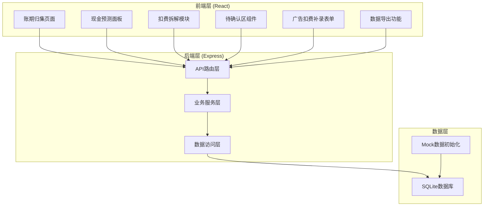
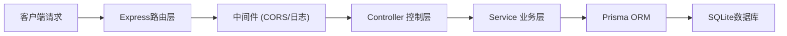
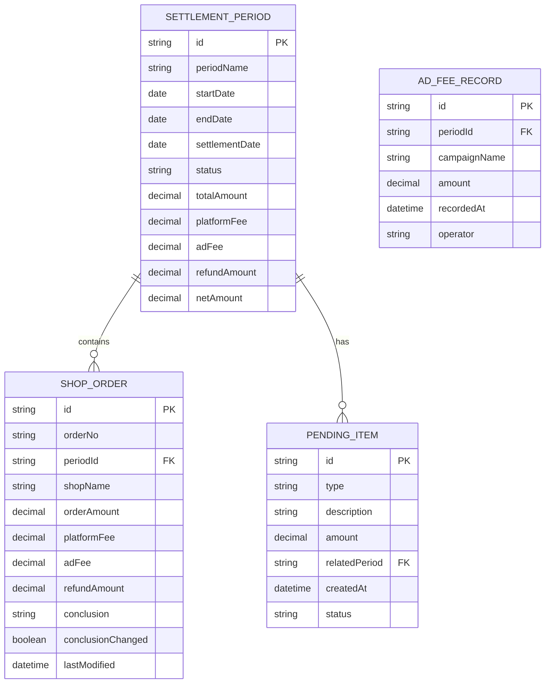

## 1. 架构设计



## 2. 技术描述

- **前端**：React@18 + TypeScript + TailwindCSS@3 + Vite
- **图表库**：Recharts（轻量React图表库）
- **状态管理**：React Context + useReducer（轻量级状态管理）
- **初始化工具**：Vite
- **后端**：Express@4 + TypeScript
- **数据库**：SQLite（本地文件数据库，无需额外安装）
- **ORM**：Prisma（类型安全的数据库访问）
- **Excel导出**：SheetJS (xlsx)

## 3. 路由定义

| 路由 | 页面/组件 | 用途 |
|------|-----------|------|
| / | 账期归集主页 | 系统主页面，三栏布局展示所有核心功能 |
| /api/periods | 后端API | 获取账期列表及详情 |
| /api/orders | 后端API | 获取/筛选店铺订单 |
| /api/cashflow | 后端API | 获取现金流预测数据 |
| /api/fees | 后端API | 获取/录入广告扣费 |
| /api/pending | 后端API | 获取/确认待处理事项 |
| /api/export | 后端API | 导出Excel报表 |

## 4. API 定义

```typescript
// 账期相关
interface SettlementPeriod {
  id: string;
  periodName: string;
  startDate: string;
  endDate: string;
  settlementDate: string;
  status: 'pending' | 'processing' | 'completed';
  totalOrders: number;
  totalAmount: number;
  platformFee: number;
  adFee: number;
  refundAmount: number;
  netAmount: number;
}

// 订单相关
interface ShopOrder {
  id: string;
  orderNo: string;
  periodId: string;
  shopName: string;
  orderAmount: number;
  platformFee: number;
  adFee: number;
  refundAmount: number;
  conclusion: string;
  conclusionChanged: boolean;
  lastModified: string;
}

// 现金流预测
interface CashFlowForecast {
  date: string;
  inflow: number;
  outflow: number;
  balance: number;
  warning: boolean;
  warningReason?: string;
}

// 待确认事项
interface PendingItem {
  id: string;
  type: 'deduction' | 'delay' | 'refund';
  description: string;
  amount: number;
  relatedPeriod: string;
  createdAt: string;
  status: 'pending' | 'confirmed';
}

// API响应格式
interface ApiResponse<T> {
  success: boolean;
  data: T;
  message?: string;
}
```

## 5. 后端架构图



## 6. 数据模型

### 6.1 数据模型定义



### 6.2 Prisma Schema

```prisma
model SettlementPeriod {
  id             String   @id @default(uuid())
  periodName     String
  startDate      DateTime
  endDate        DateTime
  settlementDate DateTime
  status         String   @default("pending")
  totalAmount    Decimal  @default(0)
  platformFee    Decimal  @default(0)
  adFee          Decimal  @default(0)
  refundAmount   Decimal  @default(0)
  netAmount      Decimal  @default(0)
  orders         ShopOrder[]
  pendingItems   PendingItem[]
  adFeeRecords   AdFeeRecord[]
  createdAt      DateTime @default(now())
  updatedAt      DateTime @updatedAt
}

model ShopOrder {
  id                String   @id @default(uuid())
  orderNo           String   @unique
  periodId          String
  period            SettlementPeriod @relation(fields: [periodId], references: [id])
  shopName          String
  orderAmount       Decimal
  platformFee       Decimal
  adFee             Decimal
  refundAmount      Decimal
  conclusion        String
  conclusionChanged Boolean  @default(false)
  lastModified      DateTime @default(now())
}

model PendingItem {
  id            String   @id @default(uuid())
  type          String
  description   String
  amount        Decimal
  relatedPeriod String
  period        SettlementPeriod @relation(fields: [relatedPeriod], references: [id])
  createdAt     DateTime @default(now())
  status        String   @default("pending")
}

model AdFeeRecord {
  id           String   @id @default(uuid())
  periodId     String
  period       SettlementPeriod @relation(fields: [periodId], references: [id])
  campaignName String
  amount       Decimal
  recordedAt   DateTime @default(now())
  operator     String
}
```
