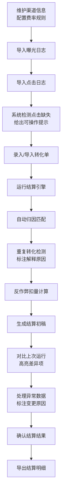
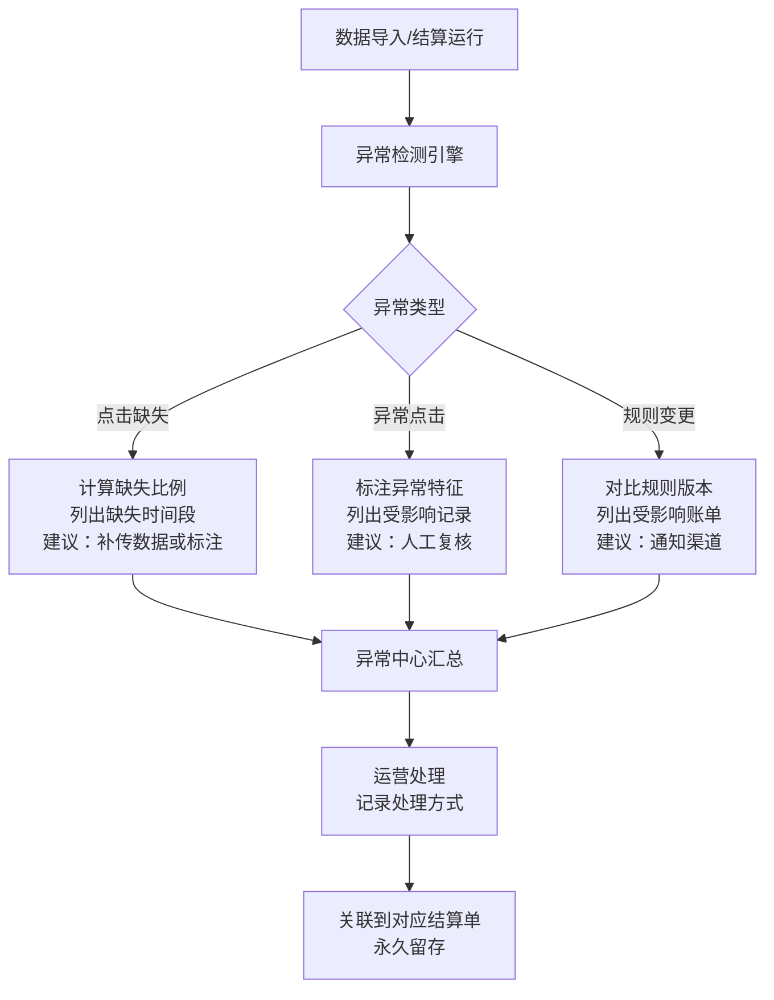

## 1. 产品概述

广告联盟结算扣量系统，用于替代手工台账，解决渠道佣金结算不透明问题。核心用户为增长运营团队，目标是实现曝光、点击、转化、反作弊扣量全链路可追溯。

- **主要目的**：实现渠道佣金结算自动化、透明化，解决重复转化无解释、异常点击无提示、扣量规则不透明等痛点
- **目标用户**：增长运营团队、渠道结算人员、财务审核人员
- **产品价值**：减少90%手工对账时间，结算争议降低80%，规则变更可追溯，数据异常可解释

## 2. 核心功能

### 2.1 用户角色
| 角色 | 注册方式 | 核心权限 |
|------|----------|----------|
| 增长运营 | 账号登录 | 数据录入、对比分析、异常处理、结算导出 |
| 财务审核 | 账号登录 | 账单查看、导出确认、审计追溯 |
| 系统管理员 | 账号登录 | 渠道管理、规则配置、用户管理 |

### 2.2 功能模块
1. **仪表盘**：核心指标概览、异常告警、待处理事项
2. **渠道管理**：渠道账号CRUD、费率配置、生效日期管理
3. **数据录入**：曝光日志导入、点击日志导入、转化单录入
4. **结算引擎**：自动归因、费率快照、扣量计算、重复转化检测
5. **对比分析**：两次运行差异标注、变化追溯、变更原因记录
6. **异常中心**：缺失数据提示、异常点击标注、规则版本变更记录
7. **结算明细**：转化归因链路、费率快照查看、结算单导出

### 2.3 页面详情
| 页面名称 | 模块名称 | 功能描述 |
|----------|----------|----------|
| 仪表盘 | 指标概览 | 展示本周曝光量、点击量、转化量、预估佣金、扣减金额 |
| 仪表盘 | 异常告警 | 展示点击缺失、异常点击、规则变更三类告警，支持快捷处理 |
| 渠道管理 | 渠道列表 | 渠道名称、账号、当前费率、状态、操作 |
| 渠道管理 | 费率历史 | 费率变更记录、生效日期、变更人、变更原因 |
| 数据录入 | 曝光日志 | 文件上传、数据预览、导入进度、冲突处理 |
| 数据录入 | 点击日志 | 同上，支持缺失数据检测和提示 |
| 数据录入 | 转化单 | 手动录入、批量导入、重复检测 |
| 结算运行 | 运行列表 | 批次号、运行时间、数据范围、状态、操作 |
| 结算运行 | 运行详情 | 归因结果、扣量明细、异常记录、对比基线 |
| 结算运行 | 差异对比 | 与上次运行对比，高亮变化项，支持标注原因 |
| 异常中心 | 异常列表 | 异常类型、级别、发生时间、处理状态、操作 |
| 异常中心 | 异常详情 | 异常详情、影响范围、建议处理方式、操作记录 |
| 结算明细 | 账单列表 | 结算周期、渠道、应结金额、扣减金额、实结金额 |
| 结算明细 | 账单详情 | 每笔转化的归因链路、费率快照、扣量原因、导出记录 |

## 3. 核心流程

### 3.1 结算主流程
增长运营首先维护渠道账号和费率规则，然后按周导入曝光日志和点击日志，录入转化单。系统自动运行结算引擎进行归因匹配、重复转化检测、扣量计算，生成初步结算结果。运营可对比两次运行结果，处理异常数据，最终导出结算明细。

### 3.2 异常处理流程
系统在数据导入和结算过程中自动检测异常，包括点击记录缺失、异常点击模式、规则版本变更。所有异常在异常中心汇总，运营可查看详情、确认影响、标记处理状态，处理结果自动记录用于后续追溯。

## 4. 用户界面设计

### 4.1 设计风格
- **主色调**：深蓝 #165DFF（专业、可信赖），搭配深灰 #1D2129 作为文本色
- **辅助色**：告警红 #F53F3F、成功绿 #00B42A、警告橙 #FF7D00、信息蓝 #86909C
- **按钮风格**：圆角 6px，主按钮填充主色，次要按钮描边，悬停有微交互
- **字体**：标题使用 PingFang SC Semibold，正文使用 PingFang SC Regular，等宽数据展示使用 JetBrains Mono
- **布局风格**：左右分栏，左侧导航固定宽度 220px，右侧内容区自适应，卡片式内容容器，阴影柔和
- **图标风格**：线性图标，16px/20px 两种尺寸，与文本对齐

### 4.2 页面设计概述
| 页面名称 | 模块名称 | UI 元素 |
|----------|----------|---------|
| 仪表盘 | 指标概览 | 4张指标卡片横向排列，数值大字突出，环比变化用箭头和颜色标识，背景用渐变+轻量纹理 |
| 仪表盘 | 异常告警 | 三色告警卡片堆叠，异常数量徽标，点击展开快捷操作，支持滑动动画 |
| 数据录入 | 文件上传 | 拖拽上传区域，虚线边框，悬停高亮，上传后展示进度条和数据预览表格 |
| 结算运行 | 差异对比 | 左右两列对比布局，差异行用背景色高亮，变化数值用红绿箭头标注，支持点击查看变更详情 |
| 异常中心 | 异常列表 | 表格布局，异常级别用颜色标签，操作列有快捷处理按钮，行展开显示详情 |
| 结算明细 | 归因链路 | 时间轴布局，展示曝光→点击→转化→扣量全链路，每节点可点击查看详情 |

### 4.3 响应式设计
- 桌面端优先设计，最小支持宽度 1280px
- 平板端折叠左侧导航为图标模式，内容区自适应
- 移动端隐藏次要数据列，核心信息卡片化展示，支持横向滚动查看完整表格

### 4.4 数据可视化
- 趋势图：使用折线图展示渠道每日曝光/点击/转化趋势，支持多渠道对比
- 扣量分布图：饼图展示各类扣量原因占比
- 异常统计图：柱状图按周展示异常类型分布
