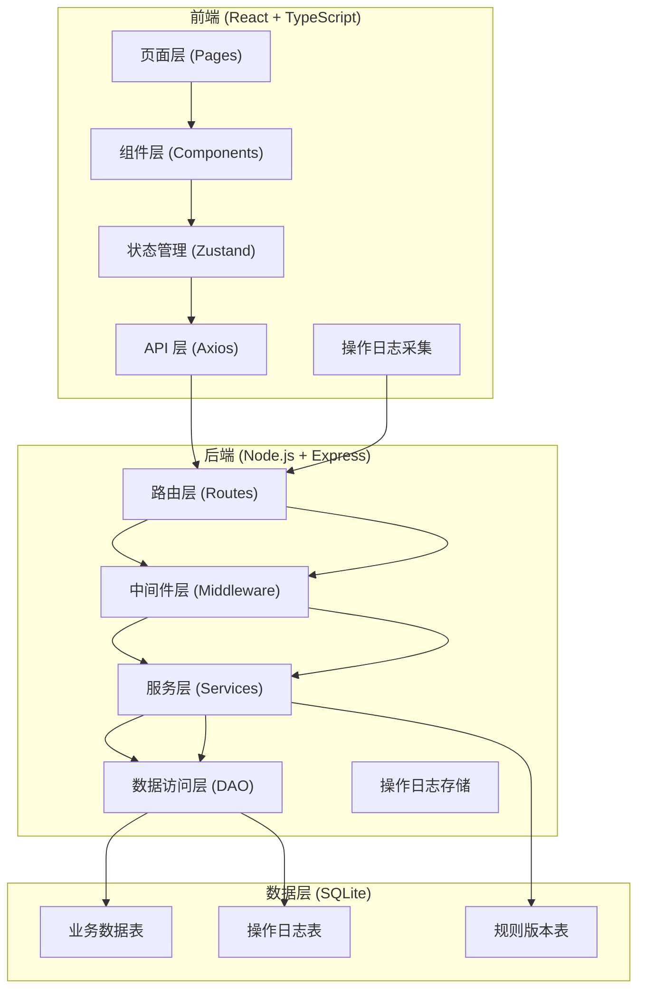
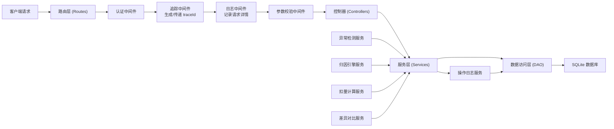
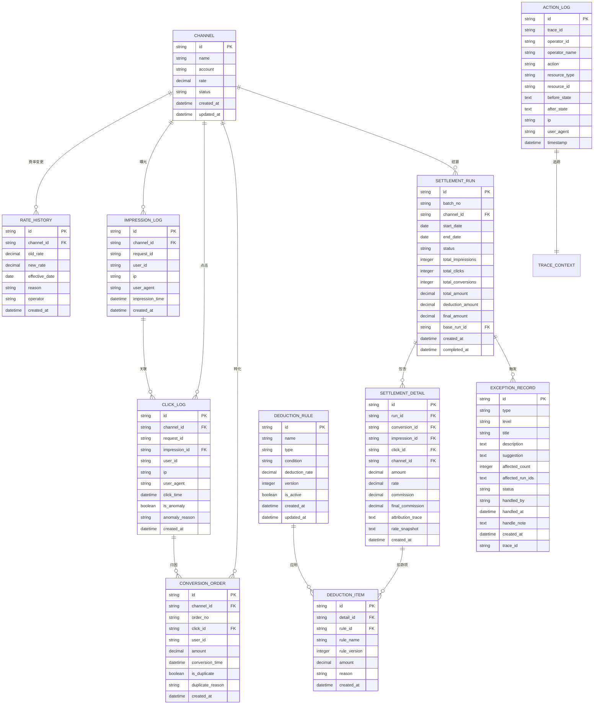

## 1. 架构设计

系统采用前后端分离架构，前端负责交互展示和数据录入，后端负责业务逻辑、数据存储和全链路追踪。为简化部署，使用 SQLite 作为数据库，无需额外安装数据库服务。



## 2. 技术描述

- **前端**：React@18 + TypeScript + Vite + TailwindCSS@3 + Zustand + Axios + React Router + Recharts
- **初始化工具**：Vite 官方模板
- **后端**：Express@4 + TypeScript + better-sqlite3 + cors + multer
- **数据库**：SQLite（通过 better-sqlite3 访问）
- **全链路追踪**：前端每个用户操作生成 traceId，随 API 请求传递到后端，全链路日志关联

## 3. 路由定义

| 路由 | 页面 | 用途 |
|------|------|------|
| / | 仪表盘 | 核心指标概览、异常告警 |
| /channels | 渠道管理 | 渠道列表、费率配置、历史记录 |
| /data/impression | 曝光日志 | 曝光数据导入、预览、管理 |
| /data/click | 点击日志 | 点击数据导入、缺失检测、管理 |
| /data/conversion | 转化单 | 转化单录入、批量导入、重复检测 |
| /settlement/runs | 结算运行 | 运行列表、新建运行、对比分析 |
| /settlement/runs/:id | 运行详情 | 归因结果、扣量明细、差异对比 |
| /exceptions | 异常中心 | 异常列表、详情查看、处理操作 |
| /bills | 结算明细 | 账单列表、详情查看、导出 |
| /bills/:id | 账单详情 | 归因链路、费率快照、导出记录 |

## 4. API 定义

### 4.1 TypeScript 类型定义

```typescript
// 基础追踪上下文
interface TraceContext {
  traceId: string;
  operatorId: string;
  operatorName: string;
  action: string;
  timestamp: number;
}

// 渠道信息
interface Channel {
  id: string;
  name: string;
  account: string;
  rate: number;
  status: 'active' | 'inactive';
  createdAt: string;
  updatedAt: string;
}

// 费率历史
interface RateHistory {
  id: string;
  channelId: string;
  oldRate: number;
  newRate: number;
  effectiveDate: string;
  reason: string;
  operator: string;
  createdAt: string;
}

// 曝光日志
interface ImpressionLog {
  id: string;
  channelId: string;
  requestId: string;
  userId?: string;
  ip: string;
  userAgent: string;
  impressionTime: string;
  createdAt: string;
}

// 点击日志
interface ClickLog {
  id: string;
  channelId: string;
  requestId: string;
  impressionId?: string;
  userId?: string;
  ip: string;
  userAgent: string;
  clickTime: string;
  isAnomaly: boolean;
  anomalyReason?: string;
  createdAt: string;
}

// 转化单
interface ConversionOrder {
  id: string;
  channelId: string;
  orderNo: string;
  clickId?: string;
  userId?: string;
  amount: number;
  conversionTime: string;
  isDuplicate: boolean;
  duplicateReason?: string;
  createdAt: string;
}

// 扣量规则
interface DeductionRule {
  id: string;
  name: string;
  type: 'click_anomaly' | 'duplicate_conversion' | 'ip_fraud' | 'time_abnormal' | 'custom';
  condition: string;
  deductionRate: number;
  version: number;
  isActive: boolean;
  createdAt: string;
  updatedAt: string;
}

// 结算运行
interface SettlementRun {
  id: string;
  batchNo: string;
  channelId: string;
  startDate: string;
  endDate: string;
  status: 'pending' | 'running' | 'completed' | 'failed';
  totalImpressions: number;
  totalClicks: number;
  totalConversions: number;
  totalAmount: number;
  deductionAmount: number;
  finalAmount: number;
  baseRunId?: string;
  createdAt: string;
  completedAt?: string;
}

// 结算明细
interface SettlementDetail {
  id: string;
  runId: string;
  conversionId: string;
  impressionId?: string;
  clickId?: string;
  channelId: string;
  amount: number;
  rate: number;
  commission: number;
  deductions: DeductionItem[];
  finalCommission: number;
  attributionTrace: AttributionNode[];
  rateSnapshot: RateHistory;
  createdAt: string;
}

// 扣款项
interface DeductionItem {
  id: string;
  ruleId: string;
  ruleName: string;
  ruleVersion: number;
  amount: number;
  reason: string;
}

// 归因节点
interface AttributionNode {
  type: 'impression' | 'click' | 'conversion';
  recordId: string;
  timestamp: string;
  ip: string;
  matched: boolean;
}

// 异常记录
interface ExceptionRecord {
  id: string;
  type: 'click_missing' | 'click_anomaly' | 'duplicate_conversion' | 'rule_change' | 'data_inconsistency';
  level: 'high' | 'medium' | 'low';
  title: string;
  description: string;
  suggestion: string;
  affectedCount: number;
  affectedRunIds: string[];
  status: 'pending' | 'processing' | 'resolved' | 'ignored';
  handledBy?: string;
  handledAt?: string;
  handleNote?: string;
  createdAt: string;
  traceId?: string;
}

// 操作日志
interface ActionLog {
  id: string;
  traceId: string;
  operatorId: string;
  operatorName: string;
  action: string;
  resourceType: string;
  resourceId: string;
  beforeState?: any;
  afterState?: any;
  ip: string;
  userAgent: string;
  timestamp: string;
}

// 差异对比结果
interface DiffResult {
  field: string;
  oldValue: any;
  newValue: any;
  changeType: 'added' | 'removed' | 'modified';
  reason?: string;
}
```

### 4.2 API 接口列表

| 方法 | 路径 | 描述 |
|------|------|------|
| POST | /api/auth/login | 登录 |
| GET | /api/channels | 获取渠道列表 |
| POST | /api/channels | 创建渠道 |
| PUT | /api/channels/:id | 更新渠道 |
| GET | /api/channels/:id/rate-history | 获取渠道费率历史 |
| POST | /api/data/impressions/import | 导入曝光日志 |
| GET | /api/data/impressions | 查询曝光日志 |
| POST | /api/data/clicks/import | 导入点击日志 |
| GET | /api/data/clicks | 查询点击日志 |
| GET | /api/data/clicks/missing-check | 点击缺失检测 |
| POST | /api/data/conversions | 创建转化单 |
| POST | /api/data/conversions/import | 批量导入转化单 |
| GET | /api/data/conversions | 查询转化单 |
| GET | /api/settlement/runs | 获取结算运行列表 |
| POST | /api/settlement/runs | 创建结算运行 |
| GET | /api/settlement/runs/:id | 获取运行详情 |
| POST | /api/settlement/runs/:id/compare | 与基线运行对比 |
| POST | /api/settlement/runs/:id/confirm | 确认结算结果 |
| GET | /api/settlement/runs/:id/export | 导出结算明细 |
| GET | /api/exceptions | 获取异常列表 |
| PUT | /api/exceptions/:id/handle | 处理异常 |
| GET | /api/bills | 获取账单列表 |
| GET | /api/bills/:id | 获取账单详情 |
| GET | /api/logs/actions | 获取操作日志 |

## 5. 后端架构



## 6. 数据模型

### 6.1 ER 图



### 6.2 DDL 语句

```sql
-- 渠道表
CREATE TABLE channel (
  id TEXT PRIMARY KEY,
  name TEXT NOT NULL,
  account TEXT NOT NULL UNIQUE,
  rate REAL NOT NULL DEFAULT 0,
  status TEXT NOT NULL DEFAULT 'active',
  created_at TEXT NOT NULL,
  updated_at TEXT NOT NULL
);

-- 费率历史表
CREATE TABLE rate_history (
  id TEXT PRIMARY KEY,
  channel_id TEXT NOT NULL,
  old_rate REAL NOT NULL,
  new_rate REAL NOT NULL,
  effective_date TEXT NOT NULL,
  reason TEXT NOT NULL,
  operator TEXT NOT NULL,
  created_at TEXT NOT NULL,
  FOREIGN KEY (channel_id) REFERENCES channel(id)
);

-- 曝光日志表
CREATE TABLE impression_log (
  id TEXT PRIMARY KEY,
  channel_id TEXT NOT NULL,
  request_id TEXT NOT NULL,
  user_id TEXT,
  ip TEXT NOT NULL,
  user_agent TEXT NOT NULL,
  impression_time TEXT NOT NULL,
  created_at TEXT NOT NULL,
  FOREIGN KEY (channel_id) REFERENCES channel(id)
);
CREATE INDEX idx_impression_request ON impression_log(request_id);
CREATE INDEX idx_impression_time ON impression_log(impression_time);
CREATE INDEX idx_impression_channel ON impression_log(channel_id);

-- 点击日志表
CREATE TABLE click_log (
  id TEXT PRIMARY KEY,
  channel_id TEXT NOT NULL,
  request_id TEXT NOT NULL,
  impression_id TEXT,
  user_id TEXT,
  ip TEXT NOT NULL,
  user_agent TEXT NOT NULL,
  click_time TEXT NOT NULL,
  is_anomaly INTEGER NOT NULL DEFAULT 0,
  anomaly_reason TEXT,
  created_at TEXT NOT NULL,
  FOREIGN KEY (channel_id) REFERENCES channel(id),
  FOREIGN KEY (impression_id) REFERENCES impression_log(id)
);
CREATE INDEX idx_click_request ON click_log(request_id);
CREATE INDEX idx_click_time ON click_log(click_time);
CREATE INDEX idx_click_channel ON click_log(channel_id);
CREATE INDEX idx_click_impression ON click_log(impression_id);

-- 转化单表
CREATE TABLE conversion_order (
  id TEXT PRIMARY KEY,
  channel_id TEXT NOT NULL,
  order_no TEXT NOT NULL UNIQUE,
  click_id TEXT,
  user_id TEXT,
  amount REAL NOT NULL,
  conversion_time TEXT NOT NULL,
  is_duplicate INTEGER NOT NULL DEFAULT 0,
  duplicate_reason TEXT,
  created_at TEXT NOT NULL,
  FOREIGN KEY (channel_id) REFERENCES channel(id),
  FOREIGN KEY (click_id) REFERENCES click_log(id)
);
CREATE INDEX idx_conversion_time ON conversion_order(conversion_time);
CREATE INDEX idx_conversion_channel ON conversion_order(channel_id);
CREATE INDEX idx_conversion_click ON conversion_order(click_id);
CREATE INDEX idx_conversion_user ON conversion_order(user_id);

-- 扣量规则表
CREATE TABLE deduction_rule (
  id TEXT PRIMARY KEY,
  name TEXT NOT NULL,
  type TEXT NOT NULL,
  condition TEXT NOT NULL,
  deduction_rate REAL NOT NULL DEFAULT 0,
  version INTEGER NOT NULL DEFAULT 1,
  is_active INTEGER NOT NULL DEFAULT 1,
  created_at TEXT NOT NULL,
  updated_at TEXT NOT NULL
);

-- 结算运行表
CREATE TABLE settlement_run (
  id TEXT PRIMARY KEY,
  batch_no TEXT NOT NULL UNIQUE,
  channel_id TEXT NOT NULL,
  start_date TEXT NOT NULL,
  end_date TEXT NOT NULL,
  status TEXT NOT NULL DEFAULT 'pending',
  total_impressions INTEGER NOT NULL DEFAULT 0,
  total_clicks INTEGER NOT NULL DEFAULT 0,
  total_conversions INTEGER NOT NULL DEFAULT 0,
  total_amount REAL NOT NULL DEFAULT 0,
  deduction_amount REAL NOT NULL DEFAULT 0,
  final_amount REAL NOT NULL DEFAULT 0,
  base_run_id TEXT,
  created_at TEXT NOT NULL,
  completed_at TEXT,
  FOREIGN KEY (channel_id) REFERENCES channel(id),
  FOREIGN KEY (base_run_id) REFERENCES settlement_run(id)
);
CREATE INDEX idx_run_channel ON settlement_run(channel_id);
CREATE INDEX idx_run_date ON settlement_run(start_date, end_date);

-- 结算明细表
CREATE TABLE settlement_detail (
  id TEXT PRIMARY KEY,
  run_id TEXT NOT NULL,
  conversion_id TEXT NOT NULL,
  impression_id TEXT,
  click_id TEXT,
  channel_id TEXT NOT NULL,
  amount REAL NOT NULL,
  rate REAL NOT NULL,
  commission REAL NOT NULL,
  final_commission REAL NOT NULL,
  attribution_trace TEXT NOT NULL,
  rate_snapshot TEXT NOT NULL,
  created_at TEXT NOT NULL,
  FOREIGN KEY (run_id) REFERENCES settlement_run(id),
  FOREIGN KEY (conversion_id) REFERENCES conversion_order(id),
  FOREIGN KEY (channel_id) REFERENCES channel(id)
);
CREATE INDEX idx_detail_run ON settlement_detail(run_id);
CREATE INDEX idx_detail_conversion ON settlement_detail(conversion_id);

-- 扣款项目表
CREATE TABLE deduction_item (
  id TEXT PRIMARY KEY,
  detail_id TEXT NOT NULL,
  rule_id TEXT NOT NULL,
  rule_name TEXT NOT NULL,
  rule_version INTEGER NOT NULL,
  amount REAL NOT NULL,
  reason TEXT NOT NULL,
  created_at TEXT NOT NULL,
  FOREIGN KEY (detail_id) REFERENCES settlement_detail(id),
  FOREIGN KEY (rule_id) REFERENCES deduction_rule(id)
);

-- 异常记录表
CREATE TABLE exception_record (
  id TEXT PRIMARY KEY,
  type TEXT NOT NULL,
  level TEXT NOT NULL,
  title TEXT NOT NULL,
  description TEXT,
  suggestion TEXT,
  affected_count INTEGER NOT NULL DEFAULT 0,
  affected_run_ids TEXT,
  status TEXT NOT NULL DEFAULT 'pending',
  handled_by TEXT,
  handled_at TEXT,
  handle_note TEXT,
  created_at TEXT NOT NULL,
  trace_id TEXT
);
CREATE INDEX idx_exception_type ON exception_record(type);
CREATE INDEX idx_exception_status ON exception_record(status);
CREATE INDEX idx_exception_level ON exception_record(level);

-- 操作日志表
CREATE TABLE action_log (
  id TEXT PRIMARY KEY,
  trace_id TEXT NOT NULL,
  operator_id TEXT NOT NULL,
  operator_name TEXT NOT NULL,
  action TEXT NOT NULL,
  resource_type TEXT NOT NULL,
  resource_id TEXT NOT NULL,
  before_state TEXT,
  after_state TEXT,
  ip TEXT NOT NULL,
  user_agent TEXT NOT NULL,
  timestamp TEXT NOT NULL
);
CREATE INDEX idx_log_trace ON action_log(trace_id);
CREATE INDEX idx_log_resource ON action_log(resource_type, resource_id);
CREATE INDEX idx_log_time ON action_log(timestamp);

-- 初始规则数据
INSERT INTO deduction_rule (id, name, type, condition, deduction_rate, version, is_active, created_at, updated_at) VALUES
('rule_001', '异常点击扣量', 'click_anomaly', 'click.is_anomaly = 1', 1.0, 1, 1, datetime('now'), datetime('now')),
('rule_002', '重复转化扣量', 'duplicate_conversion', 'conversion.is_duplicate = 1', 1.0, 1, 1, datetime('now'), datetime('now')),
('rule_003', 'IP 欺诈扣量', 'ip_fraud', '同一IP 1小时内点击超过20次', 0.5, 1, 1, datetime('now'), datetime('now')),
('rule_004', '时间异常扣量', 'time_abnormal', '点击后1秒内转化', 0.3, 1, 1, datetime('now'), datetime('now'));

-- 初始渠道数据
INSERT INTO channel (id, name, account, rate, status, created_at, updated_at) VALUES
('channel_001', '字节跳动', 'bytedance_001', 0.15, 'active', datetime('now'), datetime('now')),
('channel_002', '腾讯广告', 'tencent_002', 0.12, 'active', datetime('now'), datetime('now')),
('channel_003', '快手', 'kuaishou_003', 0.10, 'active', datetime('now'), datetime('now'));
```
