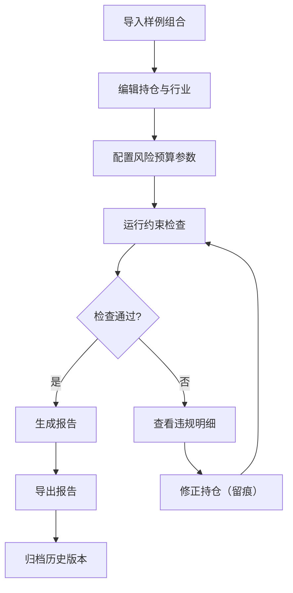

## 1. 产品概述
公募组合风险预算系统——为投顾助理提供从样例导入、约束检查、风险预算对齐到报告导出的完整闭环工具，解决 Excel 改权重即失约束、行业/波动/回撤限制反复打架的问题。
- 核心用户：投顾助理（日常调仓、合规约束检查、报告输出）
- 核心价值：把基金持仓、行业分类和风险预算三方对齐，修正全程留痕，边界样例稳定可复现

## 2. 核心功能

### 2.1 用户角色
| 角色 | 注册方式 | 核心权限 |
|------|----------|----------|
| 投顾助理 | 无需注册，直接使用 | 导入样例、编辑组合、运行约束检查、查看风险解释、导出报告、回溯历史 |

### 2.2 功能模块
1. **组合管理页**：样例导入、基金持仓编辑、行业分类展示、权重调整
2. **风险预算页**：波动/回撤限制配置、约束检查结果、风险分数与图表（含解释）
3. **修正留痕页**：每次修正操作的时间线、差异对比、可回溯至具体约束检查结果
4. **报告导出页**：生成风险预算报告、约束检查明细、历史版本导出

### 2.3 页面详情
| 页面名称 | 模块名称 | 功能描述 |
|----------|----------|----------|
| 组合管理页 | 样例导入区 | 支持从预置样例一键导入组合数据（基金代码、持仓权重、行业分类） |
| 组合管理页 | 基金持仓表 | 展示/编辑每只基金的代码、名称、权重、行业分类，实时校验权重合计 |
| 组合管理页 | 行业分布面板 | 按行业聚合展示权重分布，高亮超限行业 |
| 组合管理页 | 禁买标的标记 | 标记/识别禁买基金，阻止加入组合 |
| 风险预算页 | 风险预算配置 | 设置波动率上限、最大回撤限制、行业集中度阈值 |
| 风险预算页 | 约束检查引擎 | 一键运行：权重不满、行业超限、禁买标的三项约束检查，输出结构化结果 |
| 风险预算页 | 风险分数与雷达图 | 综合风险评分+雷达图，每个维度旁标注与持仓/行业的关系解释 |
| 风险预算页 | 波动与回撤面板 | 模拟组合波动率和最大回撤，标注计算依据 |
| 修正留痕页 | 修正时间线 | 按时间倒序展示所有修正操作，包含操作人、时间、修改字段、前后值 |
| 修正留痕页 | 差异对比 | 点击某次修正，展开显示修改前后的差异高亮 |
| 修正留痕页 | 约束关联 | 每次修正关联触发它的约束检查结果，可跳转查看 |
| 报告导出页 | 报告预览 | 预览完整风险预算报告，包含约束检查明细、风险分数、行业分布 |
| 报告导出页 | 报告导出 | 导出为可打印/可分享格式，所有数字可追溯至持仓明细 |
| 报告导出页 | 历史版本 | 查看并导出历史版本的报告 |

## 3. 核心流程

**主流程**：投顾助理导入样例组合 → 编辑持仓权重与行业 → 配置风险预算参数 → 运行约束检查 → 若有违规则修正（留痕）→ 重新检查直到通过 → 生成/导出报告

**边界样例流程**：
- 权重不满（合计 ≠ 100%）→ 约束检查标红，修正后重新检查
- 行业超限（某行业权重超过阈值）→ 高亮提示，修正后重新检查
- 禁买标的（组合包含禁买基金）→ 阻止并提示，移除后重新检查

## 4. 用户界面设计

### 4.1 设计风格
- 主色调：深墨蓝 (#1B2A4A) + 琥珀警示色 (#E8A838) + 翡翠合规色 (#2ECC71)
- 辅助色：浅灰底 (#F4F6F9)、卡片白 (#FFFFFF)、危险红 (#E74C3C)
- 按钮风格：圆角（8px），合规操作用翡翠色实心，危险操作用红色描边
- 字体：思源黑体/Source Han Sans（正文），DIN Alternate（数字/分数）
- 布局：左侧导航 + 右侧内容区，卡片式布局，表格为主交互
- 图标：线性图标风格，lucide-react

### 4.2 页面设计概览
| 页面名称 | 模块名称 | UI元素 |
|----------|----------|--------|
| 组合管理页 | 样例导入区 | 下拉选择样例 + 一键导入按钮，导入后展示基金数量与行业数 |
| 组合管理页 | 基金持仓表 | 可编辑表格，权重列可内联编辑，行业列下拉选择，底部实时显示权重合计 |
| 组合管理页 | 行业分布面板 | 水平堆叠条形图，每段标注行业名+权重%，超限段高亮红色 |
| 风险预算页 | 约束检查面板 | 三项检查卡片（权重/行业/禁买），每项显示状态图标+具体违规明细 |
| 风险预算页 | 风险雷达图 | 五维雷达图（集中度/波动/回撤/流动性/合规），每个维度旁显示文字解释 |
| 修正留痕页 | 修正时间线 | 垂直时间线，每个节点展示操作摘要，展开可看差异 |
| 报告导出页 | 报告预览 | A4纸样式的预览区，右侧操作面板（导出/历史） |

### 4.3 响应式设计
- 桌面优先设计，最小支持 1280px 宽度
- 表格在窄屏时支持横向滚动
- 图表在窄屏时堆叠为纵向排列

### 4.4 图表解释原则
- 每个风险维度分数旁必须有文字解释：该分数如何由基金持仓和行业分类推导
- 行业分布图旁标注：哪些行业超限、超限金额占组合比例
- 风险雷达图每个轴标注：该维度受哪些基金/行业影响最大
- 所有数字可点击跳转至对应的持仓明细行
